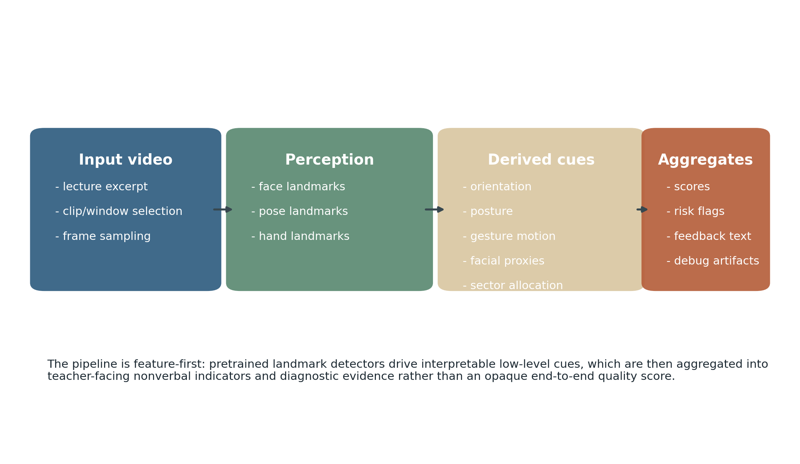
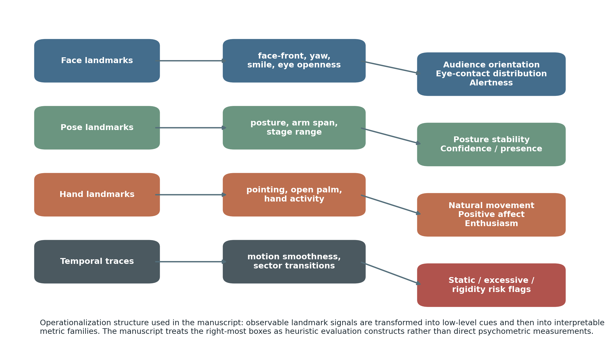
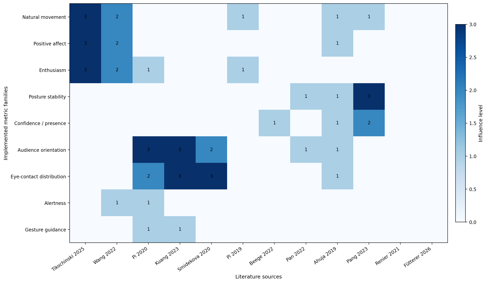
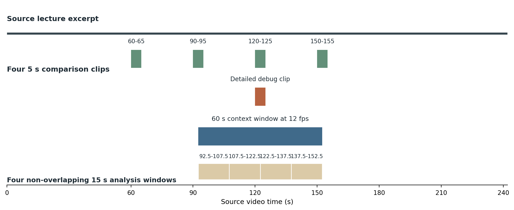
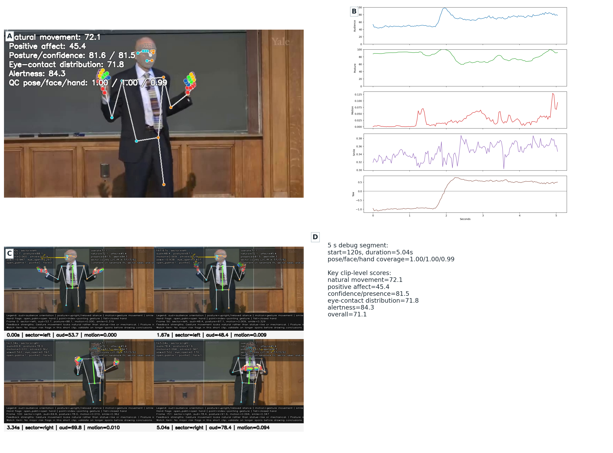
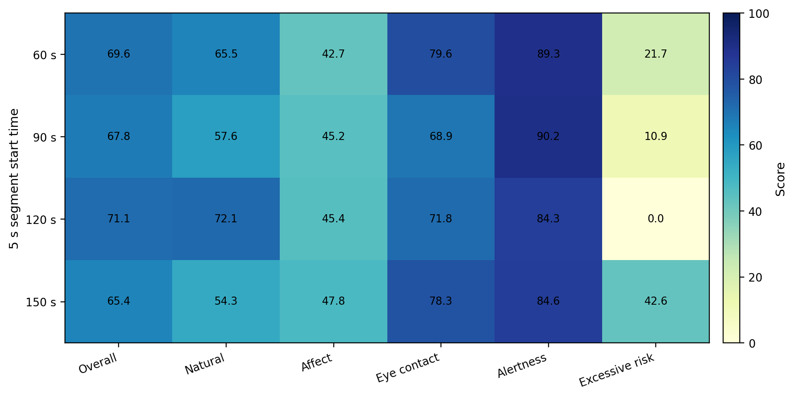
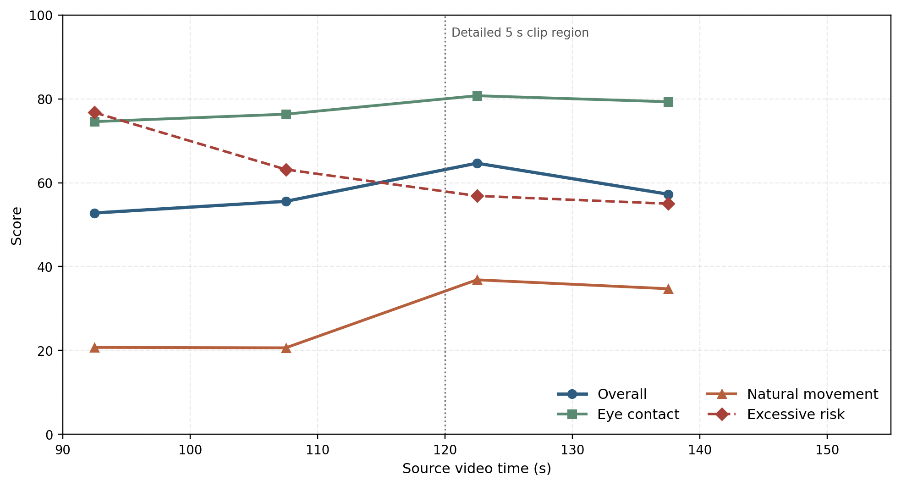
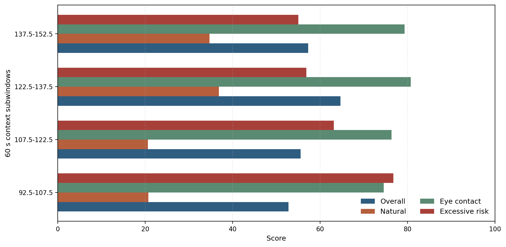
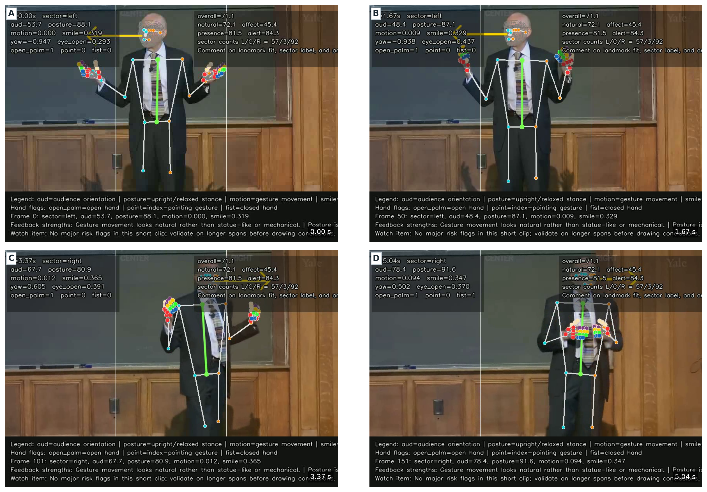

# Interpretable Computer-Vision Nonverbal-Cue Analytics for Teacher Lecture Video Review

Internal Research Draft

<strong>Abstract.</strong> This manuscript presents an interpretable computer-vision pipeline for evaluating nonverbal cues in teacher lecture video, with a focus on formative review rather than high-stakes assessment. The system uses pretrained face, pose, and hand landmark detectors and aggregates derived cues into interpretable indicators for gesture and facial expression, posture and physical presence, and eye contact and engagement. The implementation deliberately avoids training and finetuning and instead operationalizes literature-backed nonverbal constructs through transparent heuristics. The manuscript contributes three elements: first, a cue-to-metric framework grounded in recent educational and classroom-sensing literature; second, an implementation that produces both scores and auditable debugging evidence; and third, an experimental analysis of one lecture excerpt using a detailed 5 s debug segment, a four-window short-segment comparison, and a 60 s context-window analysis at 12 fps. The results show that the system can robustly track the speaker and surface stable posture, orientation, and room-scanning signals, while also revealing how clip duration changes the interpretation of movement-related cues. The findings support a feature-first design for teacher-facing reflective analytics, while also defining clear validity and fairness boundaries for what should remain manual or low-confidence.

<strong>Keywords:</strong> teacher evaluation; nonverbal behavior; computer vision; classroom analytics; educational AI; gaze; gesture; posture; formative feedback

## 1. Introduction

Teacher nonverbal behavior has long been understood as educationally consequential, but practical computational systems for evaluating such behavior remain constrained by privacy, interpretability, and ground-truth availability. In particular, teacher-facing systems must support reflective use: a teacher or coach must be able to understand which visible cues triggered a recommendation and whether those cues were tracked accurately. This requirement distinguishes classroom-feedback systems from many generic video-understanding pipelines. A model that predicts a score without an accessible trace may still be useful for ranking; it is substantially less useful for professional development.

The present work addresses that gap by framing teacher lecture video analysis as an interpretable cue-aggregation problem. Rather than fitting a new end-to-end model, the system uses pretrained landmark detectors to recover visible behavior and then converts those detections into score families that align with the research literature on instructor expressiveness, gaze, posture, and communicative presence. This design was chosen under an explicit engineering constraint: no training and no finetuning. The resulting system should therefore be evaluated not as a new predictive model, but as a rigorously designed analytics layer that turns existing perception outputs into teacher-facing evidence.

The manuscript has two goals. The first is methodological: to document how literature-backed nonverbal constructs can be operationalized using a practical landmark pipeline while preserving interpretability. The second is empirical: to examine how the resulting system behaves on a lecture excerpt under different temporal scopes, ranging from a detailed 5 s debug clip to a 60 s context-window analysis.

Three contributions follow from that framing. First, the manuscript presents an explicit mapping from observable signals to interpretable nonverbal metrics. Second, it documents a debugging-oriented evaluation workflow in which metrics are revised when score outputs conflict with visual evidence. Third, it demonstrates that temporal scope materially changes the interpretation of movement-related cues, strengthening the case for reflective multi-window analysis rather than single-clip judgment.

## 2. Related Work

### 2.1 Nonverbal expressiveness and instructor presence

Recent work has shown that instructor nonverbal behavior affects both affective and cognitive outcomes in video-mediated learning. Tikochinski et al. (2025) reported a meta-analytic advantage for teacher nonverbal expressiveness in attitudes and achievement, supporting the proposition that visible expressiveness is pedagogically relevant rather than merely stylistic. At the same time, Wang et al. (2022) showed that expressive nonverbal behavior can hinder learning for low-prior-knowledge learners, implying that movement should not be treated as uniformly beneficial. This tension directly motivates the present system's treatment of movement as a moderate-band target rather than a monotonic reward.

Instructor presence research further suggests that some visible channels matter more than others. Pi et al. (2020) found that eye gaze had clearer instructional consequences than body orientation in video lectures, while Kuang et al. (2023) meta-analytically reinforced the educational value of instructor gaze. The present manuscript therefore treats room-facing behavior and visual attention allocation as first-class constructs and explicitly gives face-derived orientation more weight than body orientation.

### 2.2 Gesture, pointing, and instructional guidance

Gesture has been studied both as a marker of expressiveness and as a direct instructional signal. Pi et al. (2019) demonstrated that pointing gestures improved learning regardless of directed gaze in video lectures, suggesting that some visible actions serve pedagogical guidance rather than generic animation. This distinction matters for evaluation. A pipeline that only counts movement magnitude will miss the fact that communicative gestures and distracting motion are not educationally equivalent. The current system therefore separates gesture-activity and pointing/open-palm cues from the broader motion profile.

### 2.3 Classroom sensing and interpretable analytics

Teacher analytics research has also increasingly emphasized interpretable sensing. EduSense (Ahuja et al., 2019) exemplifies a practical classroom-sensing architecture in which modular perceptual signals such as gaze, smile, pose, and hand-related events are exposed as usable features. Pan et al. (2022) similarly built a multimodal teaching-quality framework around interpretable mid-level descriptors rather than a pure black-box score. These systems motivate the present pipeline's core architectural choice: preserve observable cues, expose them in intermediate outputs, and permit debugging and manual validation.

At the same time, recent multimodal assessment work shows both promise and caution. Hou et al. (2024) and Fütterer et al. (2026) suggest that automated systems can approximate human judgments on some instructional constructs, but they also highlight measurement difficulty, privacy constraints, and variable predictive validity. These findings support a formative interpretation of the present pipeline rather than a summative one.

## 3. System Overview

The implemented system analyzes teacher lecture video by passing short clips or context windows through a pretrained landmark detector and aggregating the resulting signals into interpretable score families. The pipeline is organized around four stages: video window selection, perception, cue derivation, and summary generation. Observable signals include face, pose, and hand landmarks, from which the system derives orientation proxies, gesture motion, posture alignment, facial openness proxies, and spatial scanning behavior.

The system's user-facing outputs fall into three major categories:

1. gesture and facial expression
2. posture and physical presence
3. eye contact and engagement

In addition to scores, the system produces debugging evidence, including annotated keyframes, per-frame CSV traces, timeline plots, debug overlay video, contact sheets, and structured event logs. This evidence layer is not peripheral. It is a core part of the design because the intended use is reflective analysis, which requires auditable intermediate outputs.

<strong>Figure 1.</strong> High-level architecture of the implemented system. The design is feature-first: pretrained landmark detectors produce observable signals, which are transformed into derived cues and then aggregated into interpretable nonverbal indicators and diagnostic outputs.

## 4. Methods

### 4.1 Perception backbone

The perception layer uses MediaPipe Holistic to extract face, pose, and hand landmarks from RGB video. This choice is pragmatic rather than theoretical: the model is off-the-shelf, sufficiently lightweight for iterative experimentation, and exposes landmarks that can be directly inspected. In the present environment, the effective inference path is the TensorFlow Lite XNNPACK CPU delegate, even though EGL/OpenGL initialization occurs on the available NVIDIA hardware. Consequently, the system is computationally practical for offline use, but the available GPUs do not materially accelerate the landmark backbone in its current configuration.

### 4.2 Observable cues and derived features

The raw landmarks are converted into a set of low-level cues. Face-derived quantities include facial symmetry, a signed yaw proxy, smile-related width ratios, eye openness, mouth openness, and brow-eye spacing. Pose-derived quantities include shoulder width, torso length, shoulder tilt, torso lean, head balance, arm-span openness, and wrist positions. Hand-derived quantities include coarse state flags such as open palm, pointing, and fist. Temporal aggregation further yields gesture-motion mean, peak, and variance, spectral smoothness proxies, stage range, sector allocation entropy, and transition counts over left, center, and right orientation sectors.

These low-level cues are not treated as educational outcomes. Instead, they act as operational primitives from which higher-level metric families are constructed.

<strong>Figure 2.</strong> Cue-to-metric operationalization. Face, pose, hand, and temporal signals are transformed into low-level cues and then aggregated into interpretable score families. The right-most constructs are heuristic evaluation indicators rather than direct psychometric measurements.

### 4.3 Metric families

The system tracks positive indicators, risk indicators, and quality-control quantities. Positive indicators include natural movement, positive affect, enthusiasm, posture stability, confidence or presence, audience orientation, eye-contact distribution, and alertness. Risk indicators include static behavior, excessive animation, tension or hostility risk, rigidity risk, and closed posture risk. Quality-control quantities include pose coverage, face coverage, and hand coverage.

The score construction is heuristic but explicit. For example, audience orientation combines face-front and body-front evidence, eye-contact distribution blends audience orientation with sector balance and room scanning, and confidence or presence combines posture, openness, and audience orientation. Movement-related metrics use peak-shaped rather than monotonic scoring where the literature indicates that extremes are undesirable.

<strong>Table 1.</strong> Tracked metric families, operationalization in the implemented system, and principal supporting literature.

| Metric family | Operationalization in the current pipeline | Primary literature grounding |
| --- | --- | --- |
| Natural movement | Moderate-band combination of gesture-motion mean, gesture smoothness, and gesture extent | Tikochinski et al. (2025); Wang et al. (2022) |
| Positive affect | Smile proxy mean, smile variability, and open-palm evidence | Lawson et al. (2021); Tikochinski et al. (2025) |
| Enthusiasm | Blend of natural movement, positive affect, stage usage, and eye-contact distribution | Tikochinski et al. (2025); Wang et al. (2022) |
| Posture stability | Shoulder tilt, torso lean, and head balance | Pang et al. (2023) |
| Confidence / presence | Posture stability, arm-span openness, and audience orientation | Pang et al. (2023); Beege et al. (2022) |
| Audience orientation | Weighted combination of face-front and body-front evidence | Pi et al. (2020); Kuang et al. (2023) |
| Eye-contact distribution | Audience orientation, sector balance, and scan-rate behavior | Pi et al. (2020); Kuang et al. (2023); Smidekova et al. (2020) |
| Alertness | Eye openness, posture stability, and audience orientation | Pi et al. (2020); Lawson et al. (2021) |
| Static behavior risk | Inverse of gesture motion and stage range | Wang et al. (2022) |
| Excessive animation risk | Peak motion, large gesture extent, and frequent scan transitions | Wang et al. (2022) |
| Tension / hostility risk | Low smile, low facial variability, low mouth openness, fist proxy, and low brow-eye openness | Lawson et al. (2021); Renier et al. (2021) |
| Rigidity risk | Low motion variance and low facial variability | Wang et al. (2022) |
| Closed posture risk | Low arm-span openness and low audience orientation | Pang et al. (2023); Beege et al. (2022) |
| Grooming / appearance | Manual review only; not scored automatically | Beege et al. (2022); Renier et al. (2021); Fütterer et al. (2026) |

### 4.4 Literature-to-implementation traceability

The metric design was not assembled ad hoc. Each major family corresponds to at least one research line, and the literature was used in a bounded way. For example, work on gaze influenced weighting choices in audience orientation and eye-contact distribution, while work on instructor expressiveness influenced the introduction of moderate-band motion scoring and explicit excessive-animation penalties. The traceability matrix summarizes this relationship.

<strong>Figure 3.</strong> Traceability matrix linking literature sources to implemented metric families. Larger values indicate stronger influence on the operational design rather than stronger educational effect size.

## 5. Experimental Setup

### 5.1 Source material and evaluation windows

All experiments were conducted on a lecture excerpt of approximately 242 s. Three analysis modes were used. First, a 5 s clip at 120–125 s was selected for detailed debugging and visual verification. Second, four 5 s clips starting at 60, 90, 120, and 150 s were evaluated to compare short-window behavior across the lecture. Third, a 60 s context window spanning 92.5–152.5 s was extracted and analyzed at 12 fps to examine how the system behaves when the time horizon is widened while keeping the computational load practical.

This progression from short clip to longer window reflects a methodological choice. The 5 s clip is appropriate for debugging and calibration of observable behavior. The 60 s window is better suited to examining whether those same signals remain stable or shift materially under longer temporal aggregation.

### 5.2 Diagnostic workflow

The pipeline was evaluated through staged checks: extraction, frame analysis, intermediate metric traces, debug visualization, batch comparison, and targeted metric revision when visual evidence and numeric output disagreed. The clearest example of this workflow involved audience orientation, which initially relied too heavily on a brittle nose-cheek proxy. Manual inspection of the annotated keyframe and timeline traces showed that the resulting score was implausibly low. The metric was subsequently revised to combine facial symmetry, a softer yaw proxy, and body-front evidence.

This correction process is methodologically important. It shows that the pipeline can be improved through evidence-guided revision without retraining a model and without hiding uncertainty inside an end-to-end prediction architecture.

<strong>Figure 4.</strong> Experimental protocol. The same lecture excerpt was examined under three temporal scopes: a detailed 5 s debug clip, a four-window short-segment comparison, and a 60 s context-window run at 12 fps that was further subdivided into four 15 s windows.

### 5.3 Quality control

Coverage metrics were tracked in every run to identify detection instability. On the detailed 5 s debug clip, pose coverage was 1.00, face coverage was 1.00, and hand coverage was 0.99. The 60 s context-window run likewise maintained strong coverage across pose, face, and hands, indicating that the experimental observations are not driven by gross tracking failure.

In addition to static summaries, the debugging workflow emits a frame-annotated overlay video in which landmarks, sector guides, per-frame metrics, hand-state flags, and short feedback strings are burned into the output stream. This artifact is useful because it supports frame-accurate auditing of whether the system's numerical outputs align with visible behavior rather than only with post hoc summary tables.

## 6. Results

### 6.1 Detailed 5 s debug clip

The selected 5 s segment at 120–125 s produced an overall heuristic nonverbal score of 71.14. The strongest clip-level dimensions were posture stability (81.64), confidence or presence (81.50), and alertness (84.25), while positive affect remained more modest at 45.42. Risk signals were low, with excessive animation at 0.00 and rigidity at 6.07.

<strong>Table 2.</strong> Core clip-level results for the detailed 5 s debug segment.

| Metric | Score |
| --- | ---: |
| Audience orientation | 65.88 |
| Posture stability | 81.64 |
| Gesture activity | 88.31 |
| Gesture smoothness | 74.48 |
| Facial expressivity | 20.04 |
| Natural movement | 72.05 |
| Positive affect | 45.42 |
| Enthusiasm | 62.01 |
| Confidence / presence | 81.50 |
| Eye-contact distribution | 71.79 |
| Alertness | 84.25 |
| Overall heuristic score | 71.14 |

Qualitatively, this clip appears stable and well tracked. The evidence panel illustrates how this segment functioned as the calibration anchor for the study. The clip shows strong visible posture and room-facing behavior, and the low risk flags align with the impression that the speaker is engaged but not obviously over-animated within this short interval.

<strong>Figure 5.</strong> Qualitative evidence for the 5 s debug clip. Panel A shows the annotated keyframe, Panel B shows metric timelines, Panel C shows the debug contact sheet, and Panel D summarizes the final clip-level scores used in the manuscript.

### 6.2 Four-window short-segment comparison

The short-segment comparison shows that the system does not return a single stationary behavior profile across the lecture. The 120 s clip achieved the highest overall score (71.14), while the 60 s and 150 s clips showed stronger eye-contact distribution than the detailed debug clip. The 150 s segment produced the highest excessive-animation risk (42.63), demonstrating that the moderate-band movement design is functionally active.

<strong>Table 3.</strong> Short-segment comparison across four 5 s windows.

| Start time (s) | Natural movement | Positive affect | Enthusiasm | Posture stability | Confidence / presence | Eye-contact distribution | Alertness | Excessive animation risk | Overall |
| --- | ---: | ---: | ---: | ---: | ---: | ---: | ---: | ---: | ---: |
| 60 | 65.53 | 42.71 | 55.08 | 90.39 | 62.82 | 79.62 | 89.26 | 21.74 | 69.60 |
| 90 | 57.61 | 45.21 | 48.89 | 84.17 | 65.68 | 68.90 | 90.22 | 10.95 | 67.80 |
| 120 | 72.05 | 45.42 | 62.01 | 81.64 | 81.50 | 71.79 | 84.25 | 0.00 | 71.14 |
| 150 | 54.28 | 47.80 | 52.10 | 86.40 | 67.16 | 78.28 | 84.57 | 42.63 | 65.44 |

The comparison indicates that a 5 s clip can be useful for studying local behavior, but it is not sufficient for characterizing the lecture as a whole. Different windows show materially different movement and scanning profiles even under stable tracking.

<strong>Figure 6.</strong> Heatmap of the four 5 s comparison segments. The 120 s clip is strongest overall, whereas the 150 s clip shows the largest excessive-animation signal.

### 6.3 60 s context-window analysis at 12 fps

The 60 s context-window run provides the clearest demonstration that temporal scope changes interpretation. The run analyzed 721 frames, completed in approximately 97 s wall-clock time, and yielded an overall score of 58.40. Several dimensions remained strong: posture stability was 79.42, audience orientation was 70.90, eye-contact distribution was 79.89, and alertness was 85.09. However, natural movement dropped to 24.30 and excessive animation risk rose to 60.98.

This shift is important. The detailed 5 s clip suggested natural, non-problematic movement. The 60 s window shows instead that the speaker's movement profile is more variable over time and that a substantial portion of the minute appears more animated than the system's moderate-band target would prefer. In other words, the longer window does not invalidate the 5 s clip; it contextualizes it.

<strong>Table 4.</strong> Summary of the 60 s context-window run and its four non-overlapping 15 s subwindows.

| Window | Natural movement | Positive affect | Posture stability | Confidence / presence | Eye-contact distribution | Alertness | Excessive animation risk | Overall |
| --- | ---: | ---: | ---: | ---: | ---: | ---: | ---: | ---: |
| Full 92.5–152.5 s run | 24.30 | 49.77 | 79.42 | 65.74 | 79.89 | 85.09 | 60.98 | 58.40 |
| 92.5–107.5 s | 20.74 | 49.26 | 75.81 | 55.34 | 74.57 | 83.19 | 76.74 | 52.79 |
| 107.5–122.5 s | 20.64 | 46.73 | 82.74 | 71.94 | 76.34 | 84.88 | 63.16 | 55.56 |
| 122.5–137.5 s | 36.85 | 54.21 | 85.62 | 74.61 | 80.75 | 89.94 | 56.86 | 64.66 |
| 137.5–152.5 s | 34.72 | 45.34 | 73.42 | 61.13 | 79.30 | 82.35 | 55.00 | 57.27 |

The strongest 15 s block, 122.5–137.5 s, overlaps the region surrounding the earlier debug clip and again supports the intuition that the manually chosen clip was locally strong. Nonetheless, every 15 s block exhibits moderate-to-high excessive-animation risk, indicating that the lower 60 s score is not the result of a single anomalous interval.

<strong>Figure 7.</strong> Score trajectories across the four 15 s windows inside the 60 s context analysis. The detailed 5 s debug region lies within the stronger middle portion of the broader context window.

<strong>Figure 8.</strong> Comparison of subwindow-level overall score, natural movement, eye-contact distribution, and excessive-animation risk inside the 60 s context run.

## 7. Discussion

### 7.1 What the pipeline appears to do well

The present evidence suggests that the system is strongest when evaluating cues that remain close to the observable-action layer. Posture stability, room-facing behavior, scan distribution, and alertness-related visible cues remained stable across windows and aligned well with visual inspection. These are also the constructs for which the supporting literature is clearest and the operational definitions are least speculative.

The system also appears methodologically strong in its support for reflective use. Because the pipeline exposes per-frame traces and debug visuals, it permits direct inspection of whether a score seems to arise from valid detection, from an operational threshold, or from an interpretive leap. The audience-orientation revision is the clearest example. The original score was implausible, the error was diagnosable, and the correction did not require retraining or obscure post hoc justification.

### 7.2 What becomes visible at longer time scales

The most informative result in the study is the difference between the 5 s and 60 s analyses. The shorter clip would support a fairly favorable reading of the speaker's movement profile, whereas the longer window reveals substantial excess-animation risk. This pattern underscores a broader methodological point: local clips and longer windows answer different questions. A short clip is well suited to debugging or to studying a single interaction pattern. A longer window is more appropriate for judging temporal balance, room-coverage regularity, and the persistence of communicative style.

The implication for teacher-facing analytics is straightforward. Systems of this kind should avoid presenting a single short-window score as representative of an entire lecture unless accompanied by broader temporal context.

### 7.3 Why the feature-first design remains justified

The present results also support the decision to retain a feature-first design. Recent multimodal and foundation-model work shows that more powerful models can correlate with instructional constructs, but those same studies also emphasize validity complexity and the danger of overclaiming. In the current setting, an interpretable system that exposes its operational assumptions is preferable to an opaque model whose errors cannot easily be localized. The present pipeline therefore offers a defensible engineering baseline: conservative in ambition, but auditable and pedagogically legible.

## 8. Limitations and Ethical Considerations

Several limitations constrain interpretation. First, the system uses head and face orientation as a proxy for visual attention; it does not estimate pupil-level gaze. Second, the current facial-affect logic uses proxy variables such as smile width and openness rather than validated emotion recognition. Third, all score families are heuristic constructs derived from observable cues and should not be mistaken for direct measurements of pedagogical effectiveness.

These limitations carry ethical implications. In particular, the system should not be used for employment decisions, disciplinary judgments, or formal personnel evaluation. The strongest defensible use case is formative coaching or structured self-review. This boundary is consistent with the literature on nonverbal social sensing, which repeatedly cautions that higher-level social inferences are more context dependent, more bias sensitive, and more difficult to validate than lower-level action units.

Another limitation is infrastructural. In the current environment, the landmark inference path is effectively CPU-bound. This does not invalidate the pipeline, but it does shape how analysis windows should be chosen in practice.

## 9. Conclusion

This manuscript presented an interpretable computer-vision pipeline for teacher lecture video review under a strict no-training, no-finetuning constraint. The system operationalizes literature-backed nonverbal constructs using pretrained landmark detectors and transparent score aggregation. Across a detailed 5 s clip, a four-window short-segment comparison, and a 60 s context-window analysis, the pipeline showed strong tracking stability and useful sensitivity to temporal scope. The results indicate that posture, room-facing behavior, and room-scanning signals are relatively stable under this design, whereas movement-related interpretation depends strongly on window duration.

The principal methodological contribution is therefore not a new predictive model, but a repeatable strategy for building auditable, teacher-facing nonverbal analytics from existing perception components. The principal practical conclusion is that such analytics are most appropriate for reflective, evidence-supported feedback rather than high-stakes evaluation.

## 10. References

<ol class="references">
<li>Tikochinski, R., Babad, E., &amp; Hammer, R. (2025). <em>Teacher's nonverbal expressiveness boosts students' attitudes and achievements: controlled experiments and meta-analysis</em>. International Journal of Educational Technology in Higher Education, 22, 74. https://doi.org/10.1186/s41239-025-00566-6</li>
<li>Wang, M., Chen, Z., Shi, Y., Wang, Z., &amp; Xiang, C. (2022). <em>Instructors' expressive nonverbal behavior hinders learning when learners' prior knowledge is low</em>. Frontiers in Psychology, 13, 810451. https://doi.org/10.3389/fpsyg.2022.810451</li>
<li>Lawson, A. P., Mayer, R. E., Adamo-Villani, N., Benes, B., Lei, X., &amp; Cheng, J. (2021). <em>The positivity principle: do positive instructors improve learning from video lectures?</em> Educational Technology Research and Development, 69, 3101-3129. https://doi.org/10.1007/s11423-021-10057-w</li>
<li>Pi, Z., Xu, K., Liu, C., &amp; Yang, J. (2020). <em>Instructor presence in video lectures: Eye gaze matters, but not body orientation</em>. Computers &amp; Education, 144, 103713. https://doi.org/10.1016/j.compedu.2019.103713</li>
<li>Kuang, Z., Wang, F., Xie, H., Mayer, R. E., &amp; Hu, X. (2023). <em>Effect of the Instructor's Eye Gaze on Student Learning from Video Lectures: Evidence from Two Three-Level Meta-Analyses</em>. Educational Psychology Review, 35, 109. https://doi.org/10.1007/s10648-023-09820-7</li>
<li>Smidekova, H., Janik, T., &amp; Najvar, P. (2020). <em>Teachers' Gaze over Space and Time in a Real-World Classroom</em>. Journal of Eye Movement Research, 13(4). https://www.mdpi.com/1995-8692/13/4/28</li>
<li>Pi, Z., Zhang, Y., Zhu, F., Xu, K., Yang, J., &amp; Hu, W. (2019). <em>Instructors' pointing gestures improve learning regardless of their use of directed gaze in video lectures</em>. Computers &amp; Education, 128, 345-352. https://doi.org/10.1016/j.compedu.2018.10.006</li>
<li>Beege, M., Krieglstein, F., &amp; Arnold, C. (2022). <em>How instructors influence learning with instructional videos - The importance of professional appearance and communication</em>. Computers &amp; Education, 185, 104531. https://doi.org/10.1016/j.compedu.2022.104531</li>
<li>Polat, H. (2022). <em>Instructors' presence in instructional videos: A systematic review</em>. Education and Information Technologies. https://doi.org/10.1007/s10639-022-11532-4</li>
<li>Ahuja, K., Kim, D., Xhakaj, F., Varga, V., Xie, A., Zhang, S., Townsend, J. E., Harrison, C., Ogan, A., &amp; Agarwal, Y. (2019). <em>EduSense: Practical Classroom Sensing at Scale</em>. Proceedings of the ACM on Interactive, Mobile, Wearable and Ubiquitous Technologies, 3(3), 1-26.</li>
<li>Pan, Y., Wu, J., Ju, R., Zhou, Z., Gu, J., Zeng, S., Yuan, L., &amp; Li, M. (2022). <em>A Multimodal Framework for Automated Teaching Quality Assessment of One-to-many Online Instruction Videos</em>. ICPR 2022. https://sites.duke.edu/dkusmiip/files/2023/03/A_Multimodal_Framework_for_Automated_Teaching_Quality_Assessment_of_One_to_many_Online_Instruction_Videos.pdf</li>
<li>Pang, S., Lai, S., Zhang, A., Yang, Y., &amp; Sun, D. (2023). <em>Graph convolutional network for automatic detection of teachers' nonverbal behavior</em>. Computers &amp; Education: Artificial Intelligence, 5, 100174. https://doi.org/10.1016/j.caeai.2023.100174</li>
<li>Renier, L. A., Schmid Mast, M., Dael, N., &amp; Kleinlogel, E. P. (2021). <em>Nonverbal Social Sensing: What Social Sensing Can and Cannot Do for the Study of Nonverbal Behavior From Video</em>. Frontiers in Psychology, 12, 606548. https://doi.org/10.3389/fpsyg.2021.606548</li>
<li>Fütterer, T., Hou, R., Bühler, B., Bozkir, E., Bell, C., Kasneci, E., Gerjets, P., &amp; Trautwein, U. (2026). <em>Validating automated assessments of teaching effectiveness using multimodal data</em>. Learning and Instruction, 101, 102264. https://doi.org/10.1016/j.learninstruc.2025.102264</li>
</ol>

## Appendix A. Metric Definitions

Appendix A summarizes the operational definitions used by the system. These definitions remain heuristic, but they are explicit and auditable.

| Metric | Definition in the current implementation |
| --- | --- |
| Audience orientation | Clip-level average of a frame score composed of face-front and body-front evidence, with greater weight assigned to face-derived cues |
| Posture stability | Composite of shoulder tilt, torso lean, and head balance relative to the torso |
| Gesture activity | Combination of gesture extent, average gesture motion, and hand-state evidence |
| Gesture smoothness | Combination of spectral arc length and log dimensionless jerk over wrist-motion traces |
| Natural movement | Moderate-band score over movement mean, smoothness, and gesture extent |
| Positive affect | Combination of smile proxy mean, smile proxy variability, and open-palm evidence |
| Enthusiasm | Aggregate of natural movement, positive affect, stage usage, and eye-contact distribution |
| Confidence / presence | Aggregate of posture stability, arm-span openness, and audience orientation |
| Eye-contact distribution | Aggregate of audience orientation, sector-balance entropy, and room-scan behavior |
| Alertness | Aggregate of eye openness, posture stability, and audience orientation |
| Static behavior risk | Inverse scoring over movement magnitude and stage range |
| Excessive animation risk | Positive scoring over movement peaks, large gesture extent, and frequent orientation transitions |
| Tension / hostility risk | Low-confidence proxy combining low smile, low facial variability, low mouth openness, fist evidence, and low brow-eye openness |
| Rigidity risk | Inverse scoring over motion variance and facial variability |
| Closed posture risk | Inverse scoring over arm-span openness and audience orientation |

## Appendix B. Artifact Inventory

Appendix B records the primary artifacts used to construct the manuscript. The current report artifacts remain the underlying factual source of truth.

| Artifact | Role in the manuscript | Location |
| --- | --- | --- |
| Original technical report markdown | Source narrative and baseline factual record | `docs/nonverbal_eval_research_report.md` |
| Original technical report PDF | Reference artifact retained unchanged | `docs/nonverbal_eval_research_report.pdf` |
| 5 s debug summary JSON | Primary source for detailed-clip numeric results | `artifacts/nonverbal_eval_debug3/run_20260315T193444Z/summary.json` |
| 5 s debug overlay video | Frame-annotated diagnostic output used for manual audit of landmarks, sectors, and feedback overlays | `artifacts/nonverbal_eval_debug3/run_20260315T193444Z/debug_overlay.mp4` |
| 5 s debug contact sheet | Static proxy for the debug-video output used in the qualitative evidence figure | `artifacts/nonverbal_eval_debug3/run_20260315T193444Z/debug_contact_sheet.jpg` |
| 5 s debug event log | Structured execution trace for the detailed debug run | `artifacts/nonverbal_eval_debug3/run_20260315T193444Z/events.jsonl` |
| Four-window batch comparison CSV | Source for short-segment comparative tables and figures | `artifacts/nonverbal_eval_batch/batch_20260315T191630Z/comparison.csv` |
| 60 s context-run summary JSON | Source for long-window aggregate results | `artifacts/nonverbal_eval_long/run_20260315T202856Z/summary_full.json` |
| 60 s context-run window summary CSV | Source for subwindow results and trend figures | `artifacts/nonverbal_eval_long/run_20260315T202856Z/window_summary.csv` |
| `clipped_precise2` long-run summary | Source for the supplementary note-reading comparison case | `artifacts/nonverbal_eval_long/run_20260315T220440Z/summary_full.md` |
| `clipped_precise2` semantic summary | Source for the supplementary Qwen note-reading observations | `artifacts/nonverbal_eval_long/run_20260315T220440Z/semantic_extensions/semantic_summary.md` |
| `clip_5min` 60 s long-run summary | Source for the supplementary longer-window comparison case | `artifacts/nonverbal_eval_long/run_20260315T222157Z/summary_full.md` |
| `clip_5min` 60 s semantic summary | Source for the supplementary Qwen audience-focus observations | `artifacts/nonverbal_eval_long/run_20260315T222157Z/semantic_extensions/semantic_summary.md` |
| Manuscript figure generator | Produces the paper-specific figure set | `docs/generate_paper_figures.py` |
| Manuscript PDF renderer | Produces the journal-style PDF | `docs/render_paper_pdf.py` |

Representative frames from the debug overlay artifact are reproduced below to preserve the connection between the manuscript's quantitative results and the frame-level evidence available during tuning.

<strong>Figure 9.</strong> Representative frames from the debug overlay video. The output includes landmarks, sector guides, per-frame metrics, hand-state flags, and footer-level feedback text, and serves as a frame-accurate audit artifact for manual review.

## Appendix C. Cross-Video Supplementary Notes

Appendix C summarizes three additional videos that were inspected after the main experiments were completed. The purpose is not to redefine the manuscript's core results, but to record what these extra videos revealed about where the current pipeline appears reliable and where it remains calibration-sensitive.

<strong>Figure 10.</strong> First frames from the three source videos used in the supplementary cross-video review. Panel A is the original lecture benchmark used throughout the main paper, Panel B is the note-reading-heavy `clipped_precise2` case, and Panel C is the longer `clip_5min` source from which a 60 s, 12 fps window was analyzed.

<strong>Lecture_1_cut_1m_to_5m.mp4.</strong> This video remained the strongest benchmark for the pipeline. The main 5 s and 60 s analyses showed high pose and face coverage, stable posture, strong alertness, and broadly defensible audience-orientation behavior. In the additive Qwen pass, the model usually interpreted the speaker as audience-facing or board-adjacent while preserving an explanatory open-palm action label. The practical insight is that the current system is most trustworthy when the speaker is well framed, fully visible, and not heavily occluded by objects such as notes.

<strong>clipped_precise2.mp4.</strong> This video exposed a meaningful failure mode. Visual inspection showed that the speaker frequently looked down at papers and rotated away from the camera, which caused face coverage to drop sharply and made audience-orientation and affect scores much less stable. The base pipeline still produced a very high excessive-animation risk, but that penalty looked too harsh when compared against the visible behavior; the clip reads more as note-handling plus intermittent large gestures than as genuinely distracting over-animation. Qwen added useful information here by flagging note-focused behavior and reading-from-notes actions, suggesting that semantic cues can correct the narrative around a clip even when the base heuristics remain numerically brittle.

<strong>clip_5min.mp4.</strong> A 60 s window from the start of this longer lecture produced a stronger overall profile than `clipped_precise2`, with excellent face coverage, strong posture, strong eye-contact distribution, and good agreement between the base audience-orientation proxy and Qwen's audience-focused reading. The most important observation from this video was temporal drift: the first 15 s window was much stronger than the final 15 s window. That pattern reinforces the manuscript's central argument that longer windows are needed to understand stability over time. It also suggests that the present motion calibration may still over-penalize energetic delivery in some late-window segments, even when posture and room-facing behavior remain strong.

