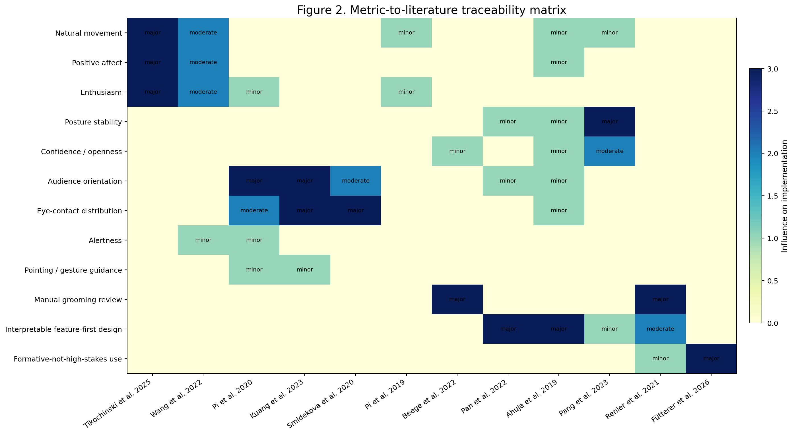
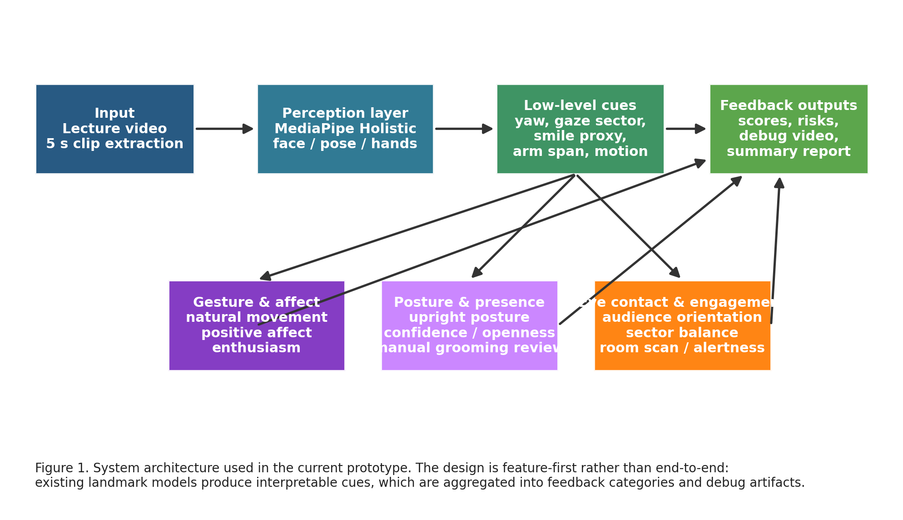
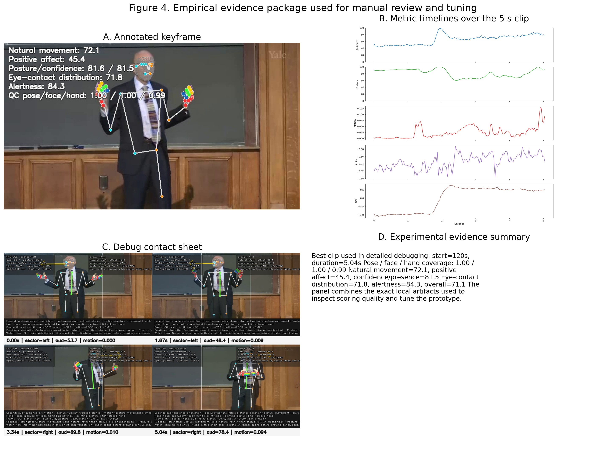
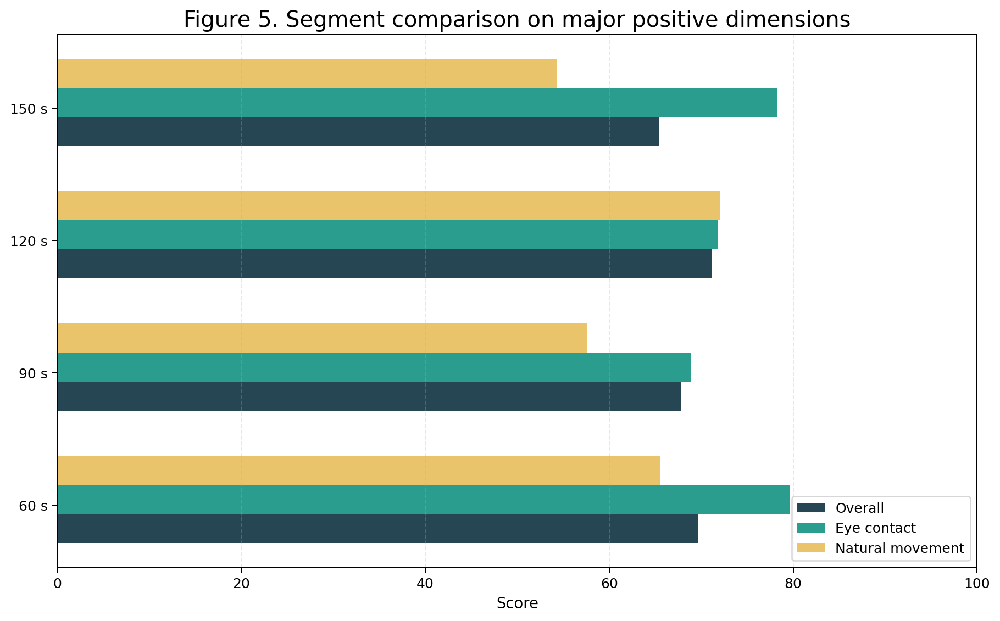
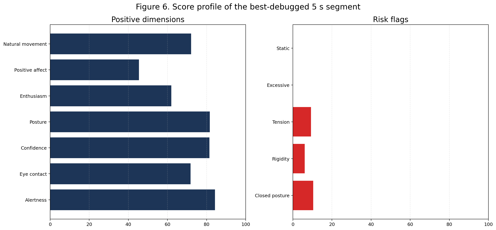
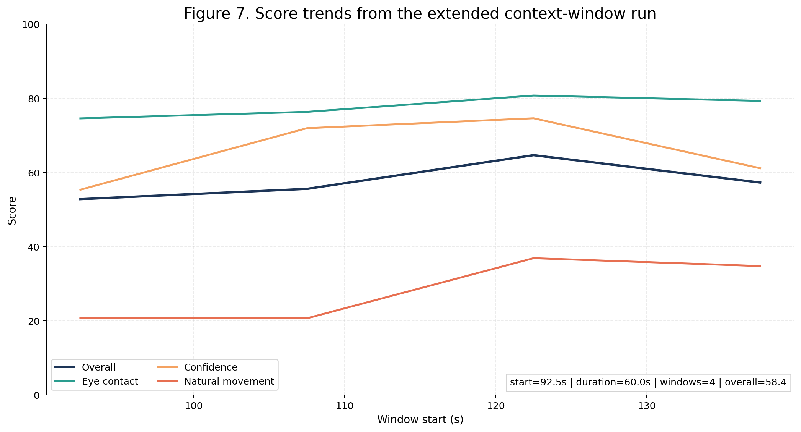
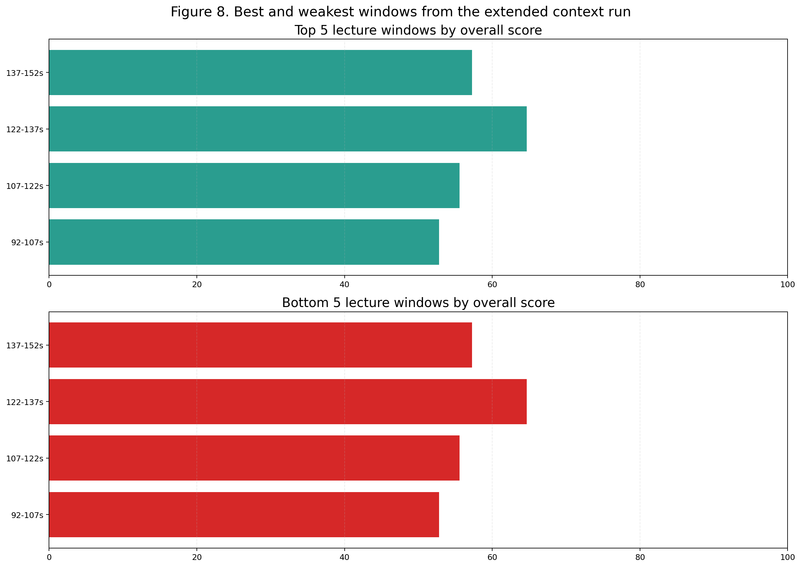
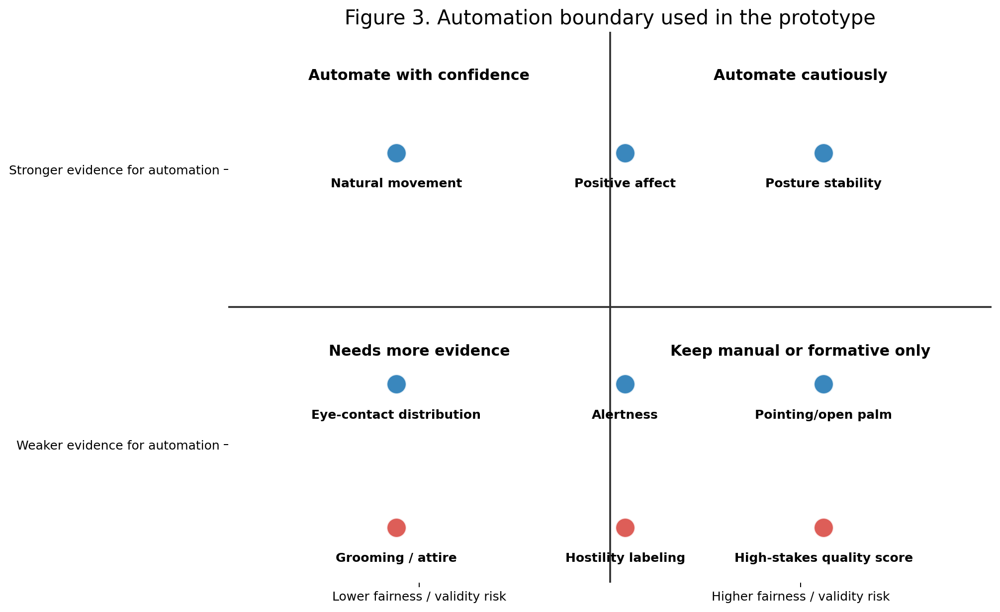

# Computer-Vision Nonverbal-Cue Analytics for Teacher Evaluation

Prepared from the implemented prototype in [../nonverbal_eval/pipeline.py](../nonverbal_eval/pipeline.py), the experiment runners in [../run_experiment.py](../run_experiment.py) and [../run_segment_batch.py](../run_segment_batch.py), and the generated artifacts in `../artifacts/` on 2026-03-15.

## Executive Summary

This document describes the current nonverbal-cue evaluation system built for teacher lecture videos under a strict engineering constraint: use existing off-the-shelf models and heuristic aggregation only, with no training or finetuning. The implemented system is therefore not a new machine learning model. It is a research-backed, modular analytics pipeline that converts landmark detections and motion traces into interpretable feedback about gestures and facial expression, posture and physical presence, and eye contact and engagement.

The system was designed around three requirements. First, it had to stay close to what the literature actually supports, rather than inventing broad teaching-quality claims from a short clip. Second, it had to be debuggable by a human reviewer, which is why the pipeline produces annotated keyframes, per-frame CSV traces, metric timelines, JSONL logs, and a full debug overlay video. Third, it had to respect the current deployment constraint of no training and no finetuning, which pushed the design toward pretrained perception models plus transparent scoring logic instead of end-to-end prediction.

The literature points to a consistent pattern. Expressive teaching behavior matters, but more is not always better. Gaze matters, but body orientation alone is not a strong enough proxy. Pose and gesture are useful, but their educational meaning depends on context. Appearance and professionalism matter to learners, but automating them from a single RGB view is not yet well justified or fair. Recent teaching-analytics systems that have been deployed successfully, such as EduSense, still emphasize modular and interpretable features rather than opaque scores. The system in this workspace follows that same feature-first logic.

The current prototype tracks the following major dimensions:

- `Natural movement`
- `Positive affect`
- `Enthusiasm`
- `Posture stability`
- `Confidence / presence`
- `Audience orientation`
- `Eye-contact distribution`
- `Alertness`
- `Static behavior risk`
- `Excessive animation risk`
- `Tension / hostility risk` as a low-confidence tension proxy, not a definitive emotion classifier
- `Rigidity risk`
- `Closed posture risk`
- `Grooming / professional appearance` as manual review only

The system was tested on `/workspace/Lecture_1_cut_1m_to_5m.mp4` using both a single-clip experiment and a four-segment comparison. The best 5-second debugging segment was `120s-125s`. On that clip the final scores were:

- `Natural movement`: `72.05`
- `Positive affect`: `45.42`
- `Enthusiasm`: `62.01`
- `Posture stability`: `81.64`
- `Confidence / presence`: `81.50`
- `Audience orientation`: `65.88`
- `Eye-contact distribution`: `71.79`
- `Alertness`: `84.25`
- `Overall heuristic nonverbal score`: `71.14`

To add more context without paying the cost of full-length native-fps inference, the system was also run on a `60s` window centered around that earlier clip. The analyzed interval was `92.5s-152.5s`, extracted at `12 fps`, yielding `721` analyzed frames. That run completed in about `97s` wall-clock time, with `90.31s` spent inside the main inference pass. Its clip-level summary was:

- `Natural movement`: `24.30`
- `Positive affect`: `49.77`
- `Posture stability`: `79.42`
- `Audience orientation`: `70.90`
- `Eye-contact distribution`: `79.89`
- `Alertness`: `85.09`
- `Excessive animation risk`: `60.98`
- `Overall heuristic nonverbal score`: `58.40`

Within that minute-long context window, the strongest `15s` block was `122.5s-137.5s` with an overall score of `64.66`, and the weakest was `92.5s-107.5s` with an overall score of `52.79`.

An important tuning result came from the debug workflow. The first audience-orientation implementation over-relied on a brittle nose-cheek geometry proxy and scored the clip implausibly low. After frame-level visual inspection, the metric was revised to weight facial symmetry and body-front evidence more appropriately. The same clip then produced an audience-orientation score of `65.88`, which aligned far better with the annotated evidence. This change is representative of the report's central claim: the prototype is not a black box, and each major score can be traced to explicit features, formulas, and source papers.

The system should be used for formative coaching and reflective review, not high-stakes evaluation. That conclusion is not only a design choice but a research-backed constraint. Recent work on multimodal automated teaching assessment shows promising validity in some subdimensions, but also variable predictive validity, confidentiality constraints, and continued dependence on expert ratings as ground truth. Accordingly, this prototype is positioned as a structured feedback instrument for review and iteration, not as a replacement for trained human observation.

## 1. Project Goal and Operating Constraints

The target use case is teacher lecture video analysis using computer vision and related nonverbal cues. The practical brief was:

- use existing methods and pretrained models only
- do not train or finetune anything
- run modular tests rather than one-shot claims
- generate logs and debugging evidence
- improve metrics only when the visual evidence justifies the change

Those constraints shaped the architecture directly. The system therefore uses `MediaPipe Holistic` for face, pose, and hand landmarks, and computes clip-level scores from interpretable low-level signals such as:

- face visibility and pose visibility
- face-front and body-front proxies
- shoulder alignment, torso lean, and head balance
- wrist motion and arm span
- smile proxy and eyebrow-eye openness ratios
- head-yaw-derived sector estimates
- simple gesture state flags such as `open_palm`, `pointing`, and `fist`

This is intentionally different from the dominant end-to-end trend in generic video modeling. The decision is consistent with recent teaching-quality work that keeps interpretability hooks at the feature layer so that teachers and reviewers can understand what produced the feedback (Pan et al., 2022; Ahuja et al., 2019).

One operational constraint emerged clearly during testing: in this environment, `MediaPipe Holistic` initializes on NVIDIA-backed EGL/OpenGL, but the effective inference path is still the `TensorFlow Lite XNNPACK` CPU delegate. In practice, that means the two A40 GPUs are not the main scaling lever for the current stack. The engineering answer was therefore not "use more GPU," but "reduce the analysis clip and the effective analysis fps while keeping the same perception model."

## 2. Metrics Tracked in the Current System

This section answers the first practical question a reviewer will ask: what exactly are we measuring, how are those measures used, and which articles justify each measure.

### 2.1 Metric Inventory

| Metric | Operationalization in the current pipeline | How the user sees it | Main supporting literature |
| --- | --- | --- | --- |
| `Natural movement` | Moderate-band score over mean wrist motion, gesture smoothness, and gesture extent | Positive feedback if movement looks organic rather than statue-like | Tikochinski et al. (2025); Wang et al. (2022) |
| `Positive affect` | Smile proxy mean, smile variability, and open-palm rate | Pleasant / welcoming facial and hand-affect proxy | Lawson et al. (2021); Tikochinski et al. (2025) |
| `Enthusiasm` | Blend of natural movement, positive affect, stage usage, and eye-contact distribution | High visible energy without assuming "more is always better" | Tikochinski et al. (2025); Wang et al. (2022) |
| `Posture stability` | Shoulder tilt, torso lean, head balance | Upright and relaxed stance | Pang et al. (2023) |
| `Confidence / presence` | Posture stability, arm-span openness, and audience orientation | Confident rather than closed-off physical presence | Pang et al. (2023); Beege et al. (2022) |
| `Audience orientation` | Weighted combination of face-front and body-front scores | Room-facing behavior rather than side-turned delivery | Pi et al. (2020); Kuang et al. (2023) |
| `Eye-contact distribution` | Audience orientation, sector balance, and room-scan rate | Whether attention appears distributed across the room | Pi et al. (2020); Kuang et al. (2023); Smidekova et al. (2020) |
| `Alertness` | Eye-open ratio, audience orientation, posture stability | Looks alert and attentive | Pi et al. (2020); Lawson et al. (2021) |
| `Static behavior risk` | Inverse of gesture motion and stage range | Warns about statue-like delivery | Wang et al. (2022) |
| `Excessive animation risk` | Peak motion, high gesture extent, and over-frequent scan transitions | Warns when movement may distract rather than support instruction | Wang et al. (2022) |
| `Tension / hostility risk` | Low smile, low facial variability, low mouth openness, fist proxy, low brow-eye openness | Low-confidence tension flag only | Lawson et al. (2021); Renier et al. (2021) |
| `Rigidity risk` | Low motion variance and low facial variability | Warns about tense or overly strict presentation style | Wang et al. (2022) |
| `Closed posture risk` | Low arm-span openness plus low audience orientation | Warns about slouching or closed body language | Pang et al. (2023); Beege et al. (2022) |
| `Grooming / appearance` | Not automated; manual review required | Explicitly reported as manual | Beege et al. (2022); Renier et al. (2021); Futterer et al. (2026) |

### 2.2 Supporting Internal Signals

Several internal metrics are not shown as headline user-facing outcomes but still matter for the final feedback. These include:

- `gesture_activity_score`
- `gesture_smoothness_score`
- `facial_expressivity_score`
- `stage_usage_score`
- `sector_balance_score`
- `room_scan_score`
- `gaze_transition_rate_per_sec`

These internal variables serve two roles. They stabilize the top-level metrics, and they make debugging possible. A reviewer can inspect whether an unexpected score came from a perception failure, a bad aggregation rule, or a mismatch between the heuristic and the educational interpretation.

### 2.3 What the System Deliberately Does Not Claim

The current prototype does **not** claim to automate:

- speech-gesture synchronization
- true pupil-level eye contact
- professional grooming or attire scoring
- definitive hostility, warmth, or abuse judgments
- overall teacher effectiveness in a high-stakes sense

Those boundaries are deliberate. They follow both the literature and the practical limitations of a single-camera landmark pipeline.

## 3. Research Basis and How Each Source Was Used

This section is the core traceability layer of the document. Each cited paper below is included because it directly shaped a metric, boundary, or architectural decision in the implemented prototype.



### 3.1 Tikochinski, Babad, and Hammer (2025)

**Citation:** Refael Tikochinski, Elisha Babad, and Ronen Hammer. "Teacher's nonverbal expressiveness boosts students' attitudes and achievements: controlled experiments and meta-analysis." *International Journal of Educational Technology in Higher Education*, 22, 74 (2025). DOI: `10.1186/s41239-025-00566-6`.

This paper was used as the strongest direct justification for keeping `expressiveness`, `visible energy`, and `enthusiasm` as positive dimensions in the system. The study reports six samples with `N = 1465` and a meta-analytic summary showing not only better teacher and lecture evaluations but also better learning outcomes. It therefore supports the proposition that teacher nonverbal expressiveness is not merely cosmetic.

**How it influenced the implementation:**

- It justified the inclusion of `natural_movement_score` as a positive metric rather than treating movement as a nuisance variable.
- It justified the inclusion of `enthusiasm_score` as a visible, behavior-linked construct rather than a purely verbal or subjective trait.
- It supported the use of positive feedback phrases such as "engaged energy" and "approachable presence" when the evidence is present.

**What we did not import from it:**

- We did not treat the paper as license to infer direct learning gains from a short clip.
- We did not collapse expressiveness into a single monotonic "more is better" rule because other work shows a moderation effect.

### 3.2 Wang, Chen, Shi, Wang, and Xiang (2022)

**Citation:** Mengke Wang, Zengzhao Chen, Yawen Shi, Zhuo Wang, and Chengguan Xiang. "Instructors' expressive nonverbal behavior hinders learning when learners' prior knowledge is low." *Frontiers in Psychology*, 13:810451 (2022). DOI: `10.3389/fpsyg.2022.810451`.

This paper supplied the main cautionary constraint on expressiveness. It shows that expressive nonverbal behavior improved affective experience and reduced perceived difficulty, but hindered learning performance in the lower-prior-knowledge group. The effect was framed through the limited-capacity assumption and an expertise-reversal interpretation.

**How it influenced the implementation:**

- It is the main reason `natural_movement_score` is a **moderate-band** target, not a linear reward for larger motion.
- It directly motivated `excessive_animation_risk`.
- It also motivated `static_behavior_risk`, because the paper contrasts expressive and nonexpressive extremes rather than treating either extreme as universally optimal.
- It informed the report's repeated caution that the same visible behavior may have different instructional value depending on learner prior knowledge and content difficulty.

**What we did not import from it:**

- We did not attempt a learner-knowledge adaptive threshold, because the current system has no viewer-side data.
- We did not equate all expressive movement with distraction; the paper argues for moderation, not suppression.

### 3.3 Lawson, Mayer, Adamo-Villani, Benes, Lei, and Cheng (2021)

**Citation:** Alyssa P. Lawson, Richard E. Mayer, Nicoletta Adamo-Villani, Bedrich Benes, Xingyu Lei, and Justin Cheng. "The positivity principle: do positive instructors improve learning from video lectures?" *Educational Technology Research and Development*, 69, 3101-3129 (2021). DOI: `10.1007/s11423-021-10057-w`.

This paper was used to sharpen what `positive affect` should mean in the system. The study manipulated positive versus negative instructor emotional tone through voice, gestures, facial expression, body positioning, and eye gaze. It found strong effects on perceived facilitation, credibility, and engagement, with delayed-posttest benefits under the positivity principle.

**How it influenced the implementation:**

- It supported the idea that visible positive affect matters educationally.
- It shaped the interpretation of `positive_affect_score` as more than a smile detector. The score is intended as a lightweight proxy for welcoming emotional tone.
- It influenced the user-facing interpretation of `tension_hostility_risk` as the negative pole of this dimension.

**What we did not import from it:**

- We did not model vocal tone, which was part of the manipulated emotional expression in the study.
- We did not map single facial snapshots directly to emotion labels such as `happy` or `frustrated`.

### 3.4 Pi, Xu, Liu, and Yang (2020)

**Citation:** Zhongling Pi, Ke Xu, Caixia Liu, and Jiumin Yang. "Instructor presence in video lectures: Eye gaze matters, but not body orientation." *Computers & Education*, 144, 103713 (2020). DOI: `10.1016/j.compedu.2019.103713`.

This paper is the strongest direct source for the gaze design in the current prototype. The study found that guided gaze shifted attention to slides and improved retention and transfer, whereas body orientation did not drive the same benefits. The conclusion was explicit: eye gaze has a stronger influence than body orientation.

**How it influenced the implementation:**

- `audience_orientation_score` weights face-front evidence more heavily than body-front evidence (`0.70 / 0.30`).
- `eye_contact_distribution_score` uses face/head orientation and scan behavior rather than coarse body angle alone.
- The audience-orientation debugging pass was evaluated against this principle. When the system produced a low score despite visually front-facing behavior, that result was treated as implausible precisely because the literature says gaze-like cues should dominate.

**What we did not import from it:**

- We did not claim actual gaze direction, because the pipeline has no pupil tracking.
- We did not treat a camera-facing look as automatically ideal in every context; guided gaze can be pedagogically better depending on visual content.

### 3.5 Kuang, Wang, Xie, Mayer, and Hu (2023)

**Citation:** Ziyi Kuang, Fuxing Wang, Heping Xie, Richard E. Mayer, and Xiangen Hu. "Effect of the Instructor's Eye Gaze on Student Learning from Video Lectures: Evidence from Two Three-Level Meta-Analyses." *Educational Psychology Review*, 35, 109 (2023). DOI: `10.1007/s10648-023-09820-7`.

This meta-analysis widened the evidence base around gaze. Guided gaze improved learning outcomes, direct gaze improved learning outcomes and parasocial interaction in certain comparisons, and both outperformed weaker alternatives such as averted gaze or no gaze.

**How it influenced the implementation:**

- It justified the decision to track both room-facing behavior and scan behavior, rather than privileging direct camera-facing orientation alone.
- It supported the inclusion of `room_scan_score` inside `eye_contact_distribution_score`.
- It supported the interpretive distinction between `audience_orientation` and `eye-contact distribution`: the first is about room-facing behavior, the second is about how attention appears to move over time.

**What we did not import from it:**

- We did not differentiate direct gaze from guided gaze at the semantic level because the current camera view and lack of synchronized slide context do not support that reliably.

### 3.6 Smidekova, Janik, and Najvar (2020)

**Citation:** Hana Smidekova, Tomas Janik, and Petr Najvar. "Teachers' Gaze over Space and Time in a Real-World Classroom." *Journal of Eye Movement Research*, 13(4) (2020). URL: `https://www.mdpi.com/1995-8692/13/4/28`.

This paper is important because it studies teacher gaze in authentic classrooms over multiple full lessons rather than single lab manipulations. It frames gaze as a spatial and temporal allocation problem and operationalizes classroom areas of interest.

**How it influenced the implementation:**

- It motivated the `left / center / right` sector model used in the prototype.
- It is the reason the system reports `sector_distribution`, `sector_balance_score`, `gaze_transition_count`, and `gaze_transition_rate_per_sec`.
- It reinforced that gaze behavior should be analyzed over time rather than through a single frame.

**What we did not import from it:**

- We did not claim mutual eye contact, because the study used teacher eye-tracking with student AOIs, while the current prototype uses only teacher video.

### 3.7 Pi, Zhang, Zhu, Xu, Yang, and Hu (2019)

**Citation:** Zhongling Pi, Yi Zhang, Fangfang Zhu, Ke Xu, Jiumin Yang, and Weiping Hu. "Instructors' pointing gestures improve learning regardless of their use of directed gaze in video lectures." *Computers & Education*, 128, 345-352 (2019). DOI: `10.1016/j.compedu.2018.10.006`.

This paper justifies keeping gesture guidance distinct from generic motion. It found that pointing gestures improved learning performance, visual search efficiency, and attention to relevant content, regardless of directed gaze.

**How it influenced the implementation:**

- It motivated explicit hand-state detection for `pointing_frame` and `open_palm_frame`.
- It is why gesture feedback is not limited to movement amount; the type of movement matters.
- It supported the current feedback language that interprets some gestures as instructional guidance rather than mere animation.

**What we did not import from it:**

- We did not claim slide-target accuracy, because the current lecture clip is not aligned with explicit content targets.

### 3.8 Beege, Krieglstein, and Arnold (2022)

**Citation:** Maik Beege, Felix Krieglstein, and Caroline Arnold. "How instructors influence learning with instructional videos - The importance of professional appearance and communication." *Computers & Education*, 185, 104531 (2022). DOI: `10.1016/j.compedu.2022.104531`.

This paper was relevant because the user requirements explicitly included grooming and professional appearance. Beege et al. show that professional appearance and communication can matter for parasocial processes, intrinsic motivation, cognitive load, retention, and transfer.

**How it influenced the implementation:**

- It justified keeping `grooming / professional appearance` in the rubric as a legitimate review dimension.
- It simultaneously supported the decision **not** to automate that dimension from landmarks alone. The paper studies perceived professionalism in a broader design sense, not a facial-landmark proxy.

**What we deliberately concluded from it:**

- Appearance matters enough to mention.
- Appearance is not measured fairly enough by the current pipeline to score automatically.

That is an inference from the paper plus the current technical limitations, not a direct claim from the paper itself.

### 3.9 Polat (2022)

**Citation:** Hamza Polat. "Instructors' presence in instructional videos: A systematic review." *Education and Information Technologies* (2022). DOI: `10.1007/s10639-022-11532-4`.

This review synthesizes `41` studies and reports that instructor presence is generally affectively positive, but cognitive and social results are mixed. It also notes that gaze, gesture, and facial expression are the most common instructor cues studied in instructional videos.

**How it influenced the implementation:**

- It supported the decision to track the three cue families most consistently studied: gaze/head orientation, gesture/pose, and facial expression.
- It reinforced a cautious design stance: subjective and social responses often improve even when transfer benefits are inconsistent.

### 3.10 Ahuja et al. (2019) and the EduSense design line

**Citation:** Karan Ahuja, Dohyun Kim, Franceska Xhakaj, Virag Varga, Anne Xie, Stanley Zhang, Jay Eric Townsend, Chris Harrison, Amy Ogan, and Yuvraj Agarwal. "EduSense: Practical Classroom Sensing at Scale." *Proceedings of the ACM on Interactive, Mobile, Wearable and Ubiquitous Technologies*, 3(3), 1-26 (2019). Project page: `https://spice-lab.org/projects/EduSense/`.

EduSense is important here not because the current prototype reproduces it technically, but because it represents a mature design philosophy for teacher-facing classroom sensing: real-world deployment, modular sensing, and interpretable outputs. The project reports a cohesive, real-time, in-the-wild evaluated system and frames its outputs as theoretically motivated classroom features.

**How it influenced the implementation:**

- It strongly supported the decision to expose interpretable features instead of a single opaque score.
- It justified the debug pack as a first-class output rather than an internal developer tool.
- It supported the use of pose, gaze, smile, hand and posture signals as a practical cue family.

### 3.11 Pan et al. (2022)

**Citation:** Yueran Pan, Jiaxin Wu, Ran Ju, Ziang Zhou, Jiayue Gu, Songtian Zeng, Lynn Yuan, and Ming Li. "A Multimodal Framework for Automated Teaching Quality Assessment of One-to-many Online Instruction Videos." *ICPR 2022*. PDF: `https://sites.duke.edu/dkusmiip/files/2023/03/A_Multimodal_Framework_for_Automated_Teaching_Quality_Assessment_of_One_to_many_Online_Instruction_Videos.pdf`.

Pan et al. is one of the most relevant architecture papers for this project because it explicitly uses:

- mid-level behavior descriptors
- high-level interpretable features
- supervised assessment over clip-level teaching dimensions

The specific recognition stack in Pan et al. includes facial expression, head pose and gaze, speech emotion, diarization, and transcript-based features.

**How it influenced the implementation:**

- It directly reinforced the current two-layer design:
  - low-level cues: landmarks, motion, front-facing proxies, hand states
  - high-level interpretable metrics: natural movement, confidence, alertness, eye-contact distribution
- It supported clip-level aggregation and report-style outputs rather than single-frame judgments.

**What we did not import from it:**

- We did not attempt multimodal training or prediction of broad pedagogical dimensions such as empathy or time management.
- We kept only the feature-first structure because the no-training constraint ruled out the rest.

### 3.12 Pang, Lai, Zhang, Yang, and Sun (2023)

**Citation:** Shiyan Pang, Shuhui Lai, Anran Zhang, Yuqin Yang, and Daner Sun. "Graph convolutional network for automatic detection of teachers' nonverbal behavior." *Computers & Education: Artificial Intelligence*, 5, 100174 (2023). DOI: `10.1016/j.caeai.2023.100174`.

This paper supports posture and pose as legitimate teacher-behavior signals. It also underscores a familiar theme in this literature: classroom video can support automated detection of teacher nonverbal categories, but only with careful behavior definitions and datasets.

**How it influenced the implementation:**

- It justified the posture-centric branch of the pipeline.
- It reinforced the use of skeleton-derived proxies for stance, openness, and body behavior.

### 3.13 Renier, Schmid Mast, Dael, and Kleinlogel (2021)

**Citation:** Laetitia Aurelie Renier, Marianne Schmid Mast, Nele Dael, and Emmanuelle Patricia Kleinlogel. "Nonverbal Social Sensing: What Social Sensing Can and Cannot Do for the Study of Nonverbal Behavior From Video." *Frontiers in Psychology*, 12:606548 (2021). DOI: `10.3389/fpsyg.2021.606548`.

This paper provides the conceptual boundary that keeps the prototype honest. It distinguishes lower-level action or motion units from higher-level inferences, and argues that the more abstract the inference, the more context-dependent and potentially biased the automation becomes.

**How it influenced the implementation:**

- It is the main reason the system distinguishes between objective-ish units and subjective interpretations.
- It drove the decision to keep `grooming`, `hostility`, and `high-stakes quality` outside the automated core.
- It motivated the report's explicit separation between detected cues and interpreted feedback.

### 3.14 Futterer et al. (2026)

**Citation:** Tim Futterer, Ruikun Hou, Babette Buhler, Efe Bozkir, Courtney Bell, Enkelejda Kasneci, Peter Gerjets, and Ulrich Trautwein. "Validating automated assessments of teaching effectiveness using multimodal data." *Learning and Instruction*, 101, 102264 (2026). DOI: `10.1016/j.learninstruc.2025.102264`.

This paper is used primarily as a deployment and validity boundary. It is one of the strongest recent studies in the area, using pretrained encoders and multimodal data to generate `18` teaching-effectiveness subdimensions. Even there, predictive validity varied, the data were confidential, and the authors explicitly called for refinement before such methods can produce robust actionable systems.

**How it influenced the implementation:**

- It is the main reason the current report repeatedly frames the prototype as `formative-not-high-stakes`.
- It justifies reporting uncertainty, coverage warnings, and manual-review requirements.

## 4. System Architecture and Why It Looks This Way



The architecture is intentionally simple and inspectable:

1. extract a short clip from a lecture video
2. run pretrained landmark detection on face, pose, and hands
3. compute low-level geometric and temporal cues frame by frame
4. aggregate those cues into clip-level interpretable scores
5. generate user-facing feedback, debug artifacts, and logs

### 4.1 Input and Perception Layer

The current implementation uses `MediaPipe Holistic` as the perception backbone. That choice was practical rather than ideological:

- it is off the shelf
- it is fast enough for this workload
- it detects face, pose, and hands together
- it enables debugging at the landmark level

The model outputs are then transformed into derived cues:

- `face_front_score_frame`
- `body_front_score_frame`
- `audience_orientation_score_frame`
- `posture_score_frame`
- `gesture_extent_frame`
- `signed_yaw_proxy`
- `gaze_sector`
- `smile_proxy`
- `mouth_open_ratio`
- `eye_open_ratio`
- `brow_eye_ratio`
- `open_palm_frame`
- `pointing_frame`
- `fist_frame`

### 4.2 Temporal Aggregation Layer

The next layer computes motion and stability over time. This is important because many classroom cues are not frame properties; they are temporal patterns. The prototype therefore adds:

- wrist-speed-based `gesture_motion`
- clip-level motion mean, peak, and standard deviation
- smoothness proxies from `SAL` and `LDLJ`
- horizontal movement range as `stage_range`
- sector counts and sector entropy
- scan-transition counts and rate

### 4.3 Score Construction

The implemented scoring logic is explicitly heuristic and transparent. For example:

```text
audience_orientation = 0.70 * face_front + 0.30 * body_front

eye_contact_distribution =
    0.45 * audience_orientation
  + 0.35 * sector_balance
  + 0.20 * room_scan_score

confidence_presence =
    0.45 * posture_stability
  + 0.25 * arm_span_openness
  + 0.30 * audience_orientation

enthusiasm =
    0.40 * natural_movement
  + 0.25 * positive_affect
  + 0.20 * stage_usage
  + 0.15 * eye_contact_distribution
```

The formulas are not presented as psychometric truths. They are engineering operationalizations chosen to align with the evidence base and remain debuggable.

### 4.4 Why a Heuristic Layer Was Necessary

The research literature contains strong guidance about which cue families matter, but it does not provide a single validated short-clip scoring recipe that can be dropped into this environment without retraining. The heuristic layer therefore serves as the bridge between:

- what pretrained perception can reliably output now
- what the literature says is educationally meaningful
- what a user can understand and comment on

This is also why the prototype includes a debug overlay video rather than only a score sheet.

## 5. Metric Design in Detail

This section explains each major metric in the language of the implementation.

### 5.1 Gesture and Facial Expression

#### Natural movement

`natural_movement_score` combines:

- average gesture motion
- gesture smoothness
- gesture extent

The score peaks in a middle band. Too little movement lowers the score. Excessively large movement also lowers the score. This directly encodes the research tension between expressiveness as a positive factor and over-animation as a potential distractor.

#### Positive affect

`positive_affect_score` uses:

- smile proxy mean
- smile proxy variability
- open-palm frequency

This is intentionally a weak proxy rather than an emotion-recognition claim. It is best interpreted as visible warmth / pleasantness evidence in the clip, not a definitive emotional state.

#### Enthusiasm

`enthusiasm_score` is not a raw perception output. It is an aggregate meant to represent visible energy through:

- movement
- positive affect
- some stage usage
- some room-facing distribution

This is closer to the educational construct of visible engagement than any single landmark feature.

#### Negative gesture-affect flags

The system also computes:

- `static_behavior_risk`
- `excessive_animation_risk`
- `tension_hostility_risk`
- `rigidity_risk`

These are especially important because the user requirements included both positive and negative indicators. The system therefore treats gesture and facial behavior as a balanced domain rather than a one-sided expressiveness score.

### 5.2 Posture and Physical Presence

#### Posture stability

`posture_stability_score` is derived from:

- shoulder tilt
- torso lean
- head balance relative to the torso

The target state is upright and stable, not ramrod straight. The metric is therefore about alignment rather than immobility.

#### Confidence / presence

`confidence_presence_score` adds two elements to posture:

- arm-span openness
- audience orientation

This turns pure posture into a broader presence construct. The idea is that a person can be upright but still closed off, or front-facing but unstable. The score only rises when these components align.

#### Closed posture risk

`closed_posture_risk` is computed from low arm-span openness and low room-facing behavior. It is meant to identify under-confident or visually closed delivery.

#### Grooming and professional appearance

This category is deliberately split:

- `professional appearance matters` in the literature
- `professional appearance is not automated` in this prototype

That distinction is critical. The system reports:

```json
"grooming_assessment": {
  "status": "manual_review_required",
  "reason": "A landmark-only pipeline is not a validated or fair way to score grooming or professional appearance."
}
```

This is an example of a dimension remaining in the rubric without being falsely automated.

### 5.3 Eye Contact and Engagement

#### Audience orientation

This metric estimates whether the instructor is visually oriented toward the room. It blends:

- facial symmetry and head-yaw information
- coarse shoulder-depth evidence

This metric went through the most important debugging revision in the project because the original geometry was too brittle.

#### Eye-contact distribution

This metric is broader than audience orientation. It combines:

- room-facing behavior
- distribution across left / center / right sectors
- scan transitions over time

This is the metric most closely aligned with the user's requirement that eye contact be distributed and that no section of the class be ignored.

#### Alertness

`alertness_score` uses:

- eye-open ratio
- audience orientation
- posture stability

The metric is intentionally simple. It does not claim wakefulness or attention as a cognitive state. It only captures visible alertness-related cues.

## 6. Experimental Protocol and Artifacts

The research-backed design would have been much weaker without a concrete experiment on the target video. The implemented workflow therefore included both single-clip and multi-segment testing.

### 6.1 Source Video

- Video: [../Lecture_1_cut_1m_to_5m.mp4](../Lecture_1_cut_1m_to_5m.mp4)
- Segment length tested in detail: `5 seconds`
- Batch scan start points: `60s`, `90s`, `120s`, `150s`
- Extended context run: `92.5s-152.5s` at `12 fps`

### 6.2 Why a 5-Second Clip Was Used

The 5-second window was not intended as a full lecture evaluation. It was chosen for:

- modular debugging
- rapid iteration
- visual validation of landmarks and metrics
- controlled before/after comparison when improving a metric

This is consistent with the development stage of the system.

### 6.3 Why the Extended Context Run Used 12 FPS

The user later requested a longer run, but not the cost of a full native-fps lecture pass. The chosen compromise was:

- a `60s` context window around the earlier `120s-125s` clip
- extracted at `12 fps`
- analyzed with the same landmark model and the same scoring logic

This choice preserved temporal context while materially reducing runtime. In the actual run:

- extraction took `3.03s`
- the main inference pass took `90.31s`
- the full pipeline completed in about `97s` wall-clock time

That tradeoff is the correct one for the current stack because the backend is effectively CPU-bound. The result is therefore more context than the original 5-second clip, without pretending that the available GPUs are accelerating the current inference path in a meaningful way.

### 6.4 Generated Artifacts

Primary outputs for the best-debugged run:

- [summary.md](../artifacts/nonverbal_eval_debug3/run_20260315T193444Z/summary.md)
- [summary.json](../artifacts/nonverbal_eval_debug3/run_20260315T193444Z/summary.json)
- [per_frame_metrics.csv](../artifacts/nonverbal_eval_debug3/run_20260315T193444Z/per_frame_metrics.csv)
- [metric_timelines.png](../artifacts/nonverbal_eval_debug3/run_20260315T193444Z/metric_timelines.png)
- [keyframe_annotated.jpg](../artifacts/nonverbal_eval_debug3/run_20260315T193444Z/keyframe_annotated.jpg)
- [debug_overlay.mp4](../artifacts/nonverbal_eval_debug3/run_20260315T193444Z/debug_overlay.mp4)
- [debug_contact_sheet.jpg](../artifacts/nonverbal_eval_debug3/run_20260315T193444Z/debug_contact_sheet.jpg)
- [events.jsonl](../artifacts/nonverbal_eval_debug3/run_20260315T193444Z/events.jsonl)

Batch comparison outputs:

- [comparison.md](../artifacts/nonverbal_eval_batch/batch_20260315T191630Z/comparison.md)
- [comparison.csv](../artifacts/nonverbal_eval_batch/batch_20260315T191630Z/comparison.csv)
- [batch_events.jsonl](../artifacts/nonverbal_eval_batch/batch_20260315T191630Z/batch_events.jsonl)

Extended context-run outputs:

- [summary_full.md](../artifacts/nonverbal_eval_long/run_20260315T202856Z/summary_full.md)
- [summary_full.json](../artifacts/nonverbal_eval_long/run_20260315T202856Z/summary_full.json)
- [per_frame_metrics_full.csv](../artifacts/nonverbal_eval_long/run_20260315T202856Z/per_frame_metrics_full.csv)
- [window_summary.md](../artifacts/nonverbal_eval_long/run_20260315T202856Z/window_summary.md)
- [window_summary.csv](../artifacts/nonverbal_eval_long/run_20260315T202856Z/window_summary.csv)
- [window_score_trends.png](../artifacts/nonverbal_eval_long/run_20260315T202856Z/window_score_trends.png)
- [window_risk_trends.png](../artifacts/nonverbal_eval_long/run_20260315T202856Z/window_risk_trends.png)
- [run_metadata.json](../artifacts/nonverbal_eval_long/run_20260315T202856Z/run_metadata.json)

### 6.5 Debugging Workflow

The pipeline was validated in the following order:

1. import and compile checks
2. clip extraction
3. frame extraction
4. frame-level landmark and metric extraction
5. timeline generation
6. debug overlay rendering
7. multi-segment comparison
8. metric correction when the visuals and the score disagreed

This workflow matters because it turns the system into a reviewable instrument rather than a score generator.



## 7. Experimental Results

### 7.1 Best-Debugged Segment

The selected segment was `120s-125s`.

Quality-control coverage was excellent:

- pose coverage: `1.00`
- face coverage: `1.00`
- hand coverage: `0.99`

Headline scores for the selected segment:

| Metric | Score |
| --- | ---: |
| Natural movement | 72.05 |
| Positive affect | 45.42 |
| Enthusiasm | 62.01 |
| Posture stability | 81.64 |
| Confidence / presence | 81.50 |
| Audience orientation | 65.88 |
| Eye-contact distribution | 71.79 |
| Alertness | 84.25 |
| Heuristic overall nonverbal score | 71.14 |

Risk flags for the same segment:

| Risk | Score |
| --- | ---: |
| Static behavior risk | 0.00 |
| Excessive animation risk | 0.00 |
| Tension / hostility risk | 9.25 |
| Rigidity risk | 6.07 |
| Closed posture risk | 10.43 |

Interpretation:

- the clip is clearly trackable
- posture and alertness are strong
- movement looks natural rather than inert
- positive affect is present but not especially strong
- no major negative flags were triggered in this short window

### 7.2 Multi-Segment Comparison

The batch comparison was useful because any single 5-second clip can be idiosyncratic.

| Start | Natural movement | Positive affect | Eye-contact distribution | Overall |
| --- | ---: | ---: | ---: | ---: |
| 60s | 65.53 | 42.71 | 79.62 | 69.60 |
| 90s | 57.61 | 45.21 | 68.90 | 67.80 |
| 120s | 72.05 | 45.42 | 71.79 | 71.14 |
| 150s | 54.28 | 47.80 | 78.28 | 65.44 |

The segment scan supports three conclusions:

- `120s` is the best overall 5-second window in the sampled set.
- `60s` and `150s` show stronger eye-contact distribution than `120s`, which suggests that room coverage is not constant across the lecture.
- `150s` produced the highest excessive-animation risk, showing that the moderate-band design is doing real work rather than acting as a cosmetic penalty.





### 7.3 One-Minute Context Window at 12 FPS

To move beyond a single short clip, the system was run on a `60s` window from `92.5s` to `152.5s`, centered around the earlier `120s-125s` inspection clip and sampled at `12 fps`.

Operational summary:

- analyzed duration: `60.00s`
- effective analysis fps: `12.00`
- analyzed frames: `721`
- extraction time: `3.03s`
- inference time: `90.31s`
- end-to-end wall-clock runtime: about `97s`

Clip-level summary for the full minute:

| Metric | Score |
| --- | ---: |
| Natural movement | 24.30 |
| Positive affect | 49.77 |
| Enthusiasm | 52.32 |
| Posture stability | 79.42 |
| Confidence / presence | 65.74 |
| Audience orientation | 70.90 |
| Eye-contact distribution | 79.89 |
| Alertness | 85.09 |
| Overall heuristic nonverbal score | 58.40 |

The longer context window changes the interpretation compared with the best isolated 5-second clip. The posture, eye-contact, and alertness signals remain strong, but the minute-long aggregate exposes a much higher `excessive_animation_risk` (`60.98`) and a correspondingly low `natural_movement_score` (`24.30`). In other words, once the time horizon is widened, movement no longer looks uniformly natural; it looks more variable and, at times, overly animated.

Subwindow breakdown using four non-overlapping `15s` windows:

| Source window | Overall | Natural movement | Positive affect | Eye-contact distribution | Excessive animation risk |
| --- | ---: | ---: | ---: | ---: | ---: |
| 92.5s-107.5s | 52.79 | 20.74 | 49.26 | 74.57 | 76.74 |
| 107.5s-122.5s | 55.56 | 20.64 | 46.73 | 76.34 | 63.16 |
| 122.5s-137.5s | 64.66 | 36.85 | 54.21 | 80.75 | 56.86 |
| 137.5s-152.5s | 57.27 | 34.72 | 45.34 | 79.30 | 55.00 |

Two points stand out:

- the strongest `15s` block is `122.5s-137.5s`, which aligns with the region surrounding the previously selected `120s-125s` clip
- every `15s` block shows moderate-to-high excessive-animation risk, so the lower minute-level score is not caused by one isolated outlier





## 8. What Changed During Tuning

The most important improvement pass involved `audience_orientation_score`.

### 8.1 Initial Problem

The first implementation leaned too heavily on a brittle nose-cheek geometry proxy. On the selected clip, it produced an audience-orientation score around `17.8`, which did not match human inspection of the annotated frame.

### 8.2 Evidence Used for Diagnosis

The following artifacts were used:

- the annotated keyframe
- the debug overlay video
- the per-frame audience score trace
- the overlaid gaze arrow
- the torso axis overlay

The visual evidence suggested that:

- the instructor was more front-facing than the score implied
- the face detector remained stable
- the problem was likely the geometry-to-score mapping, not a raw detection failure

### 8.3 Fix

The metric was rewritten to use:

- facial symmetry
- a softer yaw proxy
- body-front evidence from shoulder depth

The final frame score then aligned much better with the visible evidence and produced a clip-level audience orientation of `65.88`.

### 8.4 Why This Matters

This change is important methodologically. It demonstrates that:

- the pipeline is inspectable at the metric level
- errors can be corrected without retraining a model
- the debug artifacts are not decorative; they are necessary for valid engineering iteration

## 9. Validity, Automation Boundary, and Ethical Use



The prototype deliberately draws a line between `what can be automated reasonably now` and `what should remain manual or low-confidence`.

### 9.1 Reasonably Automatable in the Current Setup

These are the strongest current outputs:

- pose visibility and stability
- gesture movement amount and smoothness
- coarse openness versus closed posture
- face-front and body-front orientation
- rough room-sector distribution
- low-level hand-state flags such as open palm or pointing

These outputs are all close to the action-unit side of Renier et al.'s unit-versus-inference distinction.

### 9.2 Automatable Only with Caution

These outputs are useful but should be treated as proxies:

- positive affect
- enthusiasm
- eye-contact distribution
- alertness
- tension or hostility risk

They depend on interpretation of lower-level cues and therefore require human review, especially on short clips.

### 9.3 Manual or Formative Only

The current system should not automate:

- grooming or professional appearance judgments
- definitive hostility or abuse labels
- summative teacher effectiveness judgments
- personnel decisions

This boundary is supported by the literature and by the actual implementation constraints.

### 9.4 Why the System Is Formative, Not High Stakes

Three reasons matter:

1. The current pipeline uses heuristic aggregation rather than validated psychometric calibration.
2. Eye contact is a proxy from head/face orientation, not true gaze.
3. Even much stronger multimodal studies still report mixed validity and the need for refinement.

Accordingly, the appropriate use case is:

- coaching
- self-review
- mentor review
- hypothesis generation for discussion

The inappropriate use case is:

- employment evaluation
- formal rating replacement
- disciplinary evidence

## 10. Practical Interpretation of the Current Prototype

For the user's requested rubric, the current system supports the following interpretations.

### A. Gestures and Facial Expressions

**Positive indicators currently supported**

- Natural movement: yes
- Positive affect: yes, as a proxy
- Enthusiasm: yes
- Synchronization with speech: no, intentionally out of scope

**Negative indicators currently supported**

- Static behavior: yes
- Excessive animation: yes
- Rigidity: yes
- Hostility / abusive cues: partially, only as low-confidence tension proxy

### B. Posture and Physical Presence

**Currently supported**

- Upright relaxed posture: yes
- Under-confident / closed-off body language: yes

**Not currently automated**

- Grooming: manual review only

### C. Eye Contact and Engagement

**Currently supported**

- Distribution across audience sectors: yes, as a head-orientation proxy
- Alertness: yes, as a visible-cue proxy

**Important limitation**

- "Eye contact" here means estimated room-facing distribution, not mutual eye contact with specific students.

## 11. Recommendations for the Next Iteration

The next steps should stay within the same no-training philosophy.

### 11.1 Immediate Next Step

Run the entire lecture in sliding windows and generate a lecture-level summary:

- windowed scores every `5-10s`
- distribution plots across time
- stable strengths and recurrent watch items
- segment bookmarks where human review should focus

This is the highest-value extension because it turns a debugging prototype into a usable review system without changing the technical philosophy.

### 11.2 Add Audio Later, but Only If It Helps a Specific Metric

If the scope expands, audio should be added narrowly:

- speech rate and pause structure for pacing
- voice energy for enthusiasm
- later, optional speech-gesture alignment if needed

Audio should not be added merely because multimodal systems exist; it should be tied to a specific feedback need.

### 11.3 Keep the Debug Pack Permanent

The debug overlay, contact sheet, CSV traces, and JSONL event logs should remain part of the product flow, not just the development flow. Teacher-facing systems need auditability.

### 11.4 Calibrate With Human Rubric Review Before Any Wider Use

The next serious validation step is not model training. It is:

- define a small human rubric
- compare system outputs to human review on multiple lecture windows
- identify where the heuristics over- or under-estimate a construct

That is the correct next research move under the current constraints.

## 12. Conclusion

The implemented prototype is a research-grounded, interpretable nonverbal analytics system for teacher lecture video review. Its strongest contributions are not that it "solves teacher evaluation," but that it:

- operationalizes a literature-backed metric set using existing pretrained components
- keeps each score traceable to explicit cues and formulas
- generates debugging evidence that allows human correction of bad heuristics
- respects the automation boundary between observable cues and subjective inferences

The literature supports the overall design direction. Expressiveness, gaze, gesture, and posture matter. Interpretable feature-first systems are legitimate and practical. But the same literature also warns against overclaiming. Because of that, the right framing for the current system is not automated judgment, but evidence-based reflective feedback.

## References

1. Tikochinski, R., Babad, E., & Hammer, R. (2025). *Teacher's nonverbal expressiveness boosts students' attitudes and achievements: controlled experiments and meta-analysis*. International Journal of Educational Technology in Higher Education, 22, 74. https://doi.org/10.1186/s41239-025-00566-6
2. Wang, M., Chen, Z., Shi, Y., Wang, Z., & Xiang, C. (2022). *Instructors' expressive nonverbal behavior hinders learning when learners' prior knowledge is low*. Frontiers in Psychology, 13, 810451. https://doi.org/10.3389/fpsyg.2022.810451
3. Lawson, A. P., Mayer, R. E., Adamo-Villani, N., Benes, B., Lei, X., & Cheng, J. (2021). *The positivity principle: do positive instructors improve learning from video lectures?* Educational Technology Research and Development, 69, 3101-3129. https://doi.org/10.1007/s11423-021-10057-w
4. Pi, Z., Xu, K., Liu, C., & Yang, J. (2020). *Instructor presence in video lectures: Eye gaze matters, but not body orientation*. Computers & Education, 144, 103713. https://doi.org/10.1016/j.compedu.2019.103713
5. Kuang, Z., Wang, F., Xie, H., Mayer, R. E., & Hu, X. (2023). *Effect of the Instructor's Eye Gaze on Student Learning from Video Lectures: Evidence from Two Three-Level Meta-Analyses*. Educational Psychology Review, 35, 109. https://doi.org/10.1007/s10648-023-09820-7
6. Smidekova, H., Janik, T., & Najvar, P. (2020). *Teachers' Gaze over Space and Time in a Real-World Classroom*. Journal of Eye Movement Research, 13(4). https://www.mdpi.com/1995-8692/13/4/28
7. Pi, Z., Zhang, Y., Zhu, F., Xu, K., Yang, J., & Hu, W. (2019). *Instructors' pointing gestures improve learning regardless of their use of directed gaze in video lectures*. Computers & Education, 128, 345-352. https://doi.org/10.1016/j.compedu.2018.10.006
8. Beege, M., Krieglstein, F., & Arnold, C. (2022). *How instructors influence learning with instructional videos - The importance of professional appearance and communication*. Computers & Education, 185, 104531. https://doi.org/10.1016/j.compedu.2022.104531
9. Polat, H. (2022). *Instructors' presence in instructional videos: A systematic review*. Education and Information Technologies. https://doi.org/10.1007/s10639-022-11532-4
10. Ahuja, K., Kim, D., Xhakaj, F., Varga, V., Xie, A., Zhang, S., Townsend, J. E., Harrison, C., Ogan, A., & Agarwal, Y. (2019). *EduSense: Practical Classroom Sensing at Scale*. Proceedings of the ACM on Interactive, Mobile, Wearable and Ubiquitous Technologies, 3(3), 1-26. Project summary: https://spice-lab.org/projects/EduSense/
11. Pan, Y., Wu, J., Ju, R., Zhou, Z., Gu, J., Zeng, S., Yuan, L., & Li, M. (2022). *A Multimodal Framework for Automated Teaching Quality Assessment of One-to-many Online Instruction Videos*. ICPR 2022. PDF: https://sites.duke.edu/dkusmiip/files/2023/03/A_Multimodal_Framework_for_Automated_Teaching_Quality_Assessment_of_One_to_many_Online_Instruction_Videos.pdf
12. Pang, S., Lai, S., Zhang, A., Yang, Y., & Sun, D. (2023). *Graph convolutional network for automatic detection of teachers' nonverbal behavior*. Computers & Education: Artificial Intelligence, 5, 100174. https://doi.org/10.1016/j.caeai.2023.100174
13. Renier, L. A., Schmid Mast, M., Dael, N., & Kleinlogel, E. P. (2021). *Nonverbal Social Sensing: What Social Sensing Can and Cannot Do for the Study of Nonverbal Behavior From Video*. Frontiers in Psychology, 12, 606548. https://doi.org/10.3389/fpsyg.2021.606548
14. Futterer, T., Hou, R., Buhler, B., Bozkir, E., Bell, C., Kasneci, E., Gerjets, P., & Trautwein, U. (2026). *Validating automated assessments of teaching effectiveness using multimodal data*. Learning and Instruction, 101, 102264. https://doi.org/10.1016/j.learninstruc.2025.102264
