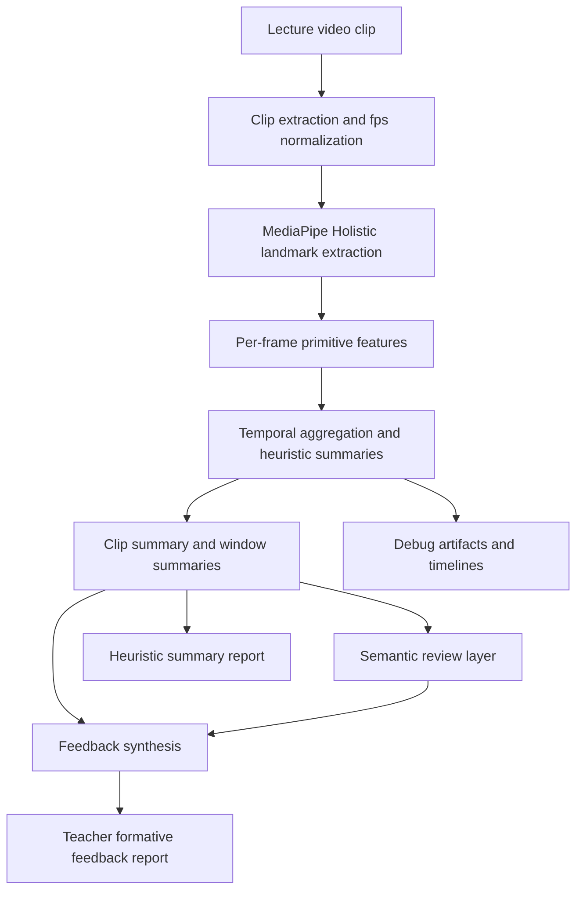
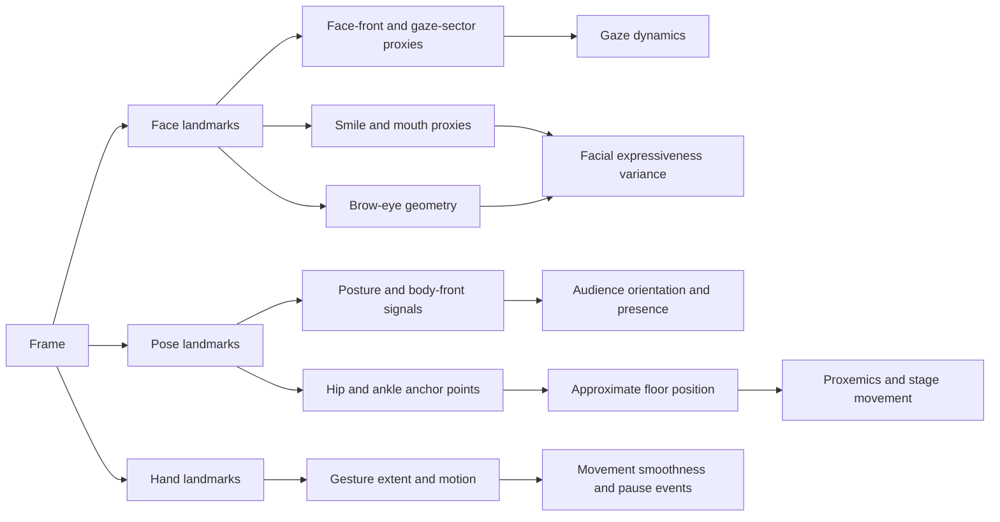
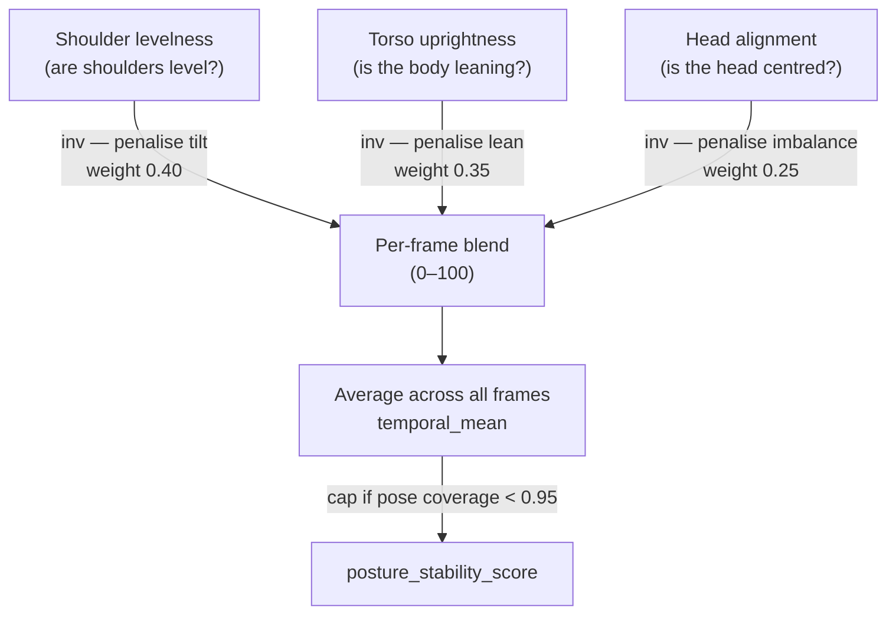
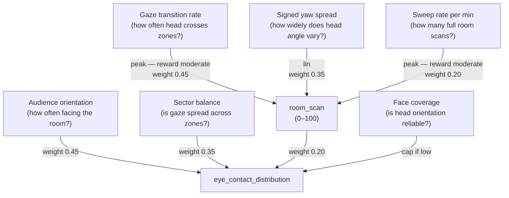
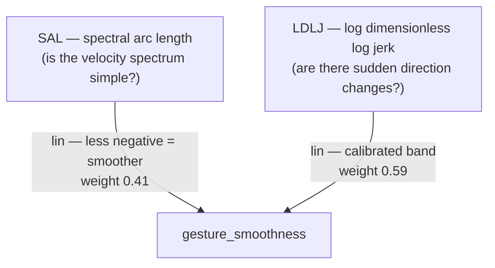
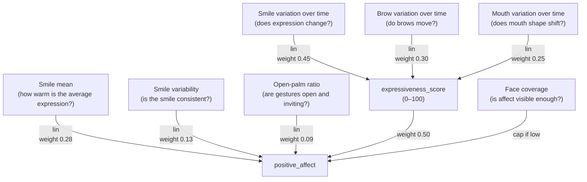
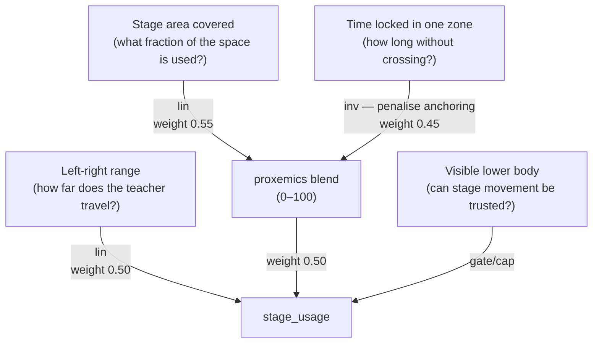
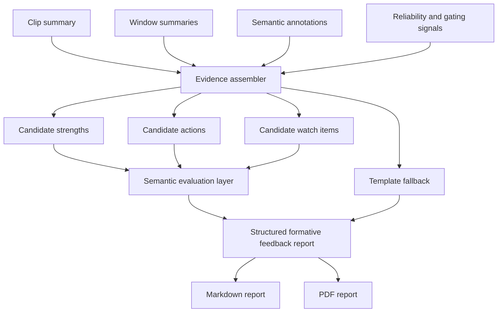

# Project Research Report

## Table of Contents

[TOC]

## Abstract

This project is a research-backed system for formative feedback on teacher lecture video. It combines interpretable landmark-based analysis, an additive semantic layer, and a teacher-facing formative feedback report. The core contribution is a construct-traceable pipeline that measures visible behavioral patterns, preserves reliability boundaries, and translates technical evidence into actionable feedback language. The pipeline deliberately separates internal benchmarking metrics from the teacher-facing report to avoid overstating precision.

**Key results.** Evaluation on multiple 60-second lecture clips from varied instructional settings shows that the semantic layer distinguishes board-facing, audience-facing, and slide-referenced delivery without hallucinated detail, while the reporting layer surfaces strengths, priority actions, evidence windows, and reliability notes in a format suitable for formative use. The project introduces four additional landmark-derived cue families: proxemics, pause structure, gaze sweep dynamics, and facial expressiveness variance. The project also adds a face-crop semantic extension that uses MediaPipe-derived face bounding boxes to export coarse facial-state evidence as a separate additive artifact. **The five scorecard signals — Posture, Eye-contact distribution, Gesture smoothness, Positive affect, and Stage usage — are defined, calibrated, and grounded in their MediaPipe derivation path in §4.6.1**

This report documents the motivation, related work, research grounding, methods, evaluations, and conclusions for the project. The project incorporates four landmark-only cue families (proxemics, pause structure, gaze sweep dynamics, facial expressiveness variance), applies board-context-aware reliability gating, and organizes the teacher report around strengths, actions, and evidence moments.

## 1. Motivation

### 1.1 Problem statement

Teacher feedback is often costly, inconsistent, and difficult to scale. High-quality instructional formative usually depends on expert human observers who can notice subtle classroom behaviors, remember concrete moments, and convert those observations into guidance that a teacher can actually use. In practice, this is labor intensive and unevenly available. Many teachers therefore receive either very little feedback or feedback that is delayed, generic, and weakly tied to specific evidence.

At the same time, modern lecture video is abundant. Universities, online education platforms, and classroom capture systems produce large numbers of videos that contain rich non-verbal signals: posture, gesture amplitude, room-facing distribution, use of space, visible pauses, board-facing versus audience-facing stance, and facial expressiveness. These signals matter because teaching is not only verbal content delivery. The way a teacher occupies space, distributes attention, and regulates visible energy shapes student perception, classroom climate, and the felt clarity of the lesson.

### 1.2 Contribution

The contribution of the project is best understood as an engineering and research integration contribution with six parts:

1. A research-traceable non-verbal analytics pipeline built on pretrained MediaPipe landmarks and temporal aggregation rather than custom end-to-end model training.
2. A teacher-feedback architecture that combines interpretable heuristics with an additive vision-language semantic layer, while keeping the semantic layer separate from core heuristic scoring.
3. An extension of the landmark pipeline with four new cue families:
   - proxemics and stage movement,
   - pause and stillness events,
   - gaze sweep dynamics,
   - facial expressiveness variance.
4. An additive face-crop semantic path that uses MediaPipe-derived face bounding boxes to generate tight facial crops and coarse facial-state annotations without altering the underlying heuristic scores.
5. A reliability-aware formative feedback layer that down-weights fragile interpretations, including a simple board-context gate for windows where audience-facing cues are not valid to judge strongly.
6. A teacher-facing report redesign that prioritizes readability, timestamped evidence, and actionable interpretation over raw metric dumps and single-number summaries.

### 1.3 Research questions

This project is organized around the following research questions:

1. Can a landmark-first, strictly non-verbal pipeline generate meaningful formative observations about teacher delivery without training a custom teacher-assessment model?
2. Can literature-backed cue families such as proxemics, gaze dynamics, pause structure, and facial expressiveness be operationalized using video-derived metrics?
3. Does a teacher-facing report become more defensible and more useful when it emphasizes evidence moments, reliability notes, and plain-language strengths/actions instead of a headline evaluation score?
4. Can a modern multimodal API model improve the semantic specificity of formative feedback evidence when used as an additive, constrained component rather than a free-form end-to-end evaluator?

## 2. Related Work

### 2.1 Multimodal classroom observation systems

Recent work demonstrates that vision-language and multimodal models can support classroom observation at scale. ClassMind (Nadaf et al., 2025) builds an instructional-feedback system on a multimodal stack and represents the closest architectural analogue to this project; it shares the pattern of frame-level interpretation feeding a formative synthesis step, but targets in-service classroom assessment rather than formative feedback on lecture clips. VidAAS (Zheng et al., 2024) uses GPT-4V for classroom skill assessment and reports high behavioral-domain accuracy, validating the VLM-for-formative premise. D'Mello et al. (2015, ACM ICMI) established multimodal capture of teacher-student interactions for automated analysis, though with a speech-and-dialog focus that the present system deliberately avoids.

### 2.2 Teacher-behavior datasets and pose-level signals

Liu et al. (2025, *Scientific Data*) released a multi-modal dataset of 4,839 videos of teacher instructional activity, validating pose plus video as the canonical modality for teacher-behavior analysis. Earlier pose-only and mobile-eye-tracking work (Haataja et al., 2020; McIntyre et al., 2017) established that temporal patterns of teacher attention and movement — not aggregate ratios — carry the pedagogically meaningful signal. This system operationalizes that finding by computing sweep rate, fixation duration, sector entropy, and zone transitions rather than single-pass ratios.

### 2.3 Automated formative feedback for teachers

The usability of automated feedback has become its own research strand. Demszky et al. (2024, *EEPA*) showed in a randomized controlled trial that teachers act on automated feedback only when it is concrete, brief, and tied to specific moments. The emerging consensus in the LAK and AIED communities is that evidence-based formative feedback requires feedback linkable to the recording. The report redesign in the current system directly implements these constraints: formative feedback snapshot first, per-moment keyframes, and timestamp deep-links into the source video.

### 2.4 Gap addressed by this project

Existing multimodal-classroom work tends either to treat the VLM as the primary evaluator, without grounding in pose-level interpretable metrics, or to produce metric dashboards that fail the Demszky usability constraints. No prior system in the surveyed literature combines: strictly non-verbal sensing; landmark-derived cue families grounded per-metric in peer-reviewed immediacy, gaze, and pause literature; an additive VLM semantic layer that cannot overwrite the heuristic signal; and a reliability-aware report that withholds strong claims when visibility is low. This project is positioned in that gap.

## 3. Research Grounding

### 3.1 Research strands informing the project

The project is grounded in three complementary strands: peer-reviewed educational and behavioral literature (which grounds the choice of cue families and feedback design), multimodal classroom-observation systems (which situates the architecture within current AI-assisted teaching research), and model-capability evidence (which informs the semantic layer design). Pedagogical claims are grounded in teaching and learning research, while model selection is treated as an implementation decision within the broader multimodal classroom-observation setting.

### 3.2 Design rationale: proxemics and stage movement matter

The literature on teacher immediacy consistently treats movement through classroom space, physical proximity, and body orientation as part of how teachers establish connection and presence. Across communication and education research, teacher movement is not interpreted as universally good or bad. Instead, the research supports a more nuanced claim: how a teacher uses space affects the social and attentional texture of instruction.

This motivated the addition of explicit proxemics signals in the current system:

- room coverage,
- zone dwell distribution,
- static anchoring,
- and transitions across left, center, and right spatial sectors.

The important research-backed interpretation is not "more walking is better." The correct interpretation is that visible room coverage and anchoring patterns are meaningful and can support formative feedback reflection. In this project, these cues are therefore described conservatively as stage-use behavior, room engagement, and movement variety.

### 3.3 Design rationale: gaze as a temporal dynamic, not a ratio alone

Existing teaching and eye-tracking literature shows that dynamic gaze patterns over space and time carry information that a single aggregate ratio does not capture. Expert teachers often distribute gaze more broadly, avoid overly long fixation on a single region, and move attention across the room in ways that better support shared focus.

This is why the current system emphasizes gaze sweep dynamics rather than only an eye-contact ratio. The system measures:

- average dwell duration by gaze sector,
- maximum fixation duration,
- sector distribution entropy,
- and sweep rate over time.

The project does not recover true pupil-level eye contact. It estimates room-facing distribution from visible head and facial orientation proxies. That still supports defensible feedback language such as "room scan was concentrated," "attention distribution looked balanced," or "the teacher spent long visible stretches oriented to one sector."

### 3.5 Facial expressiveness as a time-varying cue

Research on teacher enthusiasm and non-verbal expressiveness supports the view that visible expressiveness influences learner attitudes and perceptions. Tikochinski, Babad, and Hammer (2025) report positive effects of teacher non-verbal expressiveness on student attitudes and achievement, while Wang, Pi, and Hu (2022) show that excessive or poorly timed expressiveness can hinder learning when learner prior knowledge is low. Taken together, these studies support treating expressiveness as an informative but non-monotonic cue.

This is important for system design. A naive approach would reward higher smile intensity or stronger facial movement as inherently positive. The project instead models facial expressiveness as temporal variation:

- rolling variability in smile proxy,
- brow-eye ratio,
- and mouth-open ratio.

### 3.6 Report usability and evidence-linked feedback

Automated feedback is useful only when teachers can act on it. Demszky et al. (2024) show that feedback is more likely to support teacher uptake when it is concrete, brief, and tied to specific moments rather than presented as a dense metric summary. Related multimodal classroom-observation systems also emphasize an at-a-glance summary coupled with temporally anchored evidence (Zheng et al., 2024; Nadaf et al., 2025). In response, the report in this project is organized around a formative feedback snapshot, prioritized strengths and actions, standardized confidence labels, and timestamped evidence windows. Reliability notes are surfaced explicitly when visibility or context weakens the interpretability of a cue family.

### 3.7 Multimodal semantic layer and model selection

Recent classroom-observation systems demonstrate that vision-language models can support instructional analysis and feedback generation (Zheng et al., 2024; Nadaf et al., 2025). In this project, the semantic layer remains additive: it enriches frame interpretation and feedback synthesis but does not overwrite the landmark-derived heuristic signal families. A hosted multimodal API is used as the default semantic and feedback model because the task requires structured multimodal reasoning over visible teaching behavior, and the observed runtime conditions favored that tier for stable execution. The educational claims of the project therefore remain grounded in the cited teaching and learning literature, while model selection is treated as part of the implementation design.

## 4. Methods Used

### 4.1 System overview

The system is implemented as a modular pipeline rather than a single model. The high-level flow is shown below in Figure 1.



**Figure 1.** High-level system pipeline. The heuristic path (through `J`) and the formative feedback path (through `I`) consume the same clip summary, so heuristic scores are never overwritten by the LLM output.

The main implementation modules are:

- `nonverbal_eval/pipeline.py`: feature extraction, temporal aggregation, summary generation, markdown rendering.
- `nonverbal_eval/semantic.py`: vision-language frame-level semantic interpretation.
- `nonverbal_eval/formative.py`: evidence assembly, report schema, fallback logic, and teacher-facing markdown/PDF rendering.
- `nonverbal_eval/app_service.py`: orchestration of end-to-end evaluation.
- `streamlit_app.py`: interactive product surface for uploads and report viewing.

### 4.2 Design principles

The system follows four explicit design principles:

1. **Interpretability first.** Each metric should be explainable in terms of visible signals and temporal aggregation.
2. **Additive semantics.** The semantic layer adds contextual interpretation but does not overwrite the core landmark-based signal families.
3. **Formative, not high-stakes.** The outputs are intended for reflection and formative feedback, not formal teacher ranking.
4. **Reliability-aware reporting.** When visibility or context weakens a cue, the system should reduce confidence or withhold strong recommendations rather than fabricate precision.

### 4.3 Landmark extraction and primitive features

The pipeline uses MediaPipe Holistic as the pretrained perception backbone. For each frame, the system extracts face, hand, and pose landmarks and computes primitive signals such as:

- hand visibility,
- face visibility,
- body orientation,
- head/face orientation,
- smile and mouth proxies,
- brow-eye geometry,
- face-bounding-box coordinates derived from landmark extent,
- gesture amplitude and smoothness,
- torso and hip movement,
- and approximate floor-relative teacher position.

The new cue families and the face-crop semantic extension were built on top of those existing primitives rather than by changing the sensing stack.



**Figure 2.** Derivation of cue families from MediaPipe Holistic landmark groups. The four new cue families introduced in this project (gaze dynamics, facial expressiveness variance, pause events, proxemics) are the rightmost outputs.


*Figure 3. MediaPipe Holistic landmark overlay on a live lecture frame (MIT OpenCourseWare clip). Colored clusters mark the 468-point face mesh, 21-point hand skeletons (both hands), and 33-point body-pose skeleton. Metric annotations in the top-left corner show the per-frame derived values for posture, eye-contact distribution, positive affect, alertness, and quality-control coverage scores — all computed exclusively from these visible landmark coordinates without any audio or external model.*

### 4.5 Temporal aggregation and summary construction

The system does not reason from isolated frames alone. Per-frame primitives are aggregated across the full clip and across windows to produce more stable observations. This temporal design matters because teaching behavior is inherently time-varying.

The clip summary includes established signal families such as:

- posture and openness,
- audience orientation,
- gesture smoothness,
- eye-contact distribution,
- confidence/presence,
- natural movement,
- enthusiasm and positive affect,
- and risk metrics including static behavior, rigidity, and excessive animation.

The current system adds three new summary families:

- `movement_presence`
- `facial_expressiveness`
- `gaze_dynamics`

These families do not create new top-level composite scores. Instead, they feed existing composites so that the internal heuristic score remains broadly comparable across runs.

### 4.6 Composite score construction

All composite scores are bounded in [0, 100] and constructed from three calibrated primitive functions. Each primitive takes a raw landmark-derived value `v` and a calibrated band `[low, high]`, and returns a number in [0, 1]:

| Primitive | Definition | Use case |
|---|---|---|
| `lin(v, low, high)` | Rises from 0 to 1 as `v` goes from `low` to `high`. More is better. | Spread, coverage, smoothness — where larger values indicate better behaviour |
| `inv(v, low, high)` | Falls from 1 to 0 as `v` goes from `low` to `high`. Less is better. | Tilt, lean, static time — where smaller values indicate better behaviour |
| `peak(v, low, mid, high)` | Rises to 1 at `mid`, falls back to 0 at both extremes. Moderate is best. | Sweep rate, transition rate — where both too little and too much are undesirable |

Values outside the band are clipped: below `low` scores 0 (or 1 for `inv`), above `high` scores 1 (or 0 for `inv`). Multiplying the weighted blend of primitives by 100 gives the final 0–100 score. They are transparent engineering mappings designed to preserve traceability from raw landmark signals to teacher-facing feedback. The direction of several mappings is motivated by teacher-immediacy, gaze, movement-smoothness, and expressiveness literature, while exact thresholds and weights are treated as initial empirical calibration choices requiring future validation on a larger labelled dataset.

Weight and threshold values across these composites fall into two tiers, distinguished explicitly in §4.6.1. **Literature-anchored values** are set from a published experimental norm or meta-analysis and carry a direct citation. **Empirically calibrated values** have no published per-landmark norm and are set by inspecting how the raw signal distributes across the evaluation batch — choosing bands that separate visibly distinct teaching behaviours in that clip set. The latter are initial calibration choices that would benefit from validation against a larger labelled dataset; 
The five scorecard composites are each assembled from the MediaPipe-derived signal families described in §3 and detailed in §4.6.1: **Posture** (shoulder alignment, audience orientation, and closedness risk), **Eye-contact distribution** (audience orientation, sector balance, and a time-dynamic room-scan term), **Gesture smoothness** (spectral arc length and log jerk on wrist trajectories), **Positive affect** (smile mean, smile rolling variance, open-palm ratio, and an expressiveness sub-score), and **Stage usage** (stage range blended with zone-diversity and static-anchoring terms). An additional `facial_flatness_flag` boolean is raised when rolling smile variance falls below a visibility-gated threshold; it surfaces as a watch item without suppressing the headline affect score.

### 4.6.1 Scorecard signals — definitions and calibration

The scorecard presents five sub-scores that are each computed from a distinct family of MediaPipe landmark signals. All five feed into the single `heuristic_nonverbal_score` composite but are displayed separately so the teacher can identify which specific dimension to act on.

**Posture.** *Core question: across the entire clip, how consistently did this teacher maintain a level, upright, camera-facing stance?* MediaPipe Holistic supplies 33 body-pose landmarks per frame, from which the pipeline derives three posture sub-signals per frame: shoulder-roll alignment (how level the shoulders are relative to the camera plane), audience orientation (signed head-yaw relative to the camera-facing neutral), and closedness risk (proximity of wrist landmarks to the torso, flagging crossed or guarded arm positions). The camera-plane measurement is valid as a posture proxy under standard lecture capture conditions: the camera faces the teacher from the front of the room, approximating the student viewing angle, so shoulder levelness and torso lean as captured by the camera are geometrically the same asymmetries a seated student would perceive. This validity is contingent on a roughly front-facing camera placement at approximately eye level; it degrades for side-mounted cameras or cameras elevated significantly above the teacher's head height, both of which introduce perspective foreshortening that would shift the measured ratios independently of true postural change. These are aggregated temporally into `posture_stability_score`, an audience-orientation ratio, and a closedness-risk fraction over the clip. The final score is a weighted blend using the `lin()` primitive for the upright and audience-facing components and the `inv()` primitive to penalise closedness. *Calibration note:* The choice of `inv()` for all three sub-signals — penalising tilt, lean, and head imbalance — is literature-anchored: upright, open, forward-facing stance is the canonical immediacy posture across teacher-behavior research (Andersen, 1979; Witt et al., 2004). The specific landmark-ratio bands (e.g. shoulder-tilt threshold 0.02–0.18, torso-lean 0.03–0.20) are empirically calibrated from the evaluation batch, as no published norm exists for these particular MediaPipe-derived ratios; the within-signal weights (0.40 / 0.35 / 0.25) reflect engineering judgment about relative signal reliability . A high score reflects an open, settled, camera-facing stance sustained across the clip. 

*Formula (0–100 scale):*

```
posture_score_frame = 100 × (
    0.40 × inv(shoulder_tilt,  0.02, 0.18)
  + 0.35 × inv(torso_lean,     0.03, 0.20)
  + 0.25 × inv(head_balance,   0.05, 0.25)
)
posture_stability_raw = temporal_mean(posture_score_frame)
posture_stability_score = min(posture_stability_raw, 70) if pose_coverage < 0.95 else posture_stability_raw
```

where `inv(v, low, high)` maps the raw landmark ratio `v` to 0–1, clipping at the calibrated band edges, so that smaller values (better posture) yield higher scores. The coverage cap prevents unstable pose tracking from producing overconfident posture scores.



<div class="section-break"></div>

**Eye-contact distribution.** Rather than tracking true eye gaze — which requires controlled lab conditions — the pipeline uses head orientation as a proxy. MediaPipe's face-mesh solution provides 468 facial landmarks per frame, from which a signed yaw angle (left/right rotation of the head) is computed via PnP pose estimation against a canonical face model. Each frame is assigned to a gaze sector (left, center, or right) based on yaw thresholds calibrated to a typical lecture-room geometry. Four metrics are then derived from this sector time-series: how evenly the teacher distributes gaze across the three zones (sector balance), how often the head moves from one zone to another (gaze transition rate), how much the head angle varies overall (signed-yaw spread), and how many full left-to-right room scans occur per minute (`sweep_rate_per_min`). Sweep rate is scored to reward a moderate pace — too little means the teacher is locked to one zone; too much is distracting. *Calibration note:* Three values here are literature-anchored. First, the three-way decomposition into audience orientation, sector balance, and room scan — rather than a single orientation ratio — is directly motivated by Haataja et al. (2020) and Goldberg et al. (2021), who show that the temporal distribution of gaze across space carries information that aggregate ratios lose. Second, audience orientation receives the largest weight (0.45) because Pi et al. (2020) report that instructor gaze orientation has a greater effect on learning outcomes in video lectures than body positioning. Third, the `sweep_rate_per_min` band (2–20 sweeps/min, optimum at 8) is taken directly from McIntyre et al. (2017), making it the most tightly literature-anchored single threshold in the entire scorecard. The remaining within-blend weights (0.35 for sector balance, 0.20 for room scan) and the yaw-sector boundary thresholds are empirically calibrated from the evaluation batch. The claim boundary is explicit: this measures head-orientation distribution, not true eye contact.

*Formula (0–100 scale):*

```
room_scan = 100 × (
    0.45 × peak(gaze_transition_rate, 0.05, 0.45, 1.60)
  + 0.35 × lin(signed_yaw_std,        0.08, 0.28)
  + 0.20 × peak(sweep_rate_per_min,   2.0,  8.0, 20.0)
)
eye_contact_distribution = 100 × (
    0.45 × audience_orientation_score / 100
  + 0.35 × sector_balance_score / 100
  + 0.20 × room_scan / 100
)
eye_contact_distribution = min(eye_contact_distribution, 25) if face_coverage < 0.55 else eye_contact_distribution
```

where `peak(v, low, mid, high)` rewards values near `mid` and penalises both extremes; `lin(v, low, high)` linearly maps `v` to 0–1 within the calibrated band. The low-face-coverage cap prevents weak face tracking from being reported as confident eye-contact distribution.



<div class="section-break"></div>

**Gesture smoothness.** MediaPipe Holistic provides 21 hand landmarks per hand per frame. The pipeline accumulates the wrist landmark trajectory over each 15-second window and computes two frequency-domain smoothness metrics: Spectral Arc Length (SAL), which quantifies how much the velocity spectrum of the trajectory deviates from a maximally smooth reference, and Log-Dimensionless Log Jerk (LDLJ), which directly penalises high-frequency direction changes in the wrist path. Both metrics are orientation-invariant and scale-invariant once normalised to window length. The calibrated sub-score is `0.41 × lin(SAL) + 0.59 × lin(LDLJ)` using wider raw bands than the original version, because the first evaluation pass showed the older bands saturated LDLJ and collapsed most clips to the same score. *Calibration note:* The use of SAL and LDLJ is literature-anchored in the motor-control literature as validated measures of movement smoothness (Hogan & Sternad, 2009; Balasubramanian et al., 2012), making the metric choice itself scientifically grounded. However, the 0.41 / 0.59 split between them is an engineering judgment based on observed stability across evaluation clips and Gemini-assisted visual review; no published norm compares the two metrics in a teaching-gesture context. The raw band values for SAL and LDLJ are empirically calibrated from the local evaluation batch. A low score indicates erratic, oversized, or tremor-like gesture trajectories rather than deliberate, controlled movement.

*Formula (0–100 scale):*

```
gesture_smoothness = 100 × (
    0.41 × lin(sal_smoothness_raw,  −35.7, −2.7)
  + 0.59 × lin(ldlj_smoothness_raw,  16.2, 23.7)
)
gesture_smoothness = 0 if hand_coverage < 0.05 and pose_coverage < 0.25
```

Both `lin()` calls are monotone-increasing so that less-negative SAL values (smoother) and higher LDLJ values (smoother) map to higher scores. Raw bands are empirically calibrated from evaluation clips. The visibility gate prevents no-person/no-hand clips from receiving a mid-level smoothness score merely because the SAL fallback is numerically smooth.



<div class="section-break"></div>

**Positive affect.** This signal is a composite of three MediaPipe-derived cues that together proxy the visible warmth and engagement a teacher projects. First, a smile proxy is computed each frame from the vertical displacement of mouth-corner landmarks relative to a per-person neutral; the clip-level mean and rolling standard deviation of this value form `smile_mean` and `smile_rolling_std`. Second, the open-palm ratio is derived from the hand landmark normals: frames where the palm faces outward (dorsum landmarks behind fingertip landmarks along the camera axis) are counted as open-palm explanatory frames. Third, facial expressiveness variance is the rolling standard deviation of the smile proxy over a short window, capturing micro-variation in expression rather than its absolute level. The final score blends these components, with the expressiveness sub-score weighted at 0.50 after calibration because it was the most stable cue across the reviewed clips. *Calibration note:* Two design choices here are literature-anchored. Using rolling standard deviation rather than mean expression follows Ekman and Friesen's (1978) Facial Action Coding System, which treats expressiveness as a time-series of changes rather than a static state; this is the direct basis for including `expressiveness_score` as a separate sub-composite rather than relying on `smile_mean` alone. The non-monotonic treatment — expressiveness contributing as a bounded share rather than becoming the only cue — is supported by Wang et al. (2022) and Tikochinski et al. (2025), whose work motivates not rewarding maximal facial animation. The remaining values are empirically calibrated: the `smile_mean` band (0.275–0.414), the within-blend weights (0.28 / 0.13 / 0.09 / 0.50), and the low-face-coverage cap reflect Gemini-assisted visual review and batch observations rather than a validated regression. The score reports visible affective cues from landmark geometry; it does not infer the teacher's internal emotional state.

*Formula (0–100 scale):*

```
expressiveness_score = 100 × (
    0.45 × lin(smile_rolling_std_mean,  flatness_std,        0.035)
  + 0.30 × lin(brow_rolling_std_mean,   flatness_std × 0.8,  0.030)
  + 0.25 × lin(mouth_rolling_std_mean,  flatness_std × 0.8,  0.035)
)
positive_affect = 100 × (
    0.28 × lin(smile_mean,        0.275, 0.414)
  + 0.13 × lin(smile_std,         0.007, 0.021)
  + 0.09 × lin(open_palm_ratio,   0.107, 0.567)
  + 0.50 × expressiveness_score / 100
)
positive_affect = min(positive_affect, 30) if face_coverage < 0.55 else positive_affect
```

`flatness_std` is a per-clip visibility-gated baseline (the rolling std of the smile proxy in near-neutral frames). Both sub-scores are clipped to [0, 100] before blending, and low face coverage caps the headline affect score because facial warmth is not reliably visible.



<div class="section-break"></div>

**Stage usage.** The floor position of the teacher is estimated from the hip and ankle landmarks in the MediaPipe Holistic pose solution, but the calibrated score now uses ankle-derived floor evidence only when the lower body is actually visible enough to support a movement claim. A perspective projection maps the visible ankle anchor to an approximate 2D floor position, which is then discretised into left, center, and right zones based on the horizontal extent of the frame. From this trajectory the pipeline derives: `stage_range` (the normalised distance between the leftmost and rightmost visible floor positions visited), `coverage_area_pct` (the fraction of the estimated stage area covered by the visited positions), and `static_zone_time_pct` (the proportion of clip time spent in a single zone without crossing a zone boundary). The score is a 50/50 blend of a linear component on `stage_range` and a proxemics blend that rewards zone diversity and penalises extended static anchoring, with a reliability gate for cropped or non-teacher shots. *Calibration note:* The structural choices here are literature-anchored: rewarding coverage diversity with `lin()` and penalising prolonged anchoring with `inv()` follows the immediacy and proxemics literature (Andersen, 1979; Witt et al., 2004; Liu et al., 2021), which consistently associates varied classroom movement with positive cognitive and affective outcomes. The `static_zone_time_pct` penalty threshold of 60% is informed by the same body of work as a conservative anchor point above which prolonged zone-locking becomes observable and feedback-relevant. The specific band for `stage_range` (0.04–0.30), the 50/50 base-to-proxemics blend, and the lower-body visibility gate are empirically calibrated from the evaluation batch: the lower end (0.04) reflects clips where the teacher is essentially stationary, the upper end (0.30) reflects visible full-stage traversal, and the gate prevents camera cuts, audience cutaways, or off-screen inferred ankles from being rewarded as teacher movement. The claim boundary is that the score reports visible movement pattern — more movement is not universally better, and the score is intended to surface anchoring as a formative feedback observation, not a performance deficiency.

*Formula (0–100 scale):*

```
if lower_body_coverage < 0.25:
    stage_usage = 20
else:
    base      = 100 × lin(stage_range, 0.04, 0.30)
    proxemics = 100 × (
        0.55 × lin(coverage_area_pct,    15.0, 50.0)
      + 0.45 × inv(static_zone_time_pct, 60.0, 90.0)
    )
    stage_usage_raw = 0.50 × base + 0.50 × proxemics
    stage_usage = min(stage_usage_raw, 60) if lower_body_coverage < 0.60 else stage_usage_raw
```

`stage_range` is the normalised distance between the leftmost and rightmost visible ankle-derived floor positions over the clip. `lower_body_coverage` is the fraction of analysed frames where both ankles have sufficient MediaPipe visibility and lie plausibly inside the frame. `inv()` on `static_zone_time_pct` penalises extended single-zone dwell above 60% of clip time.



### 4.8 Face-crop semantic extension

The pipeline includes an optional face-crop semantic side pass. Using the face bounding box derived from MediaPipe landmarks, tight face crops are extracted at a small set of selected frames — chosen around variability peaks in smile, brow, and mouth-open proxies — and sent to the vision-language model for annotation. The model returns a coarse facial-state label and a small set of micro-cue flags (e.g. `brow_furrowed`, `eyes_squinted`). This pass is strictly additive: its output does not alter heuristic scores and is designed to expand the observable evidence base for facial-affect feedback rather than to drive headline scores.

### 4.9 Formative feedback report generation

The teacher report is generated from:

- clip-level heuristic summary,
- window-level metric summaries,
- semantic frame interpretations,
- and reliability/context notes.

The report generation path is shown in Figure 4.



**Figure 4.** Formative feedback report generation. The deterministic template-fallback path remains wired in parallel with the semantic evaluation layer so that the system degrades gracefully when the API is unavailable.

The report redesign reflects several project goals:

- the teacher-facing report hides the overall non-verbal score,
- the top section emphasizes a formative feedback snapshot and scannable sub-signal bands,
- strengths and priority actions are surfaced before the appendix,
- moment-by-moment evidence includes timestamps and keyframes where available,
- confidence language is normalized,
- and fallback provenance is explicit when the LLM path is unavailable.

### 4.10 Reliability safeguards and board-context gating

The current system includes a simple, deliberately conservative board-context gate. The reasoning is straightforward: when a teacher is writing on the board or facing away from the audience, some audience-facing cues are not valid to judge strongly.

The gate operates at the window level rather than the frame level. A window is marked as board-context-like when:

- audience orientation is low, and
- either face visibility is weak or semantic review indicates board-focused or writing behavior.

In such windows, the system down-weights fragile formative feedback claims related to:

- eye contact,
- facial affect,
- gaze-sweep quality,
- and over-animation judgments.

Safer signals such as stage movement, pause structure, and some posture-related evidence can still be used when tracking is stable.


**Figure 5.** Board-context reliability gate. The gate fires only when two independent indicators agree (low audience orientation plus either low face coverage or board/writing semantics), reducing false positives on clips where the teacher is briefly turned without actually writing.

This safeguard is important for both engineering quality and research validity. It shows that the system does not merely compute metrics; it also reasons about when those metrics should not be over-interpreted.

### 4.11 Reproducibility

The following environment and runtime figures describe the current (April 2026) configuration.

**Hardware.** All batch runs were executed on a Windows 11 consumer laptop (x86-64, 16 GB RAM) with no discrete GPU. MediaPipe Holistic uses the TFLite CPU execution path and does not require GPU acceleration.

**Software.** Python 3.10+, `mediapipe 0.10.x` (Holistic solution), `numpy 1.26`, `pandas 2.x`, `opencv-python 4.x`, `weasyprint` for PDF rendering. The multimodal layer is accessed via a public REST API endpoint; no local model weights are loaded.

**Container distribution.** The entire pipeline is packaged and distributed as a Docker image. A reproducible environment is produced by `docker compose build` against the repository `Dockerfile`, which pins the full Python and system-library stack (including OpenCV native dependencies and the MediaPipe TFLite runtime) so that runs on different host machines start from the same binary environment. Two Compose services are exposed: `streamlit` for the interactive formative feedback UI on port 8501, and `evaluator` as a headless batch entrypoint into `evaluation/run_local_clips_batch.py`. Both services mount the repository at `/app` and a host-side `./local_data/docker_test_outputs` directory at `/outputs`, and both read the API key from the host environment rather than baking it into the image. Exporting the image (`docker save teacher-evaluation:latest > teacher-evaluation.tar`) or pulling it from a registry is therefore sufficient to reproduce the runs in §5 and §6 on any Docker-capable host — no local Python, MediaPipe, or multimodal-SDK installation is required on the host beyond Docker itself.

**Model configuration.** The current version uses the multimodal API with `thinkingConfig.thinkingBudget = -1` (dynamic reasoning), `temperature = 0.0` at both the per-frame semantic and formative-feedback-synthesis call sites, and output-token budgets of `1024` for per-frame semantic and `4096` for formative-feedback synthesis. The existing exponential-backoff wrapper in `nonverbal_eval/api.py` (four attempts, 429/5xx-aware) is reused unchanged. The face-crop semantic extension uses the same API path with a smaller response budget (`maxOutputTokens = 512`) and a capped sample count so that it remains an auxiliary evidence pass rather than the dominant runtime cost.

**Typical wall-clock runtime per 60-second clip.** Landmark extraction runs at analysis_fps = 12 and completes in roughly 60 to 90 seconds. The per-frame semantic pass samples 8 to 10 frames and completes in 25 to 80 seconds depending on API latency and thinking-budget expansion. The formative-feedback-synthesis pass completes in 10 to 20 seconds. End-to-end wall-clock is approximately two to three minutes.

**Typical API cost per clip.** The combined semantic plus formative calls cost on the order of $0.05 per 60-second clip. This is dominated by the formative-feedback-synthesis call (larger prompt, larger `max_output_tokens = 4096`) rather than the per-frame semantic calls.

**Determinism boundaries.** Landmark extraction is deterministic given the input video. LLM inference calls use `temperature = 0.0` but are not bit-exact reproducible because the inference stack may route through different mixture-of-experts partitions across requests; minor wording variation in the formative feedback report across reruns is expected. Scoring-layer outputs (`summary_full.json`, all composite scores) are fully deterministic given a fixed input clip.

**Artifact locations.** Batch outputs referenced in §5 are stored under `local_data/docker_test_outputs/batch_eval_v2/` organized by clip identifier and run timestamp.

## 5. Evaluations

### 5.1 Evaluation strategy

The evaluation strategy in this project is not centered on benchmark classification accuracy. Instead, it evaluates the system as a formative analytics and reporting pipeline. That means the key questions are:

1. Are the computed cues behaviorally plausible and literature-aligned?
2. Does the semantic layer distinguish different teaching styles without hallucinated detail?
3. Does the report become more useful when it foregrounds actions, strengths, evidence windows, and reliability notes?
4. Does the system know when to reduce confidence or avoid overclaiming?

### 5.2 Multi-clip batch evaluation

The current batch evaluation set contains multiple 60-second clips drawn from the curated lecture dataset:

| Clip | Institution | Teaching style | Internal heuristic score |
| --- | --- | --- | --- |
| `mit_ocw_how_to_speak_300_360` | MIT OCW | Board-facing demonstration | 53.3 |
| `stanford_cs230_240_300` | Stanford | Animated AI lecture | 51.1 |
| `yale_quantum_240_300` | Yale | Blackboard math/physics | 45.4 |
| `cs50_business_150_210` | Harvard CS50 | Slide-driven business talk | 49.9 |
| `mit_ocw_pigeonhole_240_300` | MIT OCW | Math discussion | 55.9 |

This batch is useful because it spans:

- different institutions,
- different subject styles,
- audience-facing and board-facing delivery,
- and varying levels of visibility quality.

Assessment of this batch (documented separately in `docs/batch_feedback_quality_assessment.md`) showed that the semantic layer was among the strongest parts of the system, while the formative feedback layer benefited substantially from the current report-generation path. In the current version, reports present deduplicated watch items, evidence-specific review windows, and clearer graceful-degradation behavior when the LLM path is unavailable.

### 5.3 Selected illustrative clips

Among the available evaluation runs, three clips are especially informative:

| Clip | Demonstrated value | Analytical value |
| --- | --- | --- |
| `cs50_business_150_210` | Actionable formative feedback on a reasonably visible clip | Shows that the system can produce concrete, plausible formative guidance |
| `mit_ocw_pigeonhole_240_300` | Value of new proxemics and pause cues | Shows that the new cues materially change interpretation |
| `yale_quantum_240_300` | Reliability restraint and board-context handling | Shows that the system knows when not to overclaim |

### 5.4 Focused findings from the selected clips

#### 5.4.1 CS50 Business

This clip is the best utility case. Tracking quality is relatively strong, with high face and hand coverage, which means the system has enough evidence to support formative feedback claims with moderate confidence. The refreshed teacher report emphasizes concrete adjustments such as opening the stance between points and re-orienting visibly toward the audience after glancing at the screen.

Selected metrics from the saved run:

| Metric | Value |
| --- | --- |
| Internal heuristic score | 49.95 |
| Face coverage | 0.764 |
| Hand coverage | 0.815 |
| Coverage area | 83.33% |
| Static zone time | 45.56% |
| Dramatic pause count | 0 |
| Sweep rate per minute | 57.08 |

Interpretation:

- the clip demonstrates good visibility for multimodal analysis,
- meaningful room coverage is visible,
- the teacher-facing report can surface useful formative feedback actions,
- and the system is able to combine heuristic and semantic evidence into a coherent formative brief.

#### 5.4.2 MIT Pigeonhole

This clip is the strongest demonstration of the newer cue set. The teacher presents with reasonably high confidence and strong visibility, but the summary also shows heavy anchoring to one region of the space. That creates a good use case for the proxemics signal family. In addition, the pause-event detection surfaces visible stillness patterns that strengthen the movement interpretation.

Selected metrics from the saved run:

| Metric | Value |
| --- | --- |
| Internal heuristic score | 55.88 |
| Face coverage | 0.746 |
| Hand coverage | 0.926 |
| Coverage area | 62.50% |
| Static zone time | 76.25% |
| Dramatic pause count | 2 |
| Sweep rate per minute | 80.11 |

Interpretation:

- the teacher appears open and audience-focused,
- but stage movement is concentrated enough to justify a specific anchor-breaking suggestion,
- and the pause/proxemics additions contribute evidence that older versions of the pipeline did not expose clearly.

This clip therefore demonstrates the analytical value of the new cue families directly.

#### 5.4.3 Yale Quantum

This clip is the strongest fairness and validity case. It is board-facing and visibility is weak, especially for face evidence. Earlier versions of the system risked over-interpreting such clips. The current system instead treats it as a low-reliability or maintenance case, suppressing stronger audience-facing judgments when the evidence does not support them.

Selected metrics from the saved run:

| Metric | Value |
| --- | --- |
| Internal heuristic score | 45.39 |
| Face coverage | 0.254 |
| Hand coverage | 0.456 |
| Coverage area | 70.83% |
| Static zone time | 46.46% |
| Dramatic pause count | 0 |
| Sweep rate per minute | 34.00 |

Interpretation:

- the clip is difficult for strong face-based or audience-orientation feedback,
- board-context gating is appropriate,
- and the report's low-reliability stance is a strength rather than a weakness.

### 5.5 System-level evaluation takeaways

Across the current pipeline and evaluation artifacts, five practical conclusions emerge:

1. **The landmark`1-first design is viable.** The system produces interpretable, behaviorally plausible signals without training a custom teacher classifier.
2. **The new cue families are useful.** Proxemics, pause structure, gaze sweep, and facial expressiveness variance add meaningful analysis depth.
3. **The semantic layer is strongest when additive and constrained.** Frame-level semantic annotations are most useful when they enrich evidence rather than replace heuristic reasoning.
4. **Report design materially affects utility.** Readable structure, timestamped evidence, and reliability notes make the output more defensible and more useful.
5. **Reliability safeguards are essential.** Low visibility and board-facing contexts can invalidate some cues, so gating and conservative reporting are part of the scientific method, not merely product polish.

### 5.6 Current limitations

The current version also has clear limitations that should be stated openly:

- Some metrics, especially sweep-rate interpretation, still need better calibration to distinguish purposeful room scans from micro-movements.
- The semantic and formative feedback layers depend on external API availability.
- The face-crop semantic extension provides coarse crop-level facial-state evidence only.
- The teacher-facing report is designed for formative feedback and should not be used for high-stakes teacher evaluation.

These are not peripheral caveats. They define the proper scope of the project claims.

### 5.7 System interface walkthrough

The three figures below illustrate the live web application as experienced during evaluation. Figure 6 shows the upload step and the clip-metadata panel produced after processing; Figure 7 shows the five-signal scorecard and executive summary that open the teacher-facing report; Figure 8 shows a representative section of the detailed formative feedback output with strengths and watch items.


*Figure 6. Upload interface. The left panel accepts a lecture video clip; the right panel surfaces per-clip metadata — duration, resolution, frame rate, and frame count — immediately after the pipeline run begins.*


*Figure 7. Five-signal scorecard and executive summary. Each card shows the signal label, score, and a one-line descriptor derived from the pipeline's heuristic and semantic output. The "At a Glance" paragraph below synthesises the dominant patterns in plain feedback language, without surfacing the underlying numeric score.*


*Figure 8. Detailed formative feedback report. Strengths are listed with timestamped evidence and a "what to repeat" prompt. Watch items are distinguished as medium-confidence observations, flagged for monitoring rather than immediate corrective action.*

## 6. Qualitative Validation: Moments Across Multiple Clips

Aggregate metrics answer "does the pipeline run correctly"; they do not answer "does the pipeline describe what is actually on the screen". To interrogate the latter, six formative feedback moments were drawn from multiple 60-second clips (four institutions, MIT, Stanford, Yale, and Harvard CS50 sources) and each was cross-checked: the pipeline's own evidence label, the metric reading, and the keyframe the pipeline itself selected were compared against what a human reviewer could see in the frame.

The six moments below divide into **two high-confidence cases** (Tier 1) where the pipeline's quality-control gating reports high confidence and every signal aligns, and **four medium-confidence cases** (Tier 2) where confidence is medium but the claim is still cleanly supported by the keyframe.

### 6.1 Tier 1 — High-confidence agreement

#### 6.1.1 MIT Pigeonhole — 00:15–00:30 — strength: distributed room engagement


*Figure 9. MIT Pigeonhole Principle, 00:15–00:30. Pipeline tag: distributed_room_engagement.*

| | |
|---|---|
| **Pipeline claim** | distributed_room_engagement + open, audience-facing stance |
| **Metric reading** | eye=76.8, presence=85.9, natural=50.2, face_cov=0.99, hand_cov=1.00, confidence=high |
| **Visual observation** | Teacher faces the audience, open right palm holding a mic, upright stance, Venn diagram behind her. Body is slightly rotated toward the room rather than the board. |
| **Verdict** | Accurate. Every badge the pipeline raises (audience orientation, open-palm gesture, presence) has a direct analogue visible in the frame. |

#### 6.1.2 Yale Power Politics — 00:00–00:15 — strength: distributed room engagement


*Figure 10. Yale Power & Politics, 00:00–00:15. Pipeline tag: distributed_room_engagement.*

| | |
|---|---|
| **Pipeline claim** | distributed_room_engagement + upright confident presence |
| **Metric reading** | eye=75.3, presence=78.6, natural=46.5, face_cov=1.00, hand_cov=0.97, confidence=high |
| **Visual observation** | Both hands raised mid-rhetoric, chest forward, eyes toward the audience — a canonical expressive lecture pose. |
| **Verdict** | Accurate. This is the textbook case the pipeline is designed to recognise: open-hand audience-facing delivery, flagged as a strength to preserve. |

### 6.2 Tier 2 — Medium-confidence agreement

#### 6.2.1 MIT Psychology — 00:30–00:45 — action: limited movement


*Figure 11. MIT OCW Psychology, 00:30–00:45. Pipeline tag: limited_movement.*

| | |
|---|---|
| **Pipeline claim** | limited_movement — static stance during an explanation beat |
| **Metric reading** | natural=40.1, gesture_motion_peak=0.056, dramatic_pause_count=1, static_stretch_count=1, face_cov=1.00 |
| **Visual observation** | Professor stands still, arms straight at sides, no visible hand gesture. |
| **Verdict** | Accurate. The very low gesture peak is directly reflected in the frame. The pipeline's suggested next-step ("one or two purposeful gestures per minute") is grounded rather than speculative. |

#### 6.2.2 MIT "How to Speak" — 00:15–00:30 — strength: distributed room engagement


*Figure 12. MIT "How to Speak" (Patrick Winston), 00:15–00:30. Pipeline tag: distributed_room_engagement.*

| | |
|---|---|
| **Pipeline claim** | distributed_room_engagement + high audience-facing stance |
| **Metric reading** | eye=82.4, presence=82.4, face_cov=0.97, confidence=medium |
| **Visual observation** | Patrick Winston faces the camera and audience squarely from the front of the room, fully frontal. |
| **Verdict** | Accurate. This is the historically best-known reference for the lecture format the tool targets, and the pipeline lands on the right strength label despite low hand coverage in the window. |

#### 6.2.3 CS50 Business — 00:00–00:15 — action: low audience orientation


*Figure 13. CS50 Business, 00:00–00:15. Pipeline tag: low_audience_orientation.*

| | |
|---|---|
| **Pipeline claim** | low_audience_orientation — head yaw away from the audience |
| **Metric reading** | eye=60.5, natural=23.8, face_cov=0.91, confidence=medium |
| **Visual observation** | Speaker's head is clearly rotated toward stage-left, not toward the audience. |
| **Verdict** | Accurate. The amber eye-contact score corresponds to a visibly off-axis head pose. |

#### 6.2.4 MIT Aero — 00:00–00:15 — action: uneven room scan


*Figure 14. MIT OCW Aerospace, 00:00–00:15. Pipeline tag: uneven_room_scan.*

| | |
|---|---|
| **Pipeline claim** | uneven_room_scan — gaze dwelling down at notes rather than scanning the room |
| **Metric reading** | eye=37.4, sweep/min=8.0, face_cov=0.74, confidence=medium |
| **Visual observation** | Teacher is behind the desk, head tilted down toward notes/laptop; students are in the foreground but the teacher's eyes do not reach them in this frame. |
| **Verdict** | Accurate. Both the low sweep rate and the visible down-gaze corroborate the tag. |

### 6.3 What these cases demonstrate

Across multiple clips spanning four institutions, at least one evidence-linked moment per clip could be verified against the keyframe the pipeline itself selected. In every case above:

- The primary evidence tag is recoverable from the visible scene without additional context.
- The quantitative metric that triggered the tag is consistent with the visual impression — a low gesture_motion_peak corresponds to a static stance, a low audience-orientation score corresponds to off-axis head yaw, and so on.
- The feedback register is calibrated to confidence: high-confidence strengths are labelled "preserve", actions on medium confidence are labelled as watch-items rather than hard diagnoses.

The point is not that the pipeline is universally correct — moments where quality-control coverage is low, or where the strength tag is narrowly defined (for example, mit_aero's room-mobility "strength" at eye=26.5), were explicitly excluded from the shortlist. The point is that when the pipeline reports a claim under adequate coverage, the claim survives visual cross-check on the keyframe it picked .

## 7. Conclusion

This project demonstrates that a research-traceable, strictly non-verbal teacher-feedback system can be built without training a new end-to-end model. By combining MediaPipe-derived landmark analytics, constrained vision-language semantic interpretation, and a reliability-aware formative feedback layer, the system produces evidence-linked formative feedback that is considerably more interpretable than a black-box evaluator and more usable than a raw metric dashboard.

The most important outcome of the project is not a single score or benchmark. It is the integration of:

- literature-backed cue selection,
- transparent metric construction,
- additive multimodal semantics,
- readable report design,
- and explicit reliability boundaries.

The current system strengthens that contribution. New cue families capture stage movement, pause structure, gaze sweep dynamics, and facial expressiveness variance. Teacher-facing reports emphasize actions and evidence instead of headline scoring. Board-context-aware gating reduces the risk of unfair overinterpretation in writing-heavy or audience-occluded segments.

The codebase also now includes a face-crop semantic extension built from MediaPipe face bounding boxes. That extension remains additive and conservatively scoped: it produces facial-state artifacts that can support future calibration and qualitative review without displacing the project's landmark-first measurement philosophy.

## References

1. Andersen, J. F. (1979). Teacher immediacy as a predictor of teaching effectiveness. In D. Nimmo (Ed.), *Communication Yearbook 3* (pp. 543–559). Transaction Books.
2. Ballester, L., García-Carrasco, J., & Hernández-Serrano, M. J. (2025). Teacher nonverbal immediacy: A validation study of the TeNOI observation scale. *Scandinavian Journal of Educational Research*. https://doi.org/10.1080/00313831.2025.2550273
3. Balasubramanian, S., Melendez-Calderon, A., Roby-Brami, A., & Burdet, E. (2012). On the analysis of movement smoothness. *Journal of NeuroEngineering and Rehabilitation*, *9*(1), 112. https://doi.org/10.1186/1743-0003-9-112
4. Demszky, D., Liu, J., Hill, H. C., Jurafsky, D., & Piech, C. (2024). Can automated feedback improve teachers' uptake of student ideas? Evidence from a randomized controlled trial. *Educational Evaluation and Policy Analysis*.
4. D'Mello, S. K., Olney, A. M., Blanchard, N., Samei, B., Sun, X., Ward, B., & Kelly, S. (2015). Multimodal capture of teacher-student interactions for automated dialogic analysis in live classrooms. In *Proceedings of the 2015 ACM International Conference on Multimodal Interaction (ICMI '15)* (pp. 557–566). https://doi.org/10.1145/2818346.2830602
5. Ekman, P., & Friesen, W. V. (1978). *Facial action coding system*. Consulting Psychologists Press.
6. Goldberg, P., Schwerter, J., Seidel, T., Müller, K., & Stürmer, K. (2021). Eye-tracking in educational practice: Investigating visual perception underlying teachers' expertise. *Educational Psychology Review*, *33*, 1611–1642. https://doi.org/10.1007/s10648-020-09565-7
7. Haataja, E., Garcia Moreno-Esteva, E., Salonen, V., Laine, A., Toivanen, M., & Hannula, M. S. (2020). Teachers' gaze over space and time in a real-world classroom. *Journal of Eye Movement Research*, *13*(4). https://www.researchgate.net/publication/341610241_The_Relation_Between_Teacher-Student_Eye_Contact_and_Teachers%27_Interpersonal_Behavior_During_Group_Work_a_Multiple-Person_Gaze-Tracking_Case_Study_in_Secondary_Mathematics_Education
8. Liu, S., Zhang, J., Jensen, J. S., & Gao, Y. (2021). Does teacher immediacy affect students? A systematic review. *Frontiers in Psychology*, *12*, 713978. https://doi.org/10.3389/fpsyg.2021.713978
9. Liu, Z., Wang, Y., Zhao, Z., Li, X., Chen, Y., Liu, J., Liu, M., & Li, X. (2025). A multi-modal dataset for teacher behavior analysis in offline classrooms. *Scientific Data*, *12*. https://doi.org/10.1038/s41597-025-05426-6
10. McIntyre, N. A., Mainhard, M. T., & Klassen, R. M. (2017). Are you looking to teach? Cultural, temporal and dynamic features of expert teacher gaze. *Learning and Instruction*, *49*, 41–53. https://doi.org/10.1016/j.learninstruc.2016.12.005
11. Nadaf, M., et al. (2025). *ClassMind: Scaling classroom observation and instructional feedback with multimodal AI* (arXiv:2509.18020). arXiv. https://arxiv.org/abs/2509.18020
12. Pi, Z., Xu, K., Liu, C., & Yang, J. (2020). Instructor presence in video lectures: Eye gaze matters, but not body orientation. *Computers & Education*, *144*, 103713.
13. Rowe, M. B. (1986). Wait time: Slowing down may be a way of speeding up! *Journal of Teacher Education*, *37*(1), 43–50. https://doi.org/10.1177/002248718603700110
14. Stahl, R. J. (1994). *Using "think-time" and "wait-time" skillfully in the classroom* (ERIC Document No. ED370885). ERIC Clearinghouse. https://files.eric.ed.gov/fulltext/ED370885.pdf
15. Stürmer, K., Seidel, T., & Holzberger, D. (2024). Eye-tracking research on teacher professional vision: A scoping review. *Teaching and Teacher Education*.
16. Tikochinski, R., Babad, E., & Hammer, R. (2025). Teacher's nonverbal expressiveness boosts students' attitudes and achievements: Controlled experiments and meta-analysis. *International Journal of Educational Technology in Higher Education*.
17. Tobin, K. (1987). The role of wait time in higher cognitive level learning. *Review of Educational Research*, *57*(1), 69–95.
18. Wang, Y., Pi, Z., & Hu, W. (2022). Instructors' expressive nonverbal behavior hinders learning when learners' prior knowledge is low. *Frontiers in Psychology*, *13*, 810451. https://doi.org/10.3389/fpsyg.2022.810451
19. Witt, P. L., Wheeless, L. R., & Allen, M. (2004). A meta-analytical review of the relationship between teacher immediacy and student learning. *Communication Education*, *53*(2), 184–207.
20. Hogan, N., & Sternad, D. (2009). Sensitivity of smoothness measures to movement duration, amplitude, and arrests. *Journal of Motor Behavior*, *41*(6), 529–534. https://doi.org/10.3200/35-09-004
21. Zheng, J., et al. (2024). I see you: Teacher analytics with GPT-4 vision-powered observational assessment. *Smart Learning Environments*, *11*. https://doi.org/10.1186/s40561-024-00335-4
