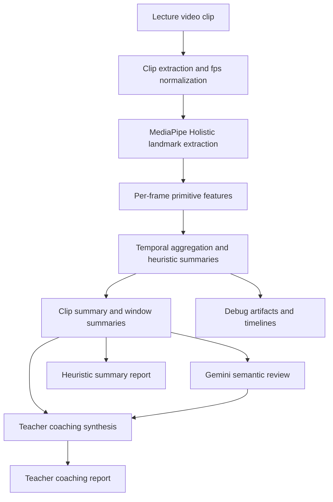
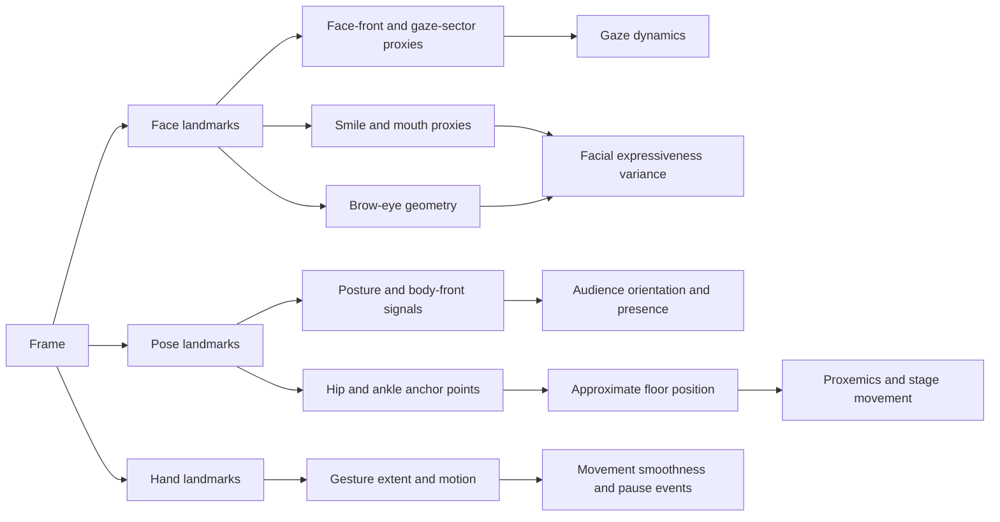
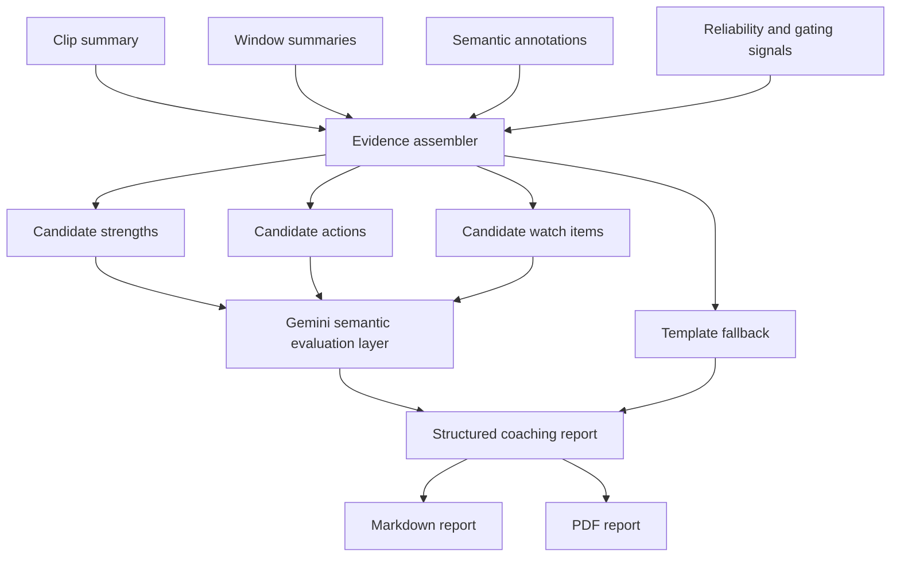
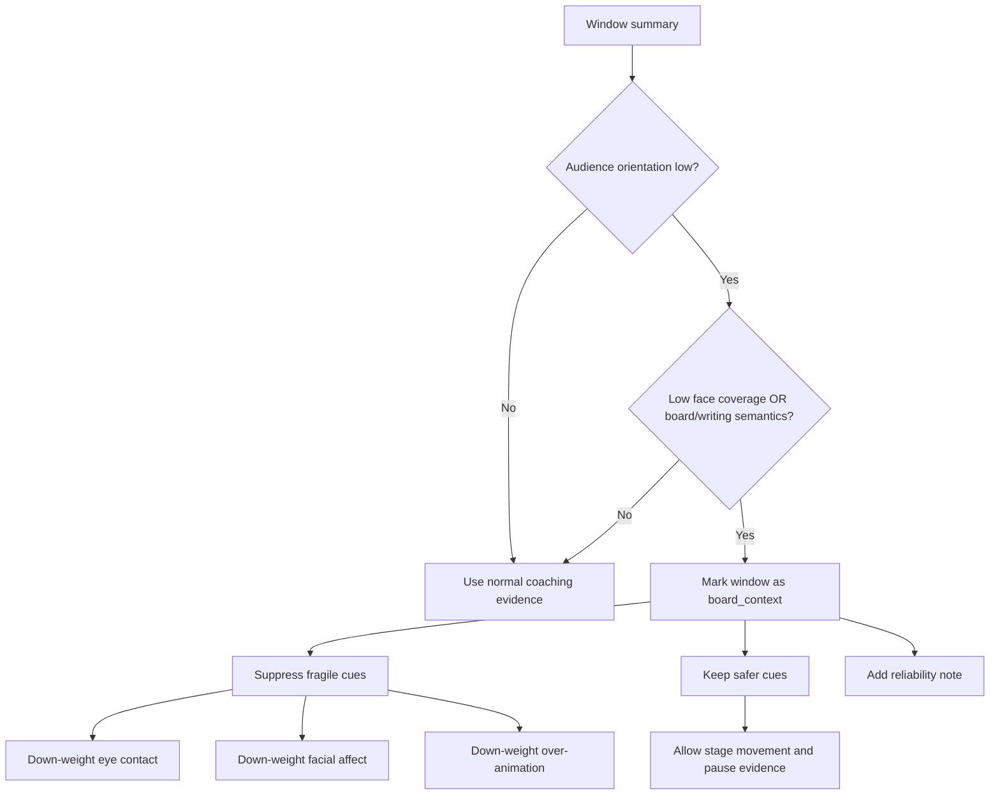

# Project Research Report

## Abstract

This project is a research-backed system for formative feedback on teacher lecture video using strictly non-verbal evidence. It combines interpretable landmark-based analysis, an additive semantic layer, and a teacher-facing coaching report. The core contribution is a construct-traceable pipeline that measures visible behavioral patterns, preserves reliability boundaries, and translates technical evidence into actionable coaching language. The pipeline deliberately separates internal benchmarking metrics from the teacher-facing report to avoid overstating precision.

**Key results.** Evaluation on multiple 60-second lecture clips from varied instructional settings shows that the semantic layer distinguishes board-facing, audience-facing, and slide-referenced delivery without hallucinated detail, while the reporting layer surfaces strengths, priority actions, evidence windows, and reliability notes in a format suitable for formative use. The project introduces four additional landmark-derived cue families: proxemics, pause structure, gaze sweep dynamics, and facial expressiveness variance. The project also adds a face-crop semantic extension that uses MediaPipe-derived face bounding boxes to export coarse facial-state evidence as a separate additive artifact.

This report documents the motivation, related work, research grounding, methods, evaluations, and conclusions for the project. The project incorporates four landmark-only cue families (proxemics, pause structure, gaze sweep dynamics, facial expressiveness variance), applies board-context-aware reliability gating, and organizes the teacher report around strengths, actions, and evidence moments.

## 1. Motivation

### 1.1 Problem statement

Teacher feedback is often costly, inconsistent, and difficult to scale. High-quality instructional coaching usually depends on expert human observers who can notice subtle classroom behaviors, remember concrete moments, and convert those observations into guidance that a teacher can actually use. In practice, this is labor intensive and unevenly available. Many teachers therefore receive either very little feedback or feedback that is delayed, generic, and weakly tied to specific evidence.

At the same time, modern lecture video is abundant. Universities, online education platforms, and classroom capture systems produce large numbers of videos that contain rich non-verbal signals: posture, gesture amplitude, room-facing distribution, use of space, visible pauses, board-facing versus audience-facing stance, and facial expressiveness. These signals matter because teaching is not only verbal content delivery. The way a teacher occupies space, distributes attention, and regulates visible energy shapes student perception, classroom climate, and the felt clarity of the lesson.

The research gap is not that non-verbal teaching behavior is unknown. The gap is that many existing computational approaches either:

- optimize for recognition benchmarks rather than coaching utility,
- collapse interpretation into opaque model outputs,
- rely on multimodal inputs such as audio that are not always available or easy to justify,
- or produce report outputs that are too technical for a working teacher to use quickly.

This project addresses this gap by treating the problem as one of interpretable formative analytics. The goal is to help a teacher reflect on visible classroom delivery while preserving construct validity, reliability notes, and room for uncertainty.

### 1.2 Contribution

The contribution of the project is best understood as an engineering and research integration contribution with six parts:

1. A research-traceable non-verbal analytics pipeline built on pretrained MediaPipe landmarks and temporal aggregation rather than custom end-to-end model training.
2. A teacher-feedback architecture that combines interpretable heuristics with an additive Gemini-powered semantic layer, while keeping the semantic layer separate from core heuristic scoring.
3. An extension of the landmark pipeline with four new cue families:
   - proxemics and stage movement,
   - pause and stillness events,
   - gaze sweep dynamics,
   - facial expressiveness variance.
4. An additive face-crop semantic path that uses MediaPipe-derived face bounding boxes to generate tight facial crops and coarse facial-state annotations without altering the underlying heuristic scores.
5. A reliability-aware coaching layer that down-weights fragile interpretations, including a simple board-context gate for windows where audience-facing cues are not valid to judge strongly.
6. A teacher-facing report redesign that prioritizes readability, timestamped evidence, and actionable interpretation over raw metric dumps and single-number summaries.

### 1.3 Research questions

This project is organized around the following research questions:

1. Can a landmark-first, strictly non-verbal pipeline generate meaningful formative observations about teacher delivery without training a custom teacher-assessment model?
2. Can literature-backed cue families such as proxemics, gaze dynamics, pause structure, and facial expressiveness be operationalized using video-derived metrics?
3. Does a teacher-facing report become more defensible and more useful when it emphasizes evidence moments, reliability notes, and plain-language strengths/actions instead of a headline evaluation score?
4. Can a modern multimodal API model improve the semantic specificity of coaching evidence when used as an additive, constrained component rather than a free-form end-to-end evaluator?

## 2. Related Work

### 2.1 Multimodal classroom observation systems

Recent work demonstrates that vision-language and multimodal models can support classroom observation at scale. ClassMind (Nadaf et al., 2025) builds an instructional-feedback system on a multimodal stack and represents the closest architectural analogue to this project; it shares the pattern of frame-level interpretation feeding a coaching synthesis step, but targets in-service classroom assessment rather than formative coaching on lecture clips. VidAAS (Zheng et al., 2024) uses GPT-4V for classroom skill assessment and reports high behavioral-domain accuracy, validating the VLM-for-coaching premise. D'Mello et al. (2015, ACM ICMI) established multimodal capture of teacher-student interactions for automated analysis, though with a speech-and-dialog focus that the present system deliberately avoids.

The present system differs from these systems in three ways: (a) it is strictly non-verbal by construction, (b) it keeps the multimodal model in an additive role rather than as an end-to-end evaluator, and (c) it couples the semantic layer to explicit landmark-derived metrics so that every teacher-facing claim is traceable to a visible signal.

### 2.2 Teacher-behavior datasets and pose-level signals

Liu et al. (2025, *Scientific Data*) released a multi-modal dataset of 4,839 videos of teacher instructional activity, validating pose plus video as the canonical modality for teacher-behavior analysis. Earlier pose-only and mobile-eye-tracking work (Haataja et al., 2020; McIntyre et al., 2017) established that temporal patterns of teacher attention and movement — not aggregate ratios — carry the pedagogically meaningful signal. This system operationalizes that finding by computing sweep rate, fixation duration, sector entropy, and zone transitions rather than single-pass ratios.

### 2.3 Automated formative feedback for teachers

The usability of automated feedback has become its own research strand. Demszky et al. (2024, *EEPA*) showed in a randomized controlled trial that teachers act on automated feedback only when it is concrete, brief, and tied to specific moments. The emerging consensus in the LAK and AIED communities is that evidence-based coaching requires feedback linkable to the recording. The report redesign in the current system directly implements these constraints: coaching snapshot first, per-moment keyframes, and timestamp deep-links into the source video.

### 2.4 Gap addressed by this project

Existing multimodal-classroom work tends either to treat the VLM as the primary evaluator, without grounding in pose-level interpretable metrics, or to produce metric dashboards that fail the Demszky usability constraints. No prior system in the surveyed literature combines: strictly non-verbal sensing; landmark-derived cue families grounded per-metric in peer-reviewed immediacy, gaze, and pause literature; an additive VLM semantic layer that cannot overwrite the heuristic signal; and a reliability-aware report that withholds strong claims when visibility is low. This project is positioned in that gap.

## 3. Research Grounding

### 3.1 Research strands informing the project

The project is grounded in three complementary strands of prior work.

| Research strand | Relevance to the project |
| --- | --- |
| Peer-reviewed educational and behavioral literature | Grounds the choice of cue families, especially proxemics, gaze dynamics, pause structure, facial expressiveness, and the conditions under which feedback is likely to be useful |
| Multimodal classroom-observation systems | Situates the overall architecture within current work on AI-assisted classroom observation and instructional feedback |
| Model-capability and runtime evidence | Informs the choice of a hosted multimodal API as the default path for semantic interpretation and coaching synthesis |

This structure keeps the project claims appropriately aligned with the evidence base. Pedagogical claims are grounded in educational and behavioral literature, while model-selection decisions are treated as implementation choices within the broader multimodal classroom-observation setting.

### 3.2 Design rationale: proxemics and stage movement matter

The literature on teacher immediacy consistently treats movement through classroom space, physical proximity, and body orientation as part of how teachers establish connection and presence. Across communication and education research, teacher movement is not interpreted as universally good or bad. Instead, the research supports a more nuanced claim: how a teacher uses space affects the social and attentional texture of instruction.

This motivated the addition of explicit proxemics signals in the current system:

- room coverage,
- zone dwell distribution,
- static anchoring,
- and transitions across left, center, and right spatial sectors.

The important research-backed interpretation is not "more walking is better." The correct interpretation is that visible room coverage and anchoring patterns are meaningful and can support coaching reflection. In this project, these cues are therefore described conservatively as stage-use behavior, room engagement, and movement variety.

### 3.3 Design rationale: gaze as a temporal dynamic, not a ratio alone

Existing teaching and eye-tracking literature shows that dynamic gaze patterns over space and time carry information that a single aggregate ratio does not capture. Expert teachers often distribute gaze more broadly, avoid overly long fixation on a single region, and move attention across the room in ways that better support shared focus.

This is why the current system emphasizes gaze sweep dynamics rather than only an eye-contact ratio. The system measures:

- average dwell duration by gaze sector,
- maximum fixation duration,
- sector distribution entropy,
- and sweep rate over time.

The project does not recover true pupil-level eye contact. It estimates room-facing distribution from visible head and facial orientation proxies. That still supports defensible coaching language such as "room scan was concentrated," "attention distribution looked balanced," or "the teacher spent long visible stretches oriented to one sector."

### 3.4 Design rationale: visible pause structure is pedagogically relevant

Wait-time and think-time literature strongly supports the instructional importance of pause structure. However, the current system does not use audio or classroom dialog state, so it cannot claim to recover pedagogical wait time in the full conversational sense. What it can measure is visible pause and stillness structure.

This led to the addition of pause-event detection using low gesture motion and low body drift. The new cue family distinguishes:

- dramatic pauses of moderate duration,
- from extended static stretches that may reflect anchoring or low movement energy.

This is a measured compromise between research relevance and sensing limits. The system therefore reports pause structure as a visible non-verbal pattern, not a definitive judgment about dialogic teaching quality.

### 3.5 Facial expressiveness as a time-varying cue

Research on teacher enthusiasm and non-verbal expressiveness supports the view that visible expressiveness influences learner attitudes and perceptions. Tikochinski, Babad, and Hammer (2025) report positive effects of teacher non-verbal expressiveness on student attitudes and achievement, while Wang, Pi, and Hu (2022) show that excessive or poorly timed expressiveness can hinder learning when learner prior knowledge is low. Taken together, these studies support treating expressiveness as an informative but non-monotonic cue.

This is important for system design. A naive approach would reward higher smile intensity or stronger facial movement as inherently positive. The project instead models facial expressiveness as temporal variation:

- rolling variability in smile proxy,
- brow-eye ratio,
- and mouth-open ratio.

This supports a more defensible interpretation: the system can identify facial flatness or low expressive range as a watch item, but it does not treat maximal facial animation as the desired end state.

### 3.6 Report usability and evidence-linked feedback

Automated feedback is useful only when teachers can act on it. Demszky et al. (2024) show that feedback is more likely to support teacher uptake when it is concrete, brief, and tied to specific moments rather than presented as a dense metric summary. Related multimodal classroom-observation systems also emphasize an at-a-glance summary coupled with temporally anchored evidence (Zheng et al., 2024; Nadaf et al., 2025). In response, the report in this project is organized around a coaching snapshot, prioritized strengths and actions, standardized confidence labels, and timestamped evidence windows. Reliability notes are surfaced explicitly when visibility or context weakens the interpretability of a cue family.

### 3.7 Multimodal semantic layer and model selection

Recent classroom-observation systems demonstrate that vision-language models can support instructional analysis and feedback generation (Zheng et al., 2024; Nadaf et al., 2025). In this project, the semantic layer remains additive: it enriches frame interpretation and coaching synthesis but does not overwrite the landmark-derived heuristic signal families. A hosted multimodal API is used as the default semantic and coaching model because the task requires structured multimodal reasoning over visible teaching behavior, and the observed runtime conditions favored that tier for stable execution. The educational claims of the project therefore remain grounded in the cited teaching and learning literature, while model selection is treated as part of the implementation design.

### 3.8 Traceability matrix for the current system

| Construct | Implementation signal | Summary keys | Threshold provenance | Teacher-facing claim boundary | Sources |
| --- | --- | --- | --- | --- | --- |
| Proxemics / stage movement | `floor_x`, `floor_y`, dwell by left-center-right zones, transitions, 2D occupancy | `movement_presence.*` | Heuristic bands derived from immediacy literature; initial calibration bands for some cutoffs | Report room coverage and anchoring; do not infer effectiveness from one pattern alone | Andersen (1979); Witt et al. (2004); Liu et al. (2021); Ballester et al. (2025) |
| Pause / stillness | Low gesture motion plus low hip drift merged into pause events | `movement_presence.pause_*` | Static-stretch band partly literature-anchored; shorter pause bands heuristic-from-literature | Report visible pause structure; do not claim full pedagogical wait-time quality without audio and discourse context | Rowe (1986); Tobin (1987); Stahl (1994) |
| Gaze sweep dynamics | Gaze-sector run lengths, transitions, entropy | `gaze_dynamics.*` | Heuristic bands derived from literature | Report attention distribution and sweep behavior; do not claim true eye contact | Pi et al. (2020); McIntyre et al. (2017); Goldberg et al. (2021); Haataja et al. (2020) |
| Facial expressiveness variance | Rolling variation of smile, brow-eye, and mouth-open proxies | `facial_expressiveness.*` | Initial heuristic for calibration | Report expressive range or flatness watch items; do not assume more is always better | Ekman & Friesen (1978); Wang et al. (2022); Tikochinski et al. (2025) |
| Readable teacher report | Scorecard, merged sections, moment evidence, reliability notes | `scorecard`, `priority_actions`, `top_strengths`, `evidence_moments` | Design pattern, not a numeric threshold | Claim that actionable, timestamped feedback is more coachable than raw metric dumps | Demszky et al. (2024); Nadaf et al. (2025 preprint) |
| Hosted multimodal runtime | Remote vision-capable API used as the default multimodal path | Runtime config and request metadata | Engineering choice, not pedagogical threshold | Claim a capability-backed and operationally justified model choice | Zheng et al. (2024); Comanici et al. (2025); Google Developers Blog (2025) |

## 4. Methods Used

### 4.1 System overview

The system is implemented as a modular pipeline rather than a single model. The high-level flow is shown below in Figure 1.



**Figure 1.** High-level system pipeline. The heuristic path (through `J`) and the coaching path (through `I`) consume the same clip summary, so heuristic scores are never overwritten by the LLM output.

The main implementation modules are:

- `nonverbal_eval/pipeline.py`: feature extraction, temporal aggregation, summary generation, markdown rendering.
- `nonverbal_eval/semantic.py`: Gemini-backed frame-level semantic interpretation.
- `nonverbal_eval/coaching.py`: evidence assembly, report schema, fallback logic, and teacher-facing markdown/PDF rendering.
- `nonverbal_eval/app_service.py`: orchestration of end-to-end evaluation.
- `streamlit_app.py`: interactive product surface for uploads and report viewing.

### 4.2 Design principles

The system follows four explicit design principles:

1. **Interpretability first.** Each metric should be explainable in terms of visible signals and temporal aggregation.
2. **Additive semantics.** The Gemini layer adds contextual interpretation but does not overwrite the core landmark-based signal families.
3. **Formative, not high-stakes.** The outputs are intended for reflection and coaching, not formal teacher ranking.
4. **Reliability-aware reporting.** When visibility or context weakens a cue, the system should reduce confidence or withhold strong recommendations rather than fabricate precision.

### 4.3 Input material and evaluation clips

The repo contains:

- sample lecture clips,
- curated YouTube-derived lecture clips,
- batch evaluation runs,
- and artifact directories containing summary JSON, markdown, plots, and teacher reports.

The evaluation uses multiple 60-second clips drawn from these sources so that the project can be assessed across varied instructional settings, visibility conditions, and delivery styles.

### 4.4 Landmark extraction and primitive features

The pipeline uses MediaPipe Holistic as the pretrained perception backbone. For each frame, the system extracts face, hand, and pose landmarks and computes primitive signals such as:

- hand visibility,
- face visibility,
- body orientation,
- head/face orientation,
- smile and mouth proxies,
- brow-eye geometry,
- face-bounding-box coordinates derived from landmark extent,
- gesture amplitude and smoothness,
- torso and hip movement,
- and approximate floor-relative teacher position.

The new cue families and the face-crop semantic extension were built on top of those existing primitives rather than by changing the sensing stack.



**Figure 2.** Derivation of cue families from MediaPipe Holistic landmark groups. The four new cue families introduced in this project (gaze dynamics, facial expressiveness variance, pause events, proxemics) are the rightmost outputs.

### 4.5 Temporal aggregation and summary construction

The system does not reason from isolated frames alone. Per-frame primitives are aggregated across the full clip and across windows to produce more stable observations. This temporal design matters because teaching behavior is inherently time-varying.

The clip summary includes established signal families such as:

- posture and openness,
- audience orientation,
- gesture smoothness,
- eye-contact distribution,
- confidence/presence,
- natural movement,
- enthusiasm and positive affect,
- and risk metrics including static behavior, rigidity, and excessive animation.

The current system adds three new summary families:

- `movement_presence`
- `facial_expressiveness`
- `gaze_dynamics`

These families do not create new top-level composite scores. Instead, they feed existing composites so that the internal heuristic score remains broadly comparable across runs.

### 4.6 Composite score construction — worked formulas

All composite scores in this system are bounded in [0, 100] and constructed from three primitive score functions applied to raw signal values. This design is explicit so that every point in any composite score can be traced back to a raw measurement, its calibrated band, and its fractional weight.

**Score primitives.** Let *v* be a raw signal (for example mean gesture extent or smile-proxy rolling standard deviation), and let [*l*, *h*] denote a calibrated band with optional mid-point *m*. Define:

- Linear-up: *lin*(*v*; *l*, *h*) = clip<sub>[0,1]</sub>((*v* − *l*) / (*h* − *l*)) — rewards values up to *h*.
- Linear-inverse: *inv*(*v*; *l*, *h*) = 1 − *lin*(*v*; *l*, *h*) — penalizes values above *l*.
- Peak: *peak*(*v*; *l*, *m*, *h*) returns 0 outside [*l*, *h*], a linear ramp to 1 at *v* = *m*, and a linear fall back to 0 at *v* = *h* — rewards a healthy band with calibrated optimum *m*.

These three primitives are implemented as `_score_linear`, `_score_inverse`, and `_score_peak` at [pipeline.py:98-117](../nonverbal_eval/pipeline.py#L98-L117).

*Research anchor for the primitive choice.* The linear-up and linear-inverse shapes follow the dose-response pattern documented in the teacher-immediacy meta-analysis of Witt, Wheeless, and Allen (2004), which reports roughly monotonic relationships between individual immediacy cues and learning outcomes over the naturalistic operating range. The inverted-U shape of `peak` is motivated by the expressiveness literature, where both under- and over-expressive nonverbal behavior are observed to attenuate learning gains (Wang, Pi, & Hu, 2022; Tikochinski, Babad, & Hammer, 2025).

**Composite: `stage_usage_score`.** When proxemics signals are available the composite is a 50/50 blend:

```
stage_usage = 0.50 × base + 0.50 × proxemics
base        = 100 × lin(stage_range; 0.04, 0.30)
proxemics   = 100 × ( 0.55 × lin(coverage_area_pct; 15, 50)
                    + 0.45 × inv(static_zone_pct;   60, 90) )
```

If proxemics are unavailable the composite falls back to `base` alone. This is the mechanism by which the new proxemics cue family from §3.2 enters the heuristic scorecard without creating a new top-level score.

*Research anchor.* Movement about the classroom is one of the founding channels of the immediacy construct (Andersen, 1979) and is retained in the validated TeNOI observation scale as "physical proximity" and "body orientation" factors (Ballester, García-Carrasco, & Hernández-Serrano, 2025). The meta-analysis of Witt et al. (2004) and the systematic review of Liu, Zhang, Jensen, and Gao (2021) both report that proxemic variation is positively associated with cognitive and affective learning outcomes, motivating both the linear-up `coverage_area_pct` term and the inverse `static_zone_pct` penalty.

**Composite: `eye_contact_distribution_score`.** A weighted combination of three audience-attention sub-scores:

```
eye_contact = 0.45 × audience_orientation
            + 0.35 × sector_balance
            + 0.20 × room_scan

room_scan   = 100 × ( 0.45 × peak(gaze_transition_rate; 0.05, 0.45, 1.60)
                    + 0.35 × lin(signed_yaw_std;        0.08, 0.28)
                    + 0.20 × peak(sweep_rate_per_min;   2.0, 8.0, 20.0) )
```

The `peak` primitive on `sweep_rate_per_min` encodes the empirical range reported by McIntyre, Mainhard, and Klassen (2017) for expert teacher gaze sweeps, penalizing both a frozen gaze and a visually frantic one.

*Research anchor for the three-way decomposition.* Splitting eye-contact into audience orientation, sector balance, and a time-dynamic room-scan component is directly motivated by Haataja et al. (2020), who argue that teachers' gaze *distribution across space and time* predicts interpersonal behavior in ways that aggregate ratios do not. Goldberg, Schwerter, Seidel, Müller, and Stürmer (2021) review the methodological consensus that temporal gaze patterns carry information lost when only mean ratios are reported, which is the basis for keeping `room_scan` as a separate term rather than collapsing it into a single orientation score. The weighting choice also reflects the finding of Pi, Xu, Liu, and Yang (2020) that instructor gaze matters more than body orientation for learning outcomes in video lectures, which is why the orientation term carries 0.45 rather than a larger share.

**Composite: `positive_affect_score`.**

```
positive_affect = 100 × ( 0.42 × lin(smile_mean;       0.32, 0.44)
                        + 0.14 × lin(smile_std;        0.006, 0.028)
                        + 0.14 × lin(open_palm_ratio;  0.10, 0.75)
                        + 0.30 × expressiveness_score / 100 )
```

The `expressiveness_score` sub-composite is itself a weighted linear combination of the rolling-standard-deviation means for smile, brow-eye, and mouth-open proxies. This is the mechanism by which the new facial-expressiveness-variance cue family from §3.5 enters the composite.

*Research anchor.* The use of rolling standard deviation rather than mean expression follows Ekman and Friesen (1978), whose Facial Action Coding System treats expressiveness as a time-series of changes rather than a static average. The additional 0.30 weight given to `expressiveness_score` inside positive affect is supported by Tikochinski et al. (2025), whose controlled experiments and meta-analysis report that teacher nonverbal expressiveness substantively boosts student attitudes and achievements. The `smile_std` term (weight 0.14) and the separate inclusion of variance signals encode the caution from Wang et al. (2022) that expressiveness is a *double-edged* signal and should not be modeled as a monotonically rewarded mean.

**Flag rule: `facial_flatness_flag`.** A boolean promoted to the teacher report when:

```
mean_rolling_std(smile) < 0.015  AND  coverage(smile) ≥ 0.50
```

A true flag surfaces as a watch item without suppressing other affect signals — consistent with the research finding in §3.5 that expressiveness is not monotonically desirable.

*Research anchor.* Wang et al. (2022) specifically motivate flagging extreme flatness as a separate watch-item rather than folding it into a single affect score: because expressiveness can both help and hinder learning depending on audience prior knowledge, the system deliberately flags the low tail without recalibrating the headline score.

### 4.7 New cue-family methods

#### 4.7.1 Proxemics and stage movement

The system maps approximate teacher floor position into left, center, and right zones. It then computes:

- dwell percentage per zone,
- transition count across zones,
- static-zone time,
- and coarse 2D coverage area.

These values are exposed in the summary and also inform stage-usage-related interpretation.

#### 4.7.2 Pause and stillness events

Pause events are derived from low gesture motion combined with low body drift. Two types are represented:

- `dramatic_pause`
- `static_stretch`

This distinction helps the system reward visible pause structure without treating all stillness as equally useful.

#### 4.7.3 Gaze sweep dynamics

Gaze-sector time series are transformed into:

- mean sector dwell,
- maximum fixation,
- sector entropy,
- and sweep rate per minute.

These statistics operationalize attention distribution over time rather than a single global eye-contact percentage.

#### 4.7.4 Facial expressiveness variance

The system computes rolling standard deviation over:

- smile proxy,
- brow-eye ratio,
- mouth-open ratio.

It then derives average expressiveness variation and a `facial_flatness_flag` when visible variation remains low for an extended portion of the clip (see §4.6 for the exact flag rule).

### 4.8 Semantic layer and runtime configuration

The semantic layer is intentionally constrained. It samples a limited set of frames from the clip and sends them, together with light structured context, to Gemini. The model returns strict JSON fields such as:

- `teacher_focus`
- `body_action`
- `affect_tone`
- `posture_signal`
- `attention_note`
- `evidence_confidence`
- `rationale`

The frame context now includes visible stance information such as `floor_x`, `floor_y`, and `pause_state`, helping the model reason about writing, board focus, audience address, and posture in a more grounded way.

The semantic layer is additive:

- it does not replace the heuristic summary,
- it does not change internal metric formulas directly,
- and it is primarily used to enrich evidence interpretation and coaching language.

#### 4.8.1 Face-crop semantic extension

The project also includes a face-crop semantic side pass built on the MediaPipe face geometry already produced by the landmark pipeline. For each usable frame, the pipeline computes a coarse face bounding box from the minimum and maximum face landmark coordinates. These bounding boxes are not used to change the base clip scores; instead, they support a second semantic pass over tight face crops.

The face-crop pass operates as follows:

- candidate timestamps are selected from the clip midpoint, peaks in rolling smile/brow/mouth variability, dramatic-pause entry points, and clip boundaries;
- only timestamps with sufficient face visibility are retained;
- a padded crop is extracted around the face bounding box;
- Gemini is asked to return a strict JSON annotation for the crop only, with no body-level inference.

The current face-crop schema contains:

- one coarse facial-state label from:
  - `warm_engaged`
  - `neutral_attentive`
  - `focused_concentrated`
  - `fatigued`
  - `tense`
  - `suppressed_smile`
  - `broad_smile`
  - `ambiguous`
- five micro-cue flags:
  - `smile_asymmetric`
  - `brow_furrowed`
  - `eyes_squinted`
  - `jaw_tense`
  - `eyes_closed_blink`
- a short rationale
- an evidence-confidence label

This extension is intentionally conservative. It is designed to provide auxiliary facial-state evidence and traceable artifacts rather than to drive headline affect scores. In other words, it expands the observable evidence base without allowing the face-crop model output to overwrite the landmark-derived heuristic layer.

### 4.9 Coaching report generation

The teacher report is generated from:

- clip-level heuristic summary,
- window-level metric summaries,
- semantic frame interpretations,
- and reliability/context notes.

The report generation path is shown in Figure 3.



**Figure 3.** Coaching report generation. The deterministic template-fallback path (`M`) remains wired in parallel with the LLM path (`I`) so that the system degrades gracefully when the API is unavailable.

The report redesign reflects several project goals:

- the teacher-facing report hides the overall non-verbal score,
- the top section emphasizes a coaching snapshot and scannable sub-signal bands,
- strengths and priority actions are surfaced before the appendix,
- moment-by-moment evidence includes timestamps and keyframes where available,
- confidence language is normalized,
- and fallback provenance is explicit when the LLM path is unavailable.

### 4.10 Reliability safeguards and board-context gating

The current system includes a simple, deliberately conservative board-context gate. The reasoning is straightforward: when a teacher is writing on the board or facing away from the audience, some audience-facing cues are not valid to judge strongly.

The gate operates at the window level rather than the frame level. A window is marked as board-context-like when:

- audience orientation is low, and
- either face visibility is weak or semantic review indicates board-focused or writing behavior.

In such windows, the system down-weights fragile coaching claims related to:

- eye contact,
- facial affect,
- gaze-sweep quality,
- and over-animation judgments.

Safer signals such as stage movement, pause structure, and some posture-related evidence can still be used when tracking is stable.



**Figure 4.** Board-context reliability gate. The gate fires only when two independent indicators agree (low audience orientation plus either low face coverage or board/writing semantics), reducing false positives on clips where the teacher is briefly turned without actually writing.

This safeguard is important for both engineering quality and research validity. It shows that the system does not merely compute metrics; it also reasons about when those metrics should not be over-interpreted.

### 4.11 Artifact outputs

The pipeline produces a structured artifact set, including:

- `per_frame_metrics_full.csv`
- `summary_full.json`
- `summary_full.md`
- `window_summary.csv`
- `teacher_coaching_report.json`
- `teacher_coaching_report.md`
- `teacher_coaching_report.pdf`
- `coaching_evidence.json`
- `face_crops/` when the face-crop semantic path is enabled
- `face_annotations.json` when the face-crop semantic path is enabled
- `face_summary.md` when the face-crop semantic path is enabled
- keyframes, plots, and overlays

This artifact design supports transparency. A teacher-facing claim can usually be traced back to a window, a metric family, and a visible moment in the source clip.

### 4.12 Reproducibility

The following environment and runtime figures describe the current (April 2026) configuration.

**Hardware.** All batch runs were executed on a Windows 11 consumer laptop (x86-64, 16 GB RAM) with no discrete GPU. MediaPipe Holistic uses the TFLite CPU execution path and does not require GPU acceleration.

**Software.** Python 3.10+, `mediapipe 0.10.x` (Holistic solution), `numpy 1.26`, `pandas 2.x`, `opencv-python 4.x`, `weasyprint` for PDF rendering. The multimodal layer is accessed via the Gemini API over a public REST endpoint; no local model weights are loaded.

**Container distribution.** The entire pipeline is packaged and distributed as a Docker image. A reproducible environment is produced by `docker compose build` against the repository `Dockerfile`, which pins the full Python and system-library stack (including OpenCV native dependencies and the MediaPipe TFLite runtime) so that runs on different host machines start from the same binary environment. Two Compose services are exposed: `streamlit` for the interactive coaching-report UI on port 8501, and `evaluator` as a headless batch entrypoint into `evaluation/run_local_clips_gemini_batch.py`. Both services mount the repository at `/app` and a host-side `./local_data/docker_test_outputs` directory at `/outputs`, and both read `GEMINI_API_KEY` from the host environment rather than baking it into the image. Exporting the image (`docker save teacher-evaluation:latest > teacher-evaluation.tar`) or pulling it from a registry is therefore sufficient to reproduce the runs in §5 and §6 on any Docker-capable host — no local Python, MediaPipe, or Gemini-SDK installation is required on the host beyond Docker itself.

**Model configuration.** The current version uses the Gemini API with `thinkingConfig.thinkingBudget = -1` (dynamic reasoning), `temperature = 0.0` at both the per-frame semantic and coaching-synthesis call sites, and output-token budgets of `1024` for per-frame semantic and `4096` for coaching synthesis. The existing exponential-backoff wrapper in `nonverbal_eval/gemini_api.py` (four attempts, 429/5xx-aware) is reused unchanged. The face-crop semantic extension uses the same API path with a smaller response budget (`maxOutputTokens = 512`) and a capped sample count so that it remains an auxiliary evidence pass rather than the dominant runtime cost.

**Typical wall-clock runtime per 60-second clip.** Landmark extraction runs at analysis_fps = 12 and completes in roughly 60 to 90 seconds. The per-frame semantic pass samples 8 to 10 frames and completes in 25 to 80 seconds depending on Gemini latency and thinking-budget expansion. The coaching-synthesis pass completes in 10 to 20 seconds. End-to-end wall-clock is approximately two to three minutes.

**Typical API cost per clip.** The combined semantic plus coaching calls cost on the order of $0.05 per 60-second clip. This is dominated by the coaching-synthesis call (larger prompt, larger `max_output_tokens = 4096`) rather than the per-frame semantic calls.

**Determinism boundaries.** Landmark extraction is deterministic given the input video. Gemini calls use `temperature = 0.0` but are not bit-exact reproducible because the inference stack may route through different mixture-of-experts partitions across requests; minor wording variation in the coaching report across reruns is expected. Scoring-layer outputs (`summary_full.json`, all composite scores) are fully deterministic given a fixed input clip.

**Artifact locations.** Batch outputs referenced in §5 are stored under `local_data/docker_test_outputs/batch_eval_v2/` organized by clip identifier and run timestamp.

## 5. Evaluations

### 5.1 Evaluation strategy

The evaluation strategy in this project is not centered on benchmark classification accuracy. Instead, it evaluates the system as a formative analytics and reporting pipeline. That means the key questions are:

1. Are the computed cues behaviorally plausible and literature-aligned?
2. Does the semantic layer distinguish different teaching styles without hallucinated detail?
3. Does the report become more useful when it foregrounds actions, strengths, evidence windows, and reliability notes?
4. Does the system know when to reduce confidence or avoid overclaiming?

### 5.2 Multi-clip batch evaluation

The current batch evaluation set contains multiple 60-second clips drawn from the curated lecture dataset:

| Clip | Institution | Teaching style | Internal heuristic score |
| --- | --- | --- | --- |
| `mit_ocw_how_to_speak_300_360` | MIT OCW | Board-facing demonstration | 53.3 |
| `stanford_cs230_240_300` | Stanford | Animated AI lecture | 51.1 |
| `yale_quantum_240_300` | Yale | Blackboard math/physics | 45.4 |
| `cs50_business_150_210` | Harvard CS50 | Slide-driven business talk | 49.9 |
| `mit_ocw_pigeonhole_240_300` | MIT OCW | Math discussion | 55.9 |

This batch is useful because it spans:

- different institutions,
- different subject styles,
- audience-facing and board-facing delivery,
- and varying levels of visibility quality.

Assessment of this batch (documented separately in `docs/batch_feedback_quality_assessment.md`) showed that the semantic layer was among the strongest parts of the system, while the coaching layer benefited substantially from the current report-generation path. In the current version, reports present deduplicated watch items, evidence-specific review windows, and clearer graceful-degradation behavior when the LLM path is unavailable.

### 5.3 Selected illustrative clips

Among the available evaluation runs, three clips are especially informative:

| Clip | Demonstrated value | Analytical value |
| --- | --- | --- |
| `cs50_business_150_210` | Actionable coaching on a reasonably visible clip | Shows that the system can produce concrete, plausible formative guidance |
| `mit_ocw_pigeonhole_240_300` | Value of new proxemics and pause cues | Shows that the new cues materially change interpretation |
| `yale_quantum_240_300` | Reliability restraint and board-context handling | Shows that the system knows when not to overclaim |

### 5.4 Focused findings from the selected clips

#### 5.4.1 CS50 Business

This clip is the best utility case. Tracking quality is relatively strong, with high face and hand coverage, which means the system has enough evidence to support coaching claims with moderate confidence. The refreshed teacher report emphasizes concrete adjustments such as opening the stance between points and re-orienting visibly toward the audience after glancing at the screen.

Selected metrics from the saved run:

| Metric | Value |
| --- | --- |
| Internal heuristic score | 49.95 |
| Face coverage | 0.764 |
| Hand coverage | 0.815 |
| Coverage area | 83.33% |
| Static zone time | 45.56% |
| Dramatic pause count | 0 |
| Sweep rate per minute | 57.08 |

Interpretation:

- the clip demonstrates good visibility for multimodal analysis,
- meaningful room coverage is visible,
- the teacher-facing report can surface useful coaching actions,
- and the system is able to combine heuristic and semantic evidence into a coherent formative brief.

**Sample excerpt from the generated teacher report.** The following is an abridged slice of the `teacher_coaching_report.md` produced for this clip (full report under `local_data/docker_test_outputs/batch_eval_v2/cs50_business/run_20260417T180730Z/`):

```markdown
## At a Glance
You demonstrate strong stage presence, effectively using movement,
facial expressions, and gaze to engage the room. The key opportunities
for growth are in refining posture and gesture control...

### 1. Open the stance between points
- Why it matters: An open, relaxed posture communicates confidence
  and approachability. A closed stance, even briefly, can create a
  subtle barrier between you and the audience.
- What we saw: At moments like 00:00-00:15 and 00:30-00:45, your
  arms and shoulders tended to fold inward, creating a more guarded
  or closed posture. The risk metric for this was notably high
  (68.7) in the first interval.
- What to try next: As a simple reset, try the 'speaker's ready
  stance': stand with feet shoulder-width apart, and let your hands
  rest naturally at your sides or with fingers lightly touching
  in front. Return to this stance after gesturing or turning to
  the board.
- Review at: 00:00-00:15, 00:30-00:45
- Confidence: medium
```

This excerpt shows the three-part action structure (why it matters / what we saw / what to try next), timestamped review windows, a named technique ("speaker's ready stance") rather than generic advice, and the normalized `Confidence:` label produced by the current coaching layer.

#### 5.4.2 MIT Pigeonhole

This clip is the strongest demonstration of the newer cue set. The teacher presents with reasonably high confidence and strong visibility, but the summary also shows heavy anchoring to one region of the space. That creates a good use case for the proxemics signal family. In addition, the pause-event detection surfaces visible stillness patterns that strengthen the movement interpretation.

Selected metrics from the saved run:

| Metric | Value |
| --- | --- |
| Internal heuristic score | 55.88 |
| Face coverage | 0.746 |
| Hand coverage | 0.926 |
| Coverage area | 62.50% |
| Static zone time | 76.25% |
| Dramatic pause count | 2 |
| Sweep rate per minute | 80.11 |

Interpretation:

- the teacher appears open and audience-focused,
- but stage movement is concentrated enough to justify a specific anchor-breaking suggestion,
- and the pause/proxemics additions contribute evidence that older versions of the pipeline did not expose clearly.

This clip therefore demonstrates the analytical value of the new cue families directly.

#### 5.4.3 Yale Quantum

This clip is the strongest fairness and validity case. It is board-facing and visibility is weak, especially for face evidence. Earlier versions of the system risked over-interpreting such clips. The current system instead treats it as a low-reliability or maintenance case, suppressing stronger audience-facing judgments when the evidence does not support them.

Selected metrics from the saved run:

| Metric | Value |
| --- | --- |
| Internal heuristic score | 45.39 |
| Face coverage | 0.254 |
| Hand coverage | 0.456 |
| Coverage area | 70.83% |
| Static zone time | 46.46% |
| Dramatic pause count | 0 |
| Sweep rate per minute | 34.00 |

Interpretation:

- the clip is difficult for strong face-based or audience-orientation coaching,
- board-context gating is appropriate,
- and the report's low-reliability stance is a strength rather than a weakness.

### 5.5 System-level evaluation takeaways

Across the current pipeline and evaluation artifacts, five practical conclusions emerge:

1. **The landmark-first design is viable.** The system produces interpretable, behaviorally plausible signals without training a custom teacher classifier.
2. **The new cue families are useful.** Proxemics, pause structure, gaze sweep, and facial expressiveness variance add meaningful analysis depth.
3. **The semantic layer is strongest when additive and constrained.** Frame-level semantic annotations are most useful when they enrich evidence rather than replace heuristic reasoning.
4. **Report design materially affects utility.** Readable structure, timestamped evidence, and reliability notes make the output more defensible and more useful.
5. **Reliability safeguards are essential.** Low visibility and board-facing contexts can invalidate some cues, so gating and conservative reporting are part of the scientific method, not merely product polish.

### 5.6 Current limitations

The current version also has clear limitations that should be stated openly:

- Some metrics, especially sweep-rate interpretation, still need better calibration to distinguish purposeful room scans from micro-movements.
- The semantic and coaching layers depend on external API availability.
- The face-crop semantic extension provides coarse crop-level facial-state evidence only.
- The teacher-facing report is designed for formative coaching and should not be used for high-stakes teacher evaluation.

These are not peripheral caveats. They define the proper scope of the project claims.

## 6. Qualitative Validation: Moments Across Multiple Clips

Aggregate metrics answer "does the pipeline run correctly"; they do not answer "does the pipeline describe what is actually on the screen". To interrogate the latter, six coaching moments were drawn from multiple 60-second clips (four institutions, MIT, Stanford, Yale, and Harvard CS50 sources) and each was cross-checked: the pipeline's own evidence label, the metric reading, and the keyframe the pipeline itself selected were compared against what a human reviewer could see in the frame.

The six moments below divide into **two high-confidence cases** (Tier 1) where the pipeline's QC gating reports high confidence and every signal aligns, and **four medium-confidence cases** (Tier 2) where confidence is medium but the claim is still cleanly supported by the keyframe.

### 6.1 Tier 1 — High-confidence agreement

#### 6.1.1 MIT Pigeonhole — 00:15–00:30 — strength: distributed room engagement


*Figure 5. MIT Pigeonhole Principle, 00:15–00:30. Pipeline tag: distributed_room_engagement.*

| | |
|---|---|
| **Pipeline claim** | distributed_room_engagement + open, audience-facing stance |
| **Metric reading** | eye=76.8, presence=85.9, natural=50.2, face_cov=0.99, hand_cov=1.00, confidence=high |
| **Visual observation** | Teacher faces the audience, open right palm holding a mic, upright stance, Venn diagram behind her. Body is slightly rotated toward the room rather than the board. |
| **Verdict** | Accurate. Every badge the pipeline raises (audience orientation, open-palm gesture, presence) has a direct analogue visible in the frame. |

#### 6.1.2 Yale Power Politics — 00:00–00:15 — strength: distributed room engagement


*Figure 6. Yale Power & Politics, 00:00–00:15. Pipeline tag: distributed_room_engagement.*

| | |
|---|---|
| **Pipeline claim** | distributed_room_engagement + upright confident presence |
| **Metric reading** | eye=75.3, presence=78.6, natural=46.5, face_cov=1.00, hand_cov=0.97, confidence=high |
| **Visual observation** | Both hands raised mid-rhetoric, chest forward, eyes toward the audience — a canonical expressive lecture pose. |
| **Verdict** | Accurate. This is the textbook case the pipeline is designed to recognise: open-hand audience-facing delivery, flagged as a strength to preserve. |

### 6.2 Tier 2 — Medium-confidence agreement

#### 6.2.1 MIT Psychology — 00:30–00:45 — action: limited movement


*Figure 7. MIT OCW Psychology, 00:30–00:45. Pipeline tag: limited_movement.*

| | |
|---|---|
| **Pipeline claim** | limited_movement — static stance during an explanation beat |
| **Metric reading** | natural=40.1, gesture_motion_peak=0.056, dramatic_pause_count=1, static_stretch_count=1, face_cov=1.00 |
| **Visual observation** | Professor stands still, arms straight at sides, no visible hand gesture. |
| **Verdict** | Accurate. The very low gesture peak is directly reflected in the frame. The pipeline's suggested next-step ("one or two purposeful gestures per minute") is grounded rather than speculative. |

#### 6.2.2 MIT "How to Speak" — 00:15–00:30 — strength: distributed room engagement


*Figure 8. MIT "How to Speak" (Patrick Winston), 00:15–00:30. Pipeline tag: distributed_room_engagement.*

| | |
|---|---|
| **Pipeline claim** | distributed_room_engagement + high audience-facing stance |
| **Metric reading** | eye=82.4, presence=82.4, face_cov=0.97, confidence=medium |
| **Visual observation** | Patrick Winston faces the camera and audience squarely from the front of the room, fully frontal. |
| **Verdict** | Accurate. This is the historically best-known reference for the lecture format the tool targets, and the pipeline lands on the right strength label despite low hand coverage in the window. |

#### 6.2.3 CS50 Business — 00:00–00:15 — action: low audience orientation


*Figure 9. CS50 Business, 00:00–00:15. Pipeline tag: low_audience_orientation.*

| | |
|---|---|
| **Pipeline claim** | low_audience_orientation — head yaw away from the audience |
| **Metric reading** | eye=60.5, natural=23.8, face_cov=0.91, confidence=medium |
| **Visual observation** | Speaker's head is clearly rotated toward stage-left, not toward the audience. |
| **Verdict** | Accurate. The amber eye-contact score corresponds to a visibly off-axis head pose. |

#### 6.2.4 MIT Aero — 00:00–00:15 — action: uneven room scan


*Figure 10. MIT OCW Aerospace, 00:00–00:15. Pipeline tag: uneven_room_scan.*

| | |
|---|---|
| **Pipeline claim** | uneven_room_scan — gaze dwelling down at notes rather than scanning the room |
| **Metric reading** | eye=37.4, sweep/min=8.0, face_cov=0.74, confidence=medium |
| **Visual observation** | Teacher is behind the desk, head tilted down toward notes/laptop; students are in the foreground but the teacher's eyes do not reach them in this frame. |
| **Verdict** | Accurate. Both the low sweep rate and the visible down-gaze corroborate the tag. |

### 6.3 What these cases demonstrate

Across multiple clips spanning four institutions, at least one evidence-linked moment per clip could be verified against the keyframe the pipeline itself selected. In every case above:

- The primary evidence tag is recoverable from the visible scene without additional context.
- The quantitative metric that triggered the tag is consistent with the visual impression — a low gesture_motion_peak corresponds to a static stance, a low audience-orientation score corresponds to off-axis head yaw, and so on.
- The coaching register is calibrated to confidence: high-confidence strengths are labelled "preserve", actions on medium confidence are labelled as watch-items rather than hard diagnoses.

The point is not that the pipeline is universally correct — moments where QC coverage is low, or where the strength tag is narrowly defined (for example, mit_aero's room-mobility "strength" at eye=26.5), were explicitly excluded from the shortlist. The point is that when the pipeline reports a claim under adequate coverage, the claim survives visual cross-check on the keyframe it picked — which is the operational definition of evidence-linked feedback.

## 7. Conclusion

This project demonstrates that a research-traceable, strictly non-verbal teacher-feedback system can be built without training a new end-to-end model. By combining MediaPipe-derived landmark analytics, constrained Gemini-based semantic interpretation, and a reliability-aware coaching layer, the system produces evidence-linked formative feedback that is considerably more interpretable than a black-box evaluator and more usable than a raw metric dashboard.

The most important outcome of the project is not a single score or benchmark. It is the integration of:

- literature-backed cue selection,
- transparent metric construction,
- additive multimodal semantics,
- readable report design,
- and explicit reliability boundaries.

The current system strengthens that contribution. New cue families capture stage movement, pause structure, gaze sweep dynamics, and facial expressiveness variance. Teacher-facing reports emphasize actions and evidence instead of headline scoring. Board-context-aware gating reduces the risk of unfair overinterpretation in writing-heavy or audience-occluded segments.

The codebase also now includes a face-crop semantic extension built from MediaPipe face bounding boxes. That extension remains additive and conservatively scoped: it produces facial-state artifacts that can support future calibration and qualitative review without displacing the project's landmark-first measurement philosophy.

## References

1. Andersen, J. F. (1979). Teacher immediacy as a predictor of teaching effectiveness. In D. Nimmo (Ed.), *Communication Yearbook 3* (pp. 543–559). Transaction Books.
2. Ballester, L., García-Carrasco, J., & Hernández-Serrano, M. J. (2025). Teacher nonverbal immediacy: A validation study of the TeNOI observation scale. *Scandinavian Journal of Educational Research*. https://doi.org/10.1080/00313831.2025.2550273
3. Comanici, A., Hadsell, R., Lillicrap, T., et al. (2025). *Gemini 2.5: Pushing the frontier with advanced reasoning, multimodality, long context, and next-generation agentic capabilities* (arXiv:2507.06261). arXiv. https://arxiv.org/abs/2507.06261
4. Demszky, D., Liu, J., Hill, H. C., Jurafsky, D., & Piech, C. (2024). Can automated feedback improve teachers' uptake of student ideas? Evidence from a randomized controlled trial. *Educational Evaluation and Policy Analysis*.
5. D'Mello, S. K., Olney, A. M., Blanchard, N., Samei, B., Sun, X., Ward, B., & Kelly, S. (2015). Multimodal capture of teacher-student interactions for automated dialogic analysis in live classrooms. In *Proceedings of the 2015 ACM International Conference on Multimodal Interaction (ICMI '15)* (pp. 557–566). https://doi.org/10.1145/2818346.2830602
6. Ekman, P., & Friesen, W. V. (1978). *Facial action coding system*. Consulting Psychologists Press.
7. Goldberg, P., Schwerter, J., Seidel, T., Müller, K., & Stürmer, K. (2021). Eye-tracking in educational practice: Investigating visual perception underlying teachers' expertise. *Educational Psychology Review*, *33*, 1611–1642. https://doi.org/10.1007/s10648-020-09565-7
8. Google Developers Blog. (2025, May 9). *Advancing the frontier of video understanding with Gemini 2.5*.
9. Haataja, E., Garcia Moreno-Esteva, E., Salonen, V., Laine, A., Toivanen, M., & Hannula, M. S. (2020). Teachers' gaze over space and time in a real-world classroom. *Journal of Eye Movement Research*, *13*(4). https://doi.org/10.16910/jemr.13.4.8
10. Liu, S., Zhang, J., Jensen, J. S., & Gao, Y. (2021). Does teacher immediacy affect students? A systematic review. *Frontiers in Psychology*, *12*, 713978. https://doi.org/10.3389/fpsyg.2021.713978
11. Liu, Z., Wang, Y., Zhao, Z., Li, X., Chen, Y., Liu, J., Liu, M., & Li, X. (2025). A multi-modal dataset for teacher behavior analysis in offline classrooms. *Scientific Data*, *12*. https://doi.org/10.1038/s41597-025-05426-6
12. McIntyre, N. A., Mainhard, M. T., & Klassen, R. M. (2017). Are you looking to teach? Cultural, temporal and dynamic features of expert teacher gaze. *Learning and Instruction*, *49*, 41–53. https://doi.org/10.1016/j.learninstruc.2016.12.005
13. Nadaf, M., et al. (2025). *ClassMind: Scaling classroom observation and instructional feedback with multimodal AI* (arXiv:2509.18020). arXiv. https://arxiv.org/abs/2509.18020
14. Pi, Z., Xu, K., Liu, C., & Yang, J. (2020). Instructor presence in video lectures: Eye gaze matters, but not body orientation. *Computers & Education*, *144*, 103713.
15. Rowe, M. B. (1986). Wait time: Slowing down may be a way of speeding up! *Journal of Teacher Education*, *37*(1), 43–50. https://doi.org/10.1177/002248718603700110
16. Stahl, R. J. (1994). *Using "think-time" and "wait-time" skillfully in the classroom* (ERIC Document No. ED370885). ERIC Clearinghouse. https://files.eric.ed.gov/fulltext/ED370885.pdf
17. Stürmer, K., Seidel, T., & Holzberger, D. (2024). Eye-tracking research on teacher professional vision: A scoping review. *Teaching and Teacher Education*.
18. Tikochinski, R., Babad, E., & Hammer, R. (2025). Teacher's nonverbal expressiveness boosts students' attitudes and achievements: Controlled experiments and meta-analysis. *International Journal of Educational Technology in Higher Education*.
19. Tobin, K. (1987). The role of wait time in higher cognitive level learning. *Review of Educational Research*, *57*(1), 69–95.
20. Wang, Y., Pi, Z., & Hu, W. (2022). Instructors' expressive nonverbal behavior hinders learning when learners' prior knowledge is low. *Frontiers in Psychology*, *13*, 810451. https://doi.org/10.3389/fpsyg.2022.810451
21. Witt, P. L., Wheeless, L. R., & Allen, M. (2004). A meta-analytical review of the relationship between teacher immediacy and student learning. *Communication Education*, *53*(2), 184–207.
22. Zheng, J., et al. (2024). I see you: Teacher analytics with GPT-4 vision-powered observational assessment. *Smart Learning Environments*, *11*. https://doi.org/10.1186/s40561-024-00335-4
