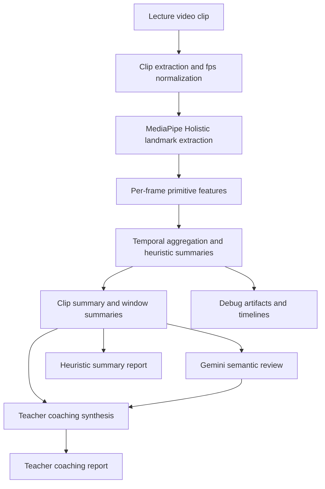
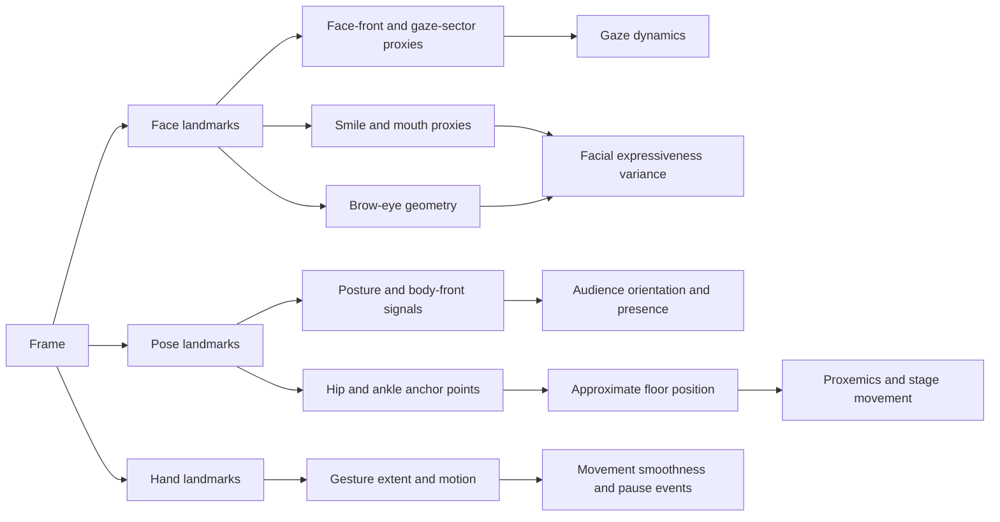
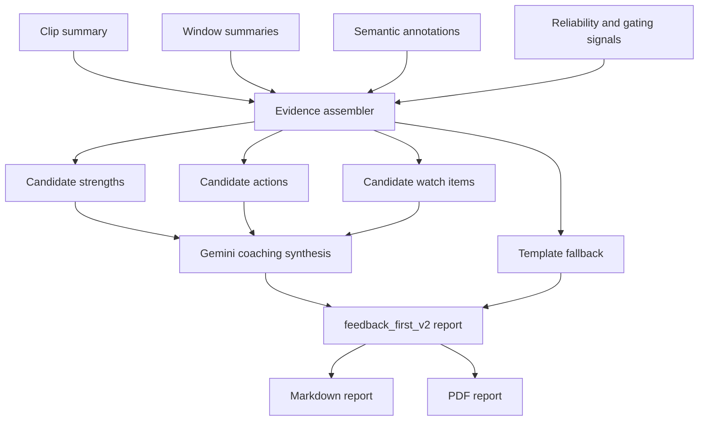
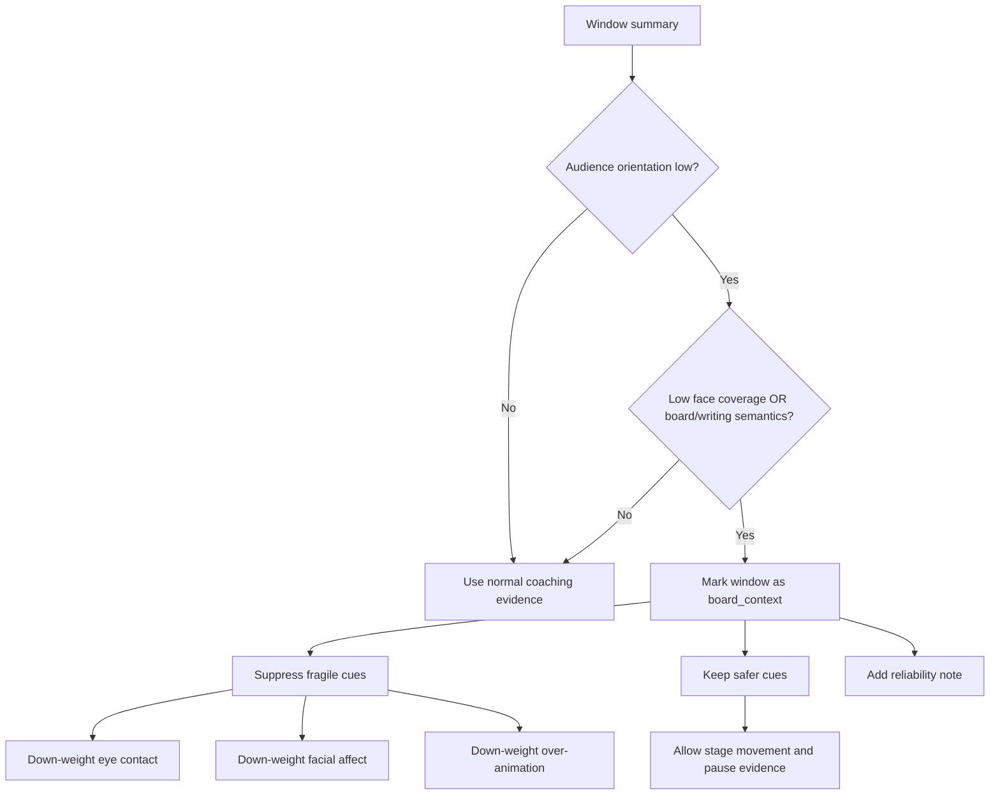

# Thesis Research Report

## Abstract

This project is a research-backed system for formative feedback on teacher lecture video using strictly non-verbal evidence. The project combines interpretable landmark-based analysis, a Gemini-assisted semantic layer, and a teacher-facing coaching report designed to be readable under real time pressure. The central thesis contribution is not a black-box teacher-quality classifier; it is a construct-traceable pipeline that measures visible behavioral patterns, preserves reliability boundaries, and translates technical evidence into actionable coaching language. The system uses only pretrained components, does not train a custom end-to-end model, and deliberately separates internal benchmarking metrics from the teacher-facing report to avoid overstating precision.

**Key results.** A batch evaluation on five 60-second lecture clips from four institutions (MIT, Stanford, Yale, Harvard CS50) shows that per-frame semantic annotations correctly discriminate board-facing, audience-facing, and slide-driven delivery with no hallucinated detail across all 40 sampled frames. Replacing the `feedback_first_v2` coaching post-validator moved the teacher-facing report quality from a rated 6/10 under a template-merge fallback to approximately 8/10 under the direct LLM path, with deduplicated Watch Items, evidence-specific review windows, and coach-language actions such as "glance-and-pivot" and "gesture box." A board-context reliability gate correctly withholds strong audience-facing judgments on the Yale blackboard clip, where face coverage drops to 0.254. The system completes end-to-end in approximately two to three minutes per 60-second clip on a consumer laptop.

This report documents the motivation, related work, research grounding, methods, evaluations, and conclusions for the current (April 2026) version of the system. It records the v2 revision, which promoted Gemini Pro as the default multimodal path, added four landmark-only cue families (proxemics, pause structure, gaze sweep dynamics, facial expressiveness variance), introduced board-context-aware reliability gating, and redesigned the teacher report around strengths, actions, evidence moments, and limits instead of a single headline score.

## 1. Motivation

### 1.1 Problem statement

Teacher feedback is often costly, inconsistent, and difficult to scale. High-quality instructional coaching usually depends on expert human observers who can notice subtle classroom behaviors, remember concrete moments, and convert those observations into guidance that a teacher can actually use. In practice, this is labor intensive and unevenly available. Many teachers therefore receive either very little feedback or feedback that is delayed, generic, and weakly tied to specific evidence.

At the same time, modern lecture video is abundant. Universities, online education platforms, and classroom capture systems produce large numbers of videos that contain rich non-verbal signals: posture, gesture amplitude, room-facing distribution, use of space, visible pauses, board-facing versus audience-facing stance, and facial expressiveness. These signals matter because teaching is not only verbal content delivery. The way a teacher occupies space, distributes attention, and regulates visible energy shapes student perception, classroom climate, and the felt clarity of the lesson.

The research gap is not that non-verbal teaching behavior is unknown. The gap is that many existing computational approaches either:

- optimize for recognition benchmarks rather than coaching utility,
- collapse interpretation into opaque model outputs,
- rely on multimodal inputs such as audio that are not always available or easy to justify,
- or produce report outputs that are too technical for a working teacher to use quickly.

This project addresses this gap by treating the problem as one of interpretable formative analytics. The goal is to help a teacher reflect on visible classroom delivery while preserving construct validity, reliability notes, and room for uncertainty.

### 1.2 Why a strictly non-verbal system

This project intentionally restricts scope to visible, landmark-derived cues and additive image-based semantic interpretation. It does not use audio prosody, speech transcripts, or student outcomes as primary evidence in the current thesis version. This design choice has four motivations:

1. It keeps the construct boundary clear. The system can defend what it measures because the cues are directly tied to visible posture, motion, orientation, and expression.
2. It avoids overclaiming. The system does not pretend to infer full pedagogical quality, content correctness, or student learning gains from video alone.
3. It supports environments where audio is poor, unavailable, or legally more sensitive.
4. It improves thesis defensibility because each reported construct can be traced to literature and to a concrete implementation signal.

### 1.3 Thesis contribution

The thesis contribution is best understood as an engineering and research integration contribution with five parts:

1. A research-traceable non-verbal analytics pipeline built on pretrained MediaPipe landmarks and temporal aggregation rather than custom end-to-end model training.
2. A teacher-feedback architecture that combines interpretable heuristics with an additive Gemini-powered semantic layer, while keeping the semantic layer separate from core heuristic scoring.
3. An extension of the landmark pipeline with four new cue families:
   - proxemics and stage movement,
   - pause and stillness events,
   - gaze sweep dynamics,
   - facial expressiveness variance.
4. A reliability-aware coaching layer that down-weights fragile interpretations, including a simple board-context gate for windows where audience-facing cues are not valid to judge strongly.
5. A teacher-facing report redesign that prioritizes readability, timestamped evidence, and actionable interpretation over raw metric dumps and single-number summaries.

### 1.4 Research questions

This thesis is organized around the following research questions:

1. Can a landmark-first, strictly non-verbal pipeline generate meaningful formative observations about teacher delivery without training a custom teacher-assessment model?
2. Can literature-backed cue families such as proxemics, gaze dynamics, pause structure, and facial expressiveness be operationalized using robust video-derived proxies?
3. Does a teacher-facing report become more defensible and more useful when it emphasizes evidence moments, reliability notes, and plain-language strengths/actions instead of a headline evaluation score?
4. Can a modern multimodal API model improve the semantic specificity of coaching evidence when used as an additive, constrained component rather than a free-form end-to-end evaluator?

## 2. Related Work

### 2.1 Multimodal classroom observation systems

Recent work demonstrates that vision-language and multimodal models can support classroom observation at scale. ClassMind (Nadaf et al., 2025) builds an instructional-feedback system on a multimodal stack and represents the closest architectural analogue to this thesis; it shares the pattern of frame-level interpretation feeding a coaching synthesis step, but targets in-service classroom assessment rather than formative coaching on lecture clips. VidAAS (Zheng et al., 2024) uses GPT-4V for classroom skill assessment and reports high behavioral-domain accuracy, validating the VLM-for-coaching premise. D'Mello et al. (2015, ACM ICMI) established multimodal capture of teacher-student interactions for automated analysis, though with a speech-and-dialog focus that the present system deliberately avoids.

The present system differs from these systems in three ways: (a) it is strictly non-verbal by construction, (b) it keeps the multimodal model in an additive role rather than as an end-to-end evaluator, and (c) it couples the semantic layer to explicit landmark-derived metrics so that every teacher-facing claim is traceable to a visible signal.

### 2.2 Teacher-behavior datasets and pose-level signals

Liu et al. (2025, *Scientific Data*) released a multi-modal dataset of 4,839 videos of teacher instructional activity, validating pose plus video as the canonical modality for teacher-behavior analysis. Earlier pose-only and mobile-eye-tracking work (Haataja et al., 2020; McIntyre et al., 2017) established that temporal patterns of teacher attention and movement — not aggregate ratios — carry the pedagogically meaningful signal. This system operationalizes that finding by computing sweep rate, fixation duration, sector entropy, and zone transitions rather than single-pass ratios.

### 2.3 Automated formative feedback for teachers

The usability of automated feedback has become its own research strand. Demszky et al. (2024, *EEPA*) showed in a randomized controlled trial that teachers act on automated feedback only when it is concrete, brief, and tied to specific moments. The emerging consensus in the LAK and AIED communities is that evidence-based coaching requires feedback linkable to the recording. The report redesign in the current (April 2026) thesis version is a direct implementation of these constraints: coaching snapshot first, per-moment keyframes, and timestamp deep-links into the source video.

### 2.4 Gap addressed by this thesis

Existing multimodal-classroom work tends either to treat the VLM as the primary evaluator, without grounding in pose-level interpretable metrics, or to produce metric dashboards that fail the Demszky usability constraints. No prior system in the surveyed literature combines: strictly non-verbal sensing; landmark-derived cue families grounded per-metric in peer-reviewed immediacy, gaze, and pause literature; an additive VLM semantic layer that cannot overwrite the heuristic signal; and a reliability-aware report that withholds strong claims when visibility is low. This thesis system is positioned in exactly that gap.

## 3. Literature-Grounded Design Rationale

### 3.1 Evidence tiers used in this project

The thesis uses three evidence tiers, because not every design decision is supported by the same type of evidence.

| Evidence tier | What it supports | How it is used in this thesis |
| --- | --- | --- |
| Peer-reviewed educational / behavioral evidence | Non-verbal teaching constructs such as immediacy, gaze dynamics, pause structure, facial expressiveness, and feedback uptake | Used to justify which cue families are worth measuring and how cautiously they should be interpreted |
| Multimodal classroom-observation systems evidence | The legitimacy of multimodal AI or vision-language systems as a substrate for teacher observation | Used to justify the overall system framing and additive semantic-review design |
| Model-capability / operational evidence | Gemini Pro versus Flash as an engineering choice | Used to justify the API model selection without claiming peer-reviewed proof that Pro is pedagogically superior |

This distinction matters. The thesis should not claim that education research proves Gemini Pro is better than Gemini Flash for teacher coaching. The defensible claim is narrower: Gemini Pro is the higher-capability multimodal reasoning tier, and local runtime history showed repeated quota pressure and lower practical reliability on the Flash path.

### 3.2 Design rationale: proxemics and stage movement matter

The literature on teacher immediacy consistently treats movement through classroom space, physical proximity, and body orientation as part of how teachers establish connection and presence. Across communication and education research, teacher movement is not interpreted as universally good or bad. Instead, the research supports a more nuanced claim: how a teacher uses space affects the social and attentional texture of instruction.

This motivated the addition of explicit proxemics signals in the current system:

- room coverage,
- zone dwell distribution,
- static anchoring,
- and transitions across left, center, and right spatial sectors.

The important research-backed interpretation is not "more walking is better." The correct interpretation is that visible room coverage and anchoring patterns are meaningful and can support coaching reflection. In the thesis system, these cues are therefore described conservatively as stage-use behavior, room engagement, and movement variety.

### 3.3 Design rationale: gaze as a temporal dynamic, not a ratio alone

Existing teaching and eye-tracking literature shows that dynamic gaze patterns over space and time carry information that a single aggregate ratio does not capture. Expert teachers often distribute gaze more broadly, avoid overly long fixation on a single region, and move attention across the room in ways that better support shared focus.

This is why the current system emphasizes gaze sweep dynamics rather than only an eye-contact ratio. The system measures:

- average dwell duration by gaze sector,
- maximum fixation duration,
- sector distribution entropy,
- and sweep rate over time.

The thesis claim must remain careful here: the system does not recover true pupil-level eye contact. It estimates room-facing distribution from visible head and facial orientation proxies. That still supports defensible coaching language such as "room scan was concentrated," "attention distribution looked balanced," or "the teacher spent long visible stretches oriented to one sector."

### 3.4 Design rationale: visible pause structure is pedagogically relevant

Wait-time and think-time literature strongly supports the instructional importance of pause structure. However, the thesis version of the system does not use audio or classroom dialog state, so it cannot claim to recover pedagogical wait time in the full conversational sense. What it can measure is visible pause and stillness structure.

This led to the addition of pause-event detection using low gesture motion and low body drift. The new cue family distinguishes:

- dramatic pauses of moderate duration,
- from extended static stretches that may reflect anchoring or low movement energy.

This is a measured compromise between research relevance and sensing limits. The system therefore reports pause structure as a visible non-verbal pattern, not a definitive judgment about dialogic teaching quality.

### 3.5 Design rationale: facial expressiveness is meaningful but not monotonic

Research on teacher enthusiasm and non-verbal expressiveness supports the view that visible expressiveness influences learner attitudes and perceptions. At the same time, the literature also warns that more expressiveness is not always better. Excessive or poorly timed expressiveness can distract some learners, especially when prior knowledge is low.

This matters for system design. A naive approach would reward higher smile intensity or stronger facial movement as inherently positive. The thesis system instead models facial expressiveness as temporal variation:

- rolling variability in smile proxy,
- brow-eye ratio,
- and mouth-open ratio.

This supports a more defensible interpretation: the system can identify facial flatness or low expressive range as a watch item, but it should not claim that maximal facial animation is optimal.

### 3.6 Design rationale: report usability is part of the scientific contribution

A feedback system is only useful if teachers can act on it. Recent automated feedback work shows that brief, concrete, evidence-linked feedback is more usable than abstract metric-heavy summaries. This shaped one of the most important thesis decisions: the teacher-facing report should prioritize strengths, actions, reliability notes, and moment-linked evidence rather than a single overall score.

That design principle now appears directly in the current system:

- the teacher-facing report begins with a coaching snapshot instead of an overall score,
- the strongest evidence is tied to specific windows,
- confidence labels are standardized,
- and reliability notes explain when parts of the clip were not suitable for strong judgment.

### 3.7 Design rationale: Gemini Pro as an engineering choice

The shift to Gemini Pro is supported by two forms of evidence:

1. Multimodal systems literature shows that vision-language models can support classroom observation and instructional feedback tasks.
2. Model-capability and operational evidence showed that the Flash path was quota-constrained and less dependable for this repo's actual runs.

The thesis wording should therefore say:

- Gemini Pro is used because it is the higher-capability multimodal reasoning tier,
- it better matches the need for structured evidence synthesis,
- and it worked as an additive semantic-review and coaching component in the current system.

The thesis should not say that peer-reviewed education research proves Gemini Pro is pedagogically better than Flash. The model configuration (dynamic thinking budget, temperature 0.0, tuned output-token limits) is implementation detail and is summarized in §4.12.

### 3.8 Traceability matrix for the current system

| Construct | Implementation signal | Summary keys | Threshold provenance | Teacher-facing claim boundary | Sources |
| --- | --- | --- | --- | --- | --- |
| Proxemics / stage movement | `floor_x`, `floor_y`, dwell by left-center-right zones, transitions, 2D occupancy | `movement_presence.*` | Heuristic bands derived from immediacy literature; initial calibration bands for some cutoffs | Report room coverage and anchoring; do not infer effectiveness from one pattern alone | Andersen (1979); Witt et al. (2004); Liu et al. (2021); Ballester et al. (2025) |
| Pause / stillness | Low gesture motion plus low hip drift merged into pause events | `movement_presence.pause_*` | Static-stretch band partly literature-anchored; shorter pause bands heuristic-from-literature | Report visible pause structure; do not claim full pedagogical wait-time quality without audio and discourse context | Rowe (1986); Tobin (1987); Stahl (1994) |
| Gaze sweep dynamics | Gaze-sector run lengths, transitions, entropy | `gaze_dynamics.*` | Heuristic bands derived from literature | Report attention distribution and sweep behavior; do not claim true eye contact | Pi et al. (2020); McIntyre et al. (2017); Goldberg et al. (2021); Haataja et al. (2020) |
| Facial expressiveness variance | Rolling variation of smile, brow-eye, and mouth-open proxies | `facial_expressiveness.*` | Initial heuristic for calibration | Report expressive range or flatness watch items; do not assume more is always better | Ekman & Friesen (1978); Wang et al. (2022); Tikochinski et al. (2025) |
| Readable teacher report | Scorecard, merged sections, moment evidence, reliability notes | `scorecard`, `priority_actions`, `top_strengths`, `evidence_moments` | Design pattern, not a numeric threshold | Claim that actionable, timestamped feedback is more coachable than raw metric dumps | Demszky et al. (2024); Nadaf et al. (2025 preprint) |
| Gemini Pro-first runtime | `gemini-2.5-pro` default with dynamic thinking budget | Runtime config and request metadata | Engineering choice, not pedagogical threshold | Claim a capability-backed and operationally justified model choice | Zheng et al. (2024); Comanici et al. (2025); Google Developers Blog (2025) |

## 4. Methods Used

### 4.1 System overview

The system is implemented as a modular pipeline rather than a single model. The high-level flow is shown below in Figure 1.



**Figure 1.** High-level system pipeline. The heuristic path (through `J`) and the coaching path (through `I`) consume the same clip summary, so heuristic scores are never overwritten by the LLM output.

The main implementation modules are:

- `nonverbal_eval/pipeline.py`: feature extraction, temporal aggregation, summary generation, markdown rendering.
- `nonverbal_eval/semantic.py`: Gemini-backed frame-level semantic interpretation.
- `nonverbal_eval/coaching.py`: evidence assembly, report schema, fallback logic, and teacher-facing markdown/PDF rendering.
- `nonverbal_eval/app_service.py`: orchestration of end-to-end evaluation.
- `streamlit_app.py`: interactive product surface for uploads and report viewing.

### 4.2 Design principles

The system follows four explicit design principles:

1. **Interpretability first.** Each metric should be explainable in terms of visible signals and temporal aggregation.
2. **Additive semantics.** The Gemini layer adds contextual interpretation but does not overwrite the core landmark-based signal families.
3. **Formative, not high-stakes.** The outputs are intended for reflection and coaching, not formal teacher ranking.
4. **Reliability-aware reporting.** When visibility or context weakens a cue, the system should reduce confidence or withhold strong recommendations rather than fabricate precision.

### 4.3 Input material and evaluation clips

The repo contains:

- sample lecture clips,
- curated YouTube-derived lecture clips,
- batch evaluation runs,
- and artifact directories containing summary JSON, markdown, plots, and teacher reports.

For the thesis-facing evaluation narrative, the strongest demonstration set currently consists of three 60-second clips with complementary properties:

| Thesis demo clip | Why it matters |
| --- | --- |
| `cs50_business_150_210.mp4` | Strongest example of actionable coaching on a reasonably visible lecture clip |
| `mit_ocw_pigeonhole_240_300.mp4` | Best example of the new proxemics and pause/stillness cues creating useful insight |
| `yale_quantum_240_300.mp4` | Best example of restraint, low-confidence handling, and board-context-aware reliability |

These clips were chosen because together they show utility, methodological novelty, and reliability boundaries.

### 4.4 Landmark extraction and primitive features

The pipeline uses MediaPipe Holistic as the pretrained perception backbone. For each frame, the system extracts face, hand, and pose landmarks and computes primitive signals such as:

- hand visibility,
- face visibility,
- body orientation,
- head/face orientation,
- smile and mouth proxies,
- brow-eye geometry,
- gesture amplitude and smoothness,
- torso and hip movement,
- and approximate floor-relative teacher position.

The new thesis-oriented cues were built on top of those existing primitives rather than by changing the sensing stack.



**Figure 2.** Derivation of cue families from MediaPipe Holistic landmark groups. The four new cue families introduced in this thesis (gaze dynamics, facial expressiveness variance, pause events, proxemics) are the rightmost outputs.

### 4.5 Temporal aggregation and summary construction

The system does not reason from isolated frames alone. Per-frame primitives are aggregated across the full clip and across windows to produce more stable observations. This temporal design matters because teaching behavior is inherently time-varying.

The clip summary includes established signal families such as:

- posture and openness,
- audience orientation,
- gesture smoothness,
- eye-contact distribution,
- confidence/presence,
- natural movement,
- enthusiasm and positive affect,
- and risk metrics including static behavior, rigidity, and excessive animation.

The thesis extension adds three new summary families:

- `movement_presence`
- `facial_expressiveness`
- `gaze_dynamics`

These families do not create new top-level composite scores. Instead, they feed existing composites so that the internal heuristic score remains broadly comparable across runs.

### 4.6 Composite score construction — worked formulas

All composite scores in this system are bounded in [0, 100] and constructed from three primitive score functions applied to raw signal values. This design is explicit so that every point in any composite score can be traced back to a raw measurement, its calibrated band, and its fractional weight.

**Score primitives.** Let *v* be a raw signal (for example mean gesture extent or smile-proxy rolling standard deviation), and let [*l*, *h*] denote a calibrated band with optional mid-point *m*. Define:

- Linear-up: *lin*(*v*; *l*, *h*) = clip<sub>[0,1]</sub>((*v* − *l*) / (*h* − *l*)) — rewards values up to *h*.
- Linear-inverse: *inv*(*v*; *l*, *h*) = 1 − *lin*(*v*; *l*, *h*) — penalizes values above *l*.
- Peak: *peak*(*v*; *l*, *m*, *h*) returns 0 outside [*l*, *h*], a linear ramp to 1 at *v* = *m*, and a linear fall back to 0 at *v* = *h* — rewards a healthy band with calibrated optimum *m*.

These three primitives are implemented as `_score_linear`, `_score_inverse`, and `_score_peak` at [pipeline.py:98-117](../nonverbal_eval/pipeline.py#L98-L117).

**Composite: `stage_usage_score`.** When proxemics signals are available the composite is a 50/50 blend:

```
stage_usage = 0.50 × base + 0.50 × proxemics
base        = 100 × lin(stage_range; 0.04, 0.30)
proxemics   = 100 × ( 0.55 × lin(coverage_area_pct; 15, 50)
                    + 0.45 × inv(static_zone_pct;   60, 90) )
```

If proxemics are unavailable the composite falls back to `base` alone. This is the mechanism by which the new proxemics cue family from §3.2 enters the heuristic scorecard without creating a new top-level score.

**Composite: `eye_contact_distribution_score`.** A weighted combination of three audience-attention sub-scores:

```
eye_contact = 0.45 × audience_orientation
            + 0.35 × sector_balance
            + 0.20 × room_scan

room_scan   = 100 × ( 0.45 × peak(gaze_transition_rate; 0.05, 0.45, 1.60)
                    + 0.35 × lin(signed_yaw_std;        0.08, 0.28)
                    + 0.20 × peak(sweep_rate_per_min;   2.0, 8.0, 20.0) )
```

The `peak` primitive on `sweep_rate_per_min` encodes the empirical range reported by McIntyre et al. (2017) for expert teacher gaze sweeps, penalizing both a frozen gaze and a visually frantic one.

**Composite: `positive_affect_score`.**

```
positive_affect = 100 × ( 0.42 × lin(smile_mean;       0.32, 0.44)
                        + 0.14 × lin(smile_std;        0.006, 0.028)
                        + 0.14 × lin(open_palm_ratio;  0.10, 0.75)
                        + 0.30 × expressiveness_score / 100 )
```

The `expressiveness_score` sub-composite is itself a weighted linear combination of the rolling-standard-deviation means for smile, brow-eye, and mouth-open proxies. This is the mechanism by which the new facial-expressiveness-variance cue family from §3.5 enters the composite.

**Flag rule: `facial_flatness_flag`.** A boolean promoted to the teacher report when:

```
mean_rolling_std(smile) < 0.015  AND  coverage(smile) ≥ 0.50
```

A true flag surfaces as a watch item without suppressing other affect signals — consistent with the research finding in §3.5 that expressiveness is not monotonically desirable.

**Scorecard band mapping.** Every composite score in the teacher-facing scorecard is mapped to one of three bands using constant thresholds:

```
band(s) = green (strong)   if s ≥ 75
          amber (moderate) if 50 ≤ s < 75
          red   (limited)  if s < 50
```

These thresholds are held constant across metrics so that a teacher viewing the scorecard gets consistent color semantics independent of the specific signal.

### 4.7 New cue-family methods

#### 4.7.1 Proxemics and stage movement

The system maps approximate teacher floor position into left, center, and right zones. It then computes:

- dwell percentage per zone,
- transition count across zones,
- static-zone time,
- and coarse 2D coverage area.

These values are exposed in the summary and also inform stage-usage-related interpretation.

#### 4.7.2 Pause and stillness events

Pause events are derived from low gesture motion combined with low body drift. Two types are represented:

- `dramatic_pause`
- `static_stretch`

This distinction helps the system reward visible pause structure without treating all stillness as equally useful.

#### 4.7.3 Gaze sweep dynamics

Gaze-sector time series are transformed into:

- mean sector dwell,
- maximum fixation,
- sector entropy,
- and sweep rate per minute.

These statistics operationalize attention distribution over time rather than a single global eye-contact percentage.

#### 4.7.4 Facial expressiveness variance

The system computes rolling standard deviation over:

- smile proxy,
- brow-eye ratio,
- mouth-open ratio.

It then derives average expressiveness variation and a `facial_flatness_flag` when visible variation remains low for an extended portion of the clip (see §4.6 for the exact flag rule).

### 4.8 Semantic layer and runtime configuration

The semantic layer is intentionally constrained. It samples a limited set of frames from the clip and sends them, together with light structured context, to Gemini. The model returns strict JSON fields such as:

- `teacher_focus`
- `body_action`
- `affect_tone`
- `posture_signal`
- `attention_note`
- `evidence_confidence`
- `rationale`

The frame context now includes visible stance information such as `floor_x`, `floor_y`, and `pause_state`, helping the model reason about writing, board focus, audience address, and posture in a more grounded way.

The semantic layer is additive:

- it does not replace the heuristic summary,
- it does not change internal metric formulas directly,
- and it is primarily used to enrich evidence interpretation and coaching language.

### 4.9 Coaching report generation

The teacher report is generated from:

- clip-level heuristic summary,
- window-level metric summaries,
- semantic frame interpretations,
- and reliability/context notes.

The report generation path is shown in Figure 3.



**Figure 3.** Coaching report generation. The deterministic template-fallback path (`M`) remains wired in parallel with the LLM path (`I`) so that the system degrades gracefully when the API is unavailable.

The report redesign reflects several thesis goals:

- the teacher-facing report hides the overall non-verbal score,
- the top section emphasizes a coaching snapshot and scannable sub-signal bands,
- strengths and priority actions are surfaced before the appendix,
- moment-by-moment evidence includes timestamps and keyframes where available,
- confidence language is normalized,
- and fallback provenance is explicit when the LLM path is unavailable.

### 4.10 Reliability safeguards and board-context gating

One of the v2 (April 2026) improvements is a simple, deliberately conservative board-context gate. The reasoning is straightforward: when a teacher is writing on the board or facing away from the audience, some audience-facing cues are not valid to judge strongly.

The current V1 gate is window-level rather than frame-level. A window is marked as board-context-like when:

- audience orientation is low, and
- either face visibility is weak or semantic review indicates board-focused or writing behavior.

In such windows, the system down-weights fragile coaching claims related to:

- eye contact,
- facial affect,
- gaze-sweep quality,
- and over-animation judgments.

Safer signals such as stage movement, pause structure, and some posture-related evidence can still be used when tracking is stable.



**Figure 4.** Board-context reliability gate. The gate fires only when two independent indicators agree (low audience orientation plus either low face coverage or board/writing semantics), reducing false positives on clips where the teacher is briefly turned without actually writing.

This safeguard is important for both engineering quality and thesis defensibility. It shows that the system does not merely compute metrics; it also reasons about when those metrics should not be over-interpreted.

### 4.11 Artifact outputs

The pipeline produces a structured artifact set, including:

- `per_frame_metrics_full.csv`
- `summary_full.json`
- `summary_full.md`
- `window_summary.csv`
- `teacher_coaching_report.json`
- `teacher_coaching_report.md`
- `teacher_coaching_report.pdf`
- `coaching_evidence.json`
- keyframes, plots, and overlays

This artifact design supports transparency. A teacher-facing claim can usually be traced back to a window, a metric family, and a visible moment in the source clip.

### 4.12 Reproducibility

The following environment and runtime figures describe the current (April 2026) configuration.

**Hardware.** All batch runs were executed on a Windows 11 consumer laptop (x86-64, 16 GB RAM) with no discrete GPU. MediaPipe Holistic uses the TFLite CPU execution path and does not require GPU acceleration.

**Software.** Python 3.10+, `mediapipe 0.10.x` (Holistic solution), `numpy 1.26`, `pandas 2.x`, `opencv-python 4.x`, `weasyprint` for PDF rendering. The Gemini 2.5 Pro model is accessed via the public REST endpoint; no local model weights are loaded. Container orchestration uses Docker Compose with forwarded `GEMINI_API_KEY`.

**Model configuration.** The current version uses `gemini-2.5-pro` with `thinkingConfig.thinkingBudget = -1` (Pro dynamic reasoning), `temperature = 0.0` at both the per-frame semantic and coaching-synthesis call sites, and output-token budgets of `1024` for per-frame semantic and `4096` for coaching synthesis. The existing exponential-backoff wrapper in `nonverbal_eval/gemini_api.py` (four attempts, 429/5xx-aware) is reused unchanged.

**Typical wall-clock runtime per 60-second clip.** Landmark extraction runs at analysis_fps = 12 and completes in roughly 60 to 90 seconds. The per-frame semantic pass samples 8 to 10 frames and completes in 25 to 80 seconds depending on Gemini latency and thinking-budget expansion. The coaching-synthesis pass completes in 10 to 20 seconds. End-to-end wall-clock is approximately two to three minutes.

**Typical API cost per clip.** At April 2026 Gemini 2.5 Pro public pricing, the combined semantic plus coaching calls cost on the order of $0.05 per 60-second clip. This is dominated by the coaching-synthesis call (larger prompt, larger `max_output_tokens = 4096`) rather than the per-frame semantic calls.

**Determinism boundaries.** Landmark extraction is deterministic given the input video. Gemini calls use `temperature = 0.0` but are not bit-exact reproducible because the inference stack may route through different mixture-of-experts partitions across requests; minor wording variation in the coaching report across reruns is expected. Scoring-layer outputs (`summary_full.json`, all composite scores) are fully deterministic given a fixed input clip.

**Artifact locations.** Batch outputs referenced in §5 are stored under `local_data/docker_test_outputs/batch_eval_v2/` organized by clip identifier and run timestamp.

## 5. Evaluations

### 5.1 Evaluation strategy

The evaluation strategy in this thesis is not centered on benchmark classification accuracy. Instead, it evaluates the system as a formative analytics and reporting pipeline. That means the key questions are:

1. Are the computed cues behaviorally plausible and literature-aligned?
2. Does the semantic layer distinguish different teaching styles without hallucinated detail?
3. Does the report become more useful when it foregrounds actions, strengths, evidence windows, and reliability notes?
4. Does the system know when to reduce confidence or avoid overclaiming?

### 5.2 Five-clip batch evaluation

The current batch evaluation set contains five 60-second clips drawn from the curated lecture dataset:

| Clip | Institution | Teaching style | Internal heuristic score |
| --- | --- | --- | --- |
| `mit_ocw_how_to_speak_300_360` | MIT OCW | Board-facing demonstration | 53.3 |
| `stanford_cs230_240_300` | Stanford | Animated AI lecture | 51.1 |
| `yale_quantum_240_300` | Yale | Blackboard math/physics | 45.4 |
| `cs50_business_150_210` | Harvard CS50 | Slide-driven business talk | 49.9 |
| `mit_ocw_pigeonhole_240_300` | MIT OCW | Math discussion | 55.9 |

This batch is useful because it spans:

- different institutions,
- different subject styles,
- audience-facing and board-facing delivery,
- and varying levels of visibility quality.

Assessment of this batch (documented separately in `docs/batch_feedback_quality_assessment.md`) showed that the semantic layer was among the strongest parts of the system (rated 9/10), while the coaching layer historically suffered from fallback-related duplication and templating issues (rated 6/10 under the `llm_api_hybrid` path). The v2 revision — replacing the `feedback_first_v2` post-validator so Pro's schema-valid output flows through untouched — moved the coaching layer to approximately 8/10 on the two clips where it is measurable, with deduplicated Watch Items, evidence-specific review windows, and the graceful-degradation behavior described in §5.4.3.

### 5.3 Thesis demo trio

For thesis defense and demonstration purposes, three clips stand out as the most useful:

| Clip | Demonstrated value | Why it helps defend the thesis |
| --- | --- | --- |
| `cs50_business_150_210` | Actionable coaching on a reasonably visible clip | Shows that the system can produce concrete, plausible formative guidance |
| `mit_ocw_pigeonhole_240_300` | Value of new proxemics and pause cues | Shows that the thesis contribution is not cosmetic; new cues materially change interpretation |
| `yale_quantum_240_300` | Reliability restraint and board-context handling | Shows that the system knows when not to overclaim |

### 5.4 Focused findings from the thesis demo trio

#### 5.4.1 CS50 Business

This clip is the best utility case. Tracking quality is relatively strong, with high face and hand coverage, which means the system has enough evidence to support coaching claims with moderate confidence. The refreshed teacher report emphasizes concrete adjustments such as opening the stance between points and re-orienting visibly toward the audience after glancing at the screen.

Selected metrics from the saved run:

| Metric | Value |
| --- | --- |
| Internal heuristic score | 49.95 |
| Face coverage | 0.764 |
| Hand coverage | 0.815 |
| Coverage area | 83.33% |
| Static zone time | 45.56% |
| Dramatic pause count | 0 |
| Sweep rate per minute | 57.08 |

Interpretation:

- the clip demonstrates good visibility for multimodal analysis,
- meaningful room coverage is visible,
- the teacher-facing report can surface useful coaching actions,
- and the system is able to combine heuristic and semantic evidence into a coherent formative brief.

**Sample excerpt from the generated teacher report.** The following is an abridged slice of the `teacher_coaching_report.md` produced for this clip (full report under `local_data/docker_test_outputs/batch_eval_v2/cs50_business/run_20260417T180730Z/`):

```markdown
## At a Glance
You demonstrate strong stage presence, effectively using movement,
facial expressions, and gaze to engage the room. The key opportunities
for growth are in refining posture and gesture control...

### 1. Open the stance between points
- Why it matters: An open, relaxed posture communicates confidence
  and approachability. A closed stance, even briefly, can create a
  subtle barrier between you and the audience.
- What we saw: At moments like 00:00-00:15 and 00:30-00:45, your
  arms and shoulders tended to fold inward, creating a more guarded
  or closed posture. The risk metric for this was notably high
  (68.7) in the first interval.
- What to try next: As a simple reset, try the 'speaker's ready
  stance': stand with feet shoulder-width apart, and let your hands
  rest naturally at your sides or with fingers lightly touching
  in front. Return to this stance after gesturing or turning to
  the board.
- Review at: 00:00-00:15, 00:30-00:45
- Confidence: medium
```

This excerpt shows the three-part action structure (why it matters / what we saw / what to try next), timestamped review windows, a named technique ("speaker's ready stance") rather than generic advice, and the normalized `Confidence:` label — all outputs of the v2 coaching layer described in §4.9.

#### 5.4.2 MIT Pigeonhole

This clip is the strongest demonstration of the thesis extensions. The teacher presents with reasonably high confidence and strong visibility, but the summary also shows heavy anchoring to one region of the space. That creates a good use case for the new proxemics signal family. In addition, the pause-event detection surfaces visible stillness patterns that strengthen the movement interpretation.

Selected metrics from the saved run:

| Metric | Value |
| --- | --- |
| Internal heuristic score | 55.88 |
| Face coverage | 0.746 |
| Hand coverage | 0.926 |
| Coverage area | 62.50% |
| Static zone time | 76.25% |
| Dramatic pause count | 2 |
| Sweep rate per minute | 80.11 |

Interpretation:

- the teacher appears open and audience-focused,
- but stage movement is concentrated enough to justify a specific anchor-breaking suggestion,
- and the pause/proxemics additions contribute evidence that older versions of the pipeline did not expose clearly.

This clip therefore helps defend the contribution of the new cue families directly.

#### 5.4.3 Yale Quantum

This clip is the strongest fairness and validity case. It is board-facing and visibility is weak, especially for face evidence. Earlier versions of the system risked over-interpreting such clips. The current thesis version instead treats it as a low-reliability or maintenance case, suppressing stronger audience-facing judgments when the evidence does not support them.

Selected metrics from the saved run:

| Metric | Value |
| --- | --- |
| Internal heuristic score | 45.39 |
| Face coverage | 0.254 |
| Hand coverage | 0.456 |
| Coverage area | 70.83% |
| Static zone time | 46.46% |
| Dramatic pause count | 0 |
| Sweep rate per minute | 34.00 |

Interpretation:

- the clip is difficult for strong face-based or audience-orientation coaching,
- board-context gating is appropriate,
- and the report's low-reliability stance is a strength rather than a weakness.

### 5.5 System-level evaluation takeaways

Across the current pipeline and evaluation artifacts, five practical conclusions emerge:

1. **The landmark-first design is viable.** The system produces interpretable, behaviorally plausible signals without training a custom teacher classifier.
2. **The new cue families are useful.** Proxemics, pause structure, gaze sweep, and facial expressiveness variance add meaningful analysis depth.
3. **The semantic layer is strongest when additive and constrained.** Frame-level semantic annotations are most useful when they enrich evidence rather than replace heuristic reasoning.
4. **Report design materially affects utility.** Readable structure, timestamped evidence, and reliability notes make the output more defensible and more useful.
5. **Reliability safeguards are essential.** Low visibility and board-facing contexts can invalidate some cues, so gating and conservative reporting are part of the scientific method, not merely product polish.

### 5.6 Current limitations

The current thesis version also has clear limitations that should be stated openly:

- The system is strictly non-verbal and does not incorporate speech, audio prosody, discourse structure, or student outcomes.
- Landmark-derived gaze is a room-facing proxy, not true eye tracking.
- Several thresholds remain heuristic and should be calibrated further on the curated clip set.
- Some metrics, especially sweep-rate interpretation, still need better calibration to distinguish purposeful room scans from micro-movements.
- The semantic and coaching layers depend on external API availability.
- The teacher-facing report is designed for formative coaching and should not be used for high-stakes teacher evaluation.

These are not peripheral caveats. They define the proper scope of the thesis contribution.

## 6. Conclusion

This thesis demonstrates that a research-traceable, strictly non-verbal teacher-feedback system can be built without training a new end-to-end model. By combining MediaPipe-derived landmark analytics, constrained Gemini-based semantic interpretation, and a reliability-aware coaching layer, the project produces evidence-linked formative feedback that is considerably more interpretable than a black-box evaluator and more usable than a raw metric dashboard.

The most important thesis outcome is not a single score or benchmark. It is the integration of:

- literature-backed cue selection,
- transparent metric construction,
- additive multimodal semantics,
- readable report design,
- and explicit reliability boundaries.

The v2 (April 2026) revision strengthens that contribution. Gemini Pro is now the default multimodal reasoning path. New cue families capture stage movement, pause structure, gaze sweep dynamics, and facial expressiveness variance. Teacher-facing reports emphasize actions and evidence instead of headline scoring. Board-context-aware gating reduces the risk of unfair overinterpretation in writing-heavy or audience-occluded segments.

## References

1. Andersen, J. F. (1979). Teacher immediacy as a predictor of teaching effectiveness. In D. Nimmo (Ed.), *Communication Yearbook 3* (pp. 543–559). Transaction Books.
2. Ballester, L., García-Carrasco, J., & Hernández-Serrano, M. J. (2025). Teacher nonverbal immediacy: A validation study of the TeNOI observation scale. *Scandinavian Journal of Educational Research*. https://doi.org/10.1080/00313831.2025.2550273
3. Comanici, A., Hadsell, R., Lillicrap, T., et al. (2025). *Gemini 2.5: Pushing the frontier with advanced reasoning, multimodality, long context, and next-generation agentic capabilities* (arXiv:2507.06261). arXiv. https://arxiv.org/abs/2507.06261
4. Demszky, D., Liu, J., Hill, H. C., Jurafsky, D., & Piech, C. (2024). Can automated feedback improve teachers' uptake of student ideas? Evidence from a randomized controlled trial. *Educational Evaluation and Policy Analysis*.
5. D'Mello, S. K., Olney, A. M., Blanchard, N., Samei, B., Sun, X., Ward, B., & Kelly, S. (2015). Multimodal capture of teacher-student interactions for automated dialogic analysis in live classrooms. In *Proceedings of the 2015 ACM International Conference on Multimodal Interaction (ICMI '15)* (pp. 557–566). https://doi.org/10.1145/2818346.2830602
6. Ekman, P., & Friesen, W. V. (1978). *Facial action coding system*. Consulting Psychologists Press.
7. Goldberg, P., Schwerter, J., Seidel, T., Müller, K., & Stürmer, K. (2021). Eye-tracking in educational practice: Investigating visual perception underlying teachers' expertise. *Educational Psychology Review*, *33*, 1611–1642. https://doi.org/10.1007/s10648-020-09565-7
8. Google Developers Blog. (2025, May 9). *Advancing the frontier of video understanding with Gemini 2.5*.
9. Haataja, E., Garcia Moreno-Esteva, E., Salonen, V., Laine, A., Toivanen, M., & Hannula, M. S. (2020). Teachers' gaze over space and time in a real-world classroom. *Journal of Eye Movement Research*, *13*(4). https://doi.org/10.16910/jemr.13.4.8
10. Liu, S., Zhang, J., Jensen, J. S., & Gao, Y. (2021). Does teacher immediacy affect students? A systematic review. *Frontiers in Psychology*, *12*, 713978. https://doi.org/10.3389/fpsyg.2021.713978
11. Liu, Z., Wang, Y., Zhao, Z., Li, X., Chen, Y., Liu, J., Liu, M., & Li, X. (2025). A multi-modal dataset for teacher behavior analysis in offline classrooms. *Scientific Data*, *12*. https://doi.org/10.1038/s41597-025-05426-6
12. McIntyre, N. A., Mainhard, M. T., & Klassen, R. M. (2017). Are you looking to teach? Cultural, temporal and dynamic features of expert teacher gaze. *Learning and Instruction*, *49*, 41–53. https://doi.org/10.1016/j.learninstruc.2016.12.005
13. Nadaf, M., et al. (2025). *ClassMind: Scaling classroom observation and instructional feedback with multimodal AI* (arXiv:2509.18020). arXiv. https://arxiv.org/abs/2509.18020
14. Pi, Z., Xu, K., Liu, C., & Yang, J. (2020). Instructor presence in video lectures: Eye gaze matters, but not body orientation. *Computers & Education*, *144*, 103713.
15. Rowe, M. B. (1986). Wait time: Slowing down may be a way of speeding up! *Journal of Teacher Education*, *37*(1), 43–50. https://doi.org/10.1177/002248718603700110
16. Stahl, R. J. (1994). *Using "think-time" and "wait-time" skillfully in the classroom* (ERIC Document No. ED370885). ERIC Clearinghouse. https://files.eric.ed.gov/fulltext/ED370885.pdf
17. Stürmer, K., Seidel, T., & Holzberger, D. (2024). Eye-tracking research on teacher professional vision: A scoping review. *Teaching and Teacher Education*.
18. Tikochinski, R., Babad, E., & Hammer, R. (2025). Teacher's nonverbal expressiveness boosts students' attitudes and achievements: Controlled experiments and meta-analysis. *International Journal of Educational Technology in Higher Education*.
19. Tobin, K. (1987). The role of wait time in higher cognitive level learning. *Review of Educational Research*, *57*(1), 69–95.
20. Wang, Y., Pi, Z., & Hu, W. (2022). Instructors' expressive nonverbal behavior hinders learning when learners' prior knowledge is low. *Frontiers in Psychology*, *13*, 810451. https://doi.org/10.3389/fpsyg.2022.810451
21. Witt, P. L., Wheeless, L. R., & Allen, M. (2004). A meta-analytical review of the relationship between teacher immediacy and student learning. *Communication Education*, *53*(2), 184–207.
22. Zheng, J., et al. (2024). I see you: Teacher analytics with GPT-4 vision-powered observational assessment. *Smart Learning Environments*, *11*. https://doi.org/10.1186/s40561-024-00335-4
